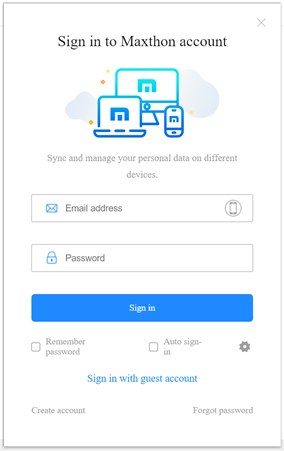
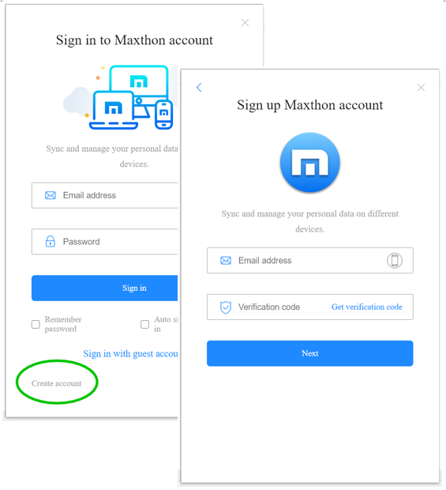
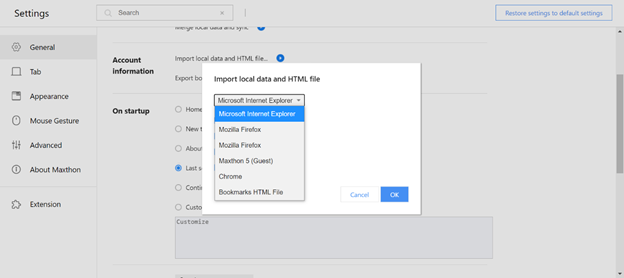
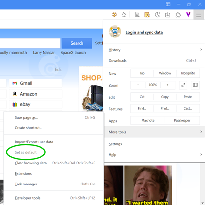
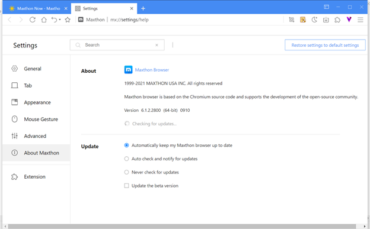
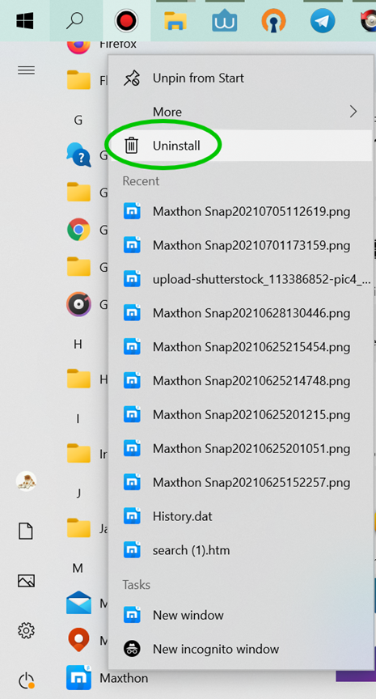

# Get Started with Maxthon

## Download & Install Maxthon

#### Install Maxthon on Windows 

Open Maxthon official website: [https://www.maxthon.com/](https://www.maxthon.com/)

Click **Download Now** to download Maxthon. It will automatically detect your system and download the suitable installer package for your device. You can also click More to view other installer packages. Double-click on the installer package, then click Install Now. Maxthon will launch automatically after the installation.

#### Use Portable Maxthon on Windows 

You can use the portable Maxthon if you need to use it on another device temporarily. 

* Download the portable Maxthon: [https://www.maxthon.com/](https://www.maxthon.com/) 
* Extract it, then launch Maxthon.exe 

Note: the data of the portable version will be saved to its folder. If you do not sign in to your Maxthon browser account, the data cannot recover after deleting the portable version folder. 

#### Update to the new Maxthon from Maxthon 5 

If you have installed Maxthon 5, you can update it to the new Maxthon browser directly. And your Maxthon 5 data can be imported automatically at the first log-in.

## Sign in to Maxthon Browser Account to Sync Data 

Sync the data to multi-devices and prevent the data loss

#### Sign in to your Maxthon browser account 

You can sign in to your Maxthon browser account to continue previous browser session.

Note: If you are an existing Maxthon 5 user and are using the new Maxthon for the first time, the history data of Maxthon 5 will be imported to the new Maxthon automatically at the first log-in.

#### Create a new Maxthon browser account 

If you are new to Maxthon, you may register a browser account using your email address or phone number.

## Sign in with the Guest Account 

You can also sign in to the guest account. Under the guest account, the data will be saved to the local and cannot sync with other devices, and some functions are not available.

Note: Please be noted that the guest account data is saved locally. If you delete the local data, it will be lost forever.

## Import Local Data 

You can import HTML files or other browsers’ data to Maxthon.

* Click **Menu** > **Settings**, in General settings, click **Import local data and HTML**; 
* Maxthon supports importing data from most popular browsers, such as Edge, IE, Firefox, Chrome, etc.

## Set Maxthon as the Default Browser 

Set Maxthon as the default browser, then the external link and file can be opened in Maxthon browser, for example, in Windows 10 system: 

* Open **Menu**> **More tools**> **Set as default**

* In system settings, go to **Default apps**> **Web browser**> **Maxthon**

* You can pin the Maxthon icon to the taskbar to open it easily.
    * Open Maxthon on your device
    * Right-click on the taskbar Maxthon icon
    * Click Pin to the taskbar

## Update & Uninstall Maxthon

#### Update Maxthon 

* Open **Menu**> **Settings**>**About Maxthon** to customize the update settings

* Regarding the update, Maxthon supports three options
    * Auto-update (recommended): it will auto-update to the latest version when the engineers release the update.
    * Notify update: it will notify the update, and you need to update manually.
    * Never update: it won’t push the update notification to you. You need to check the update and download the new installer package manually.
    * Maxthon will release the new beta version every 7-10 days. If you’d like to experience the new beta version, please check the Update the beta version. Then it will update to the latest beta version automatically, no matter it is the official version or beta version. 

#### Uninstall Maxthon 

* You can find Maxthon from the system menu, then right-click on it to choose the Uninstall button. 
* You can also uninstall the browser under the system control panel.

