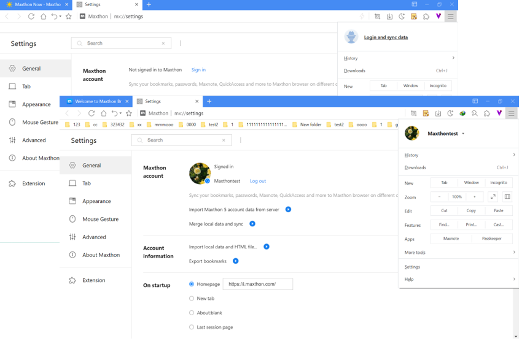
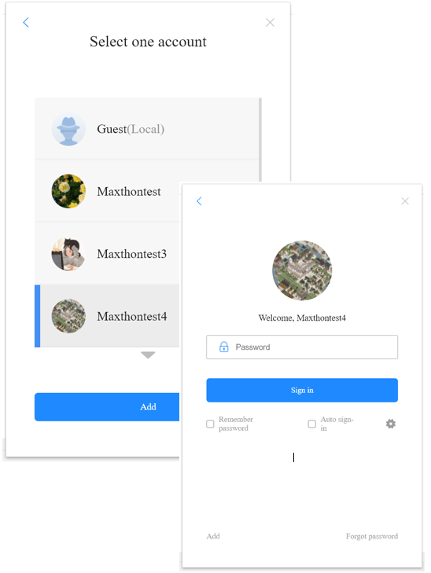
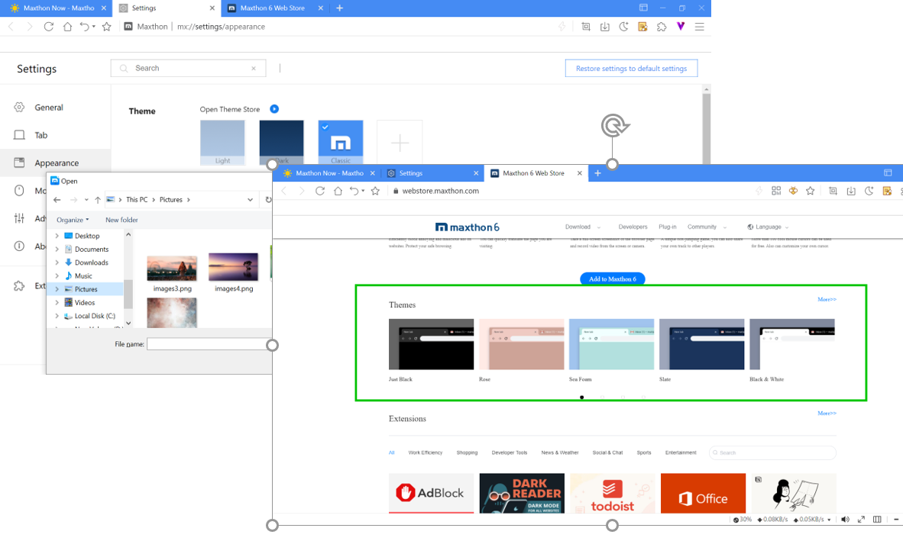
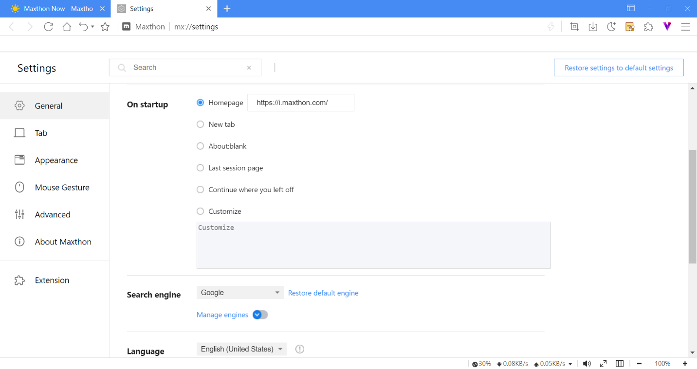
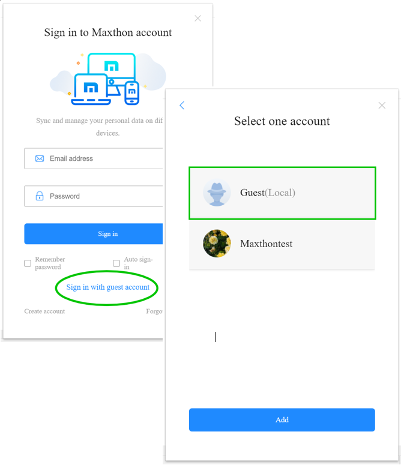

# Cloud Sync

## Sign in to Maxthon Browser Account to Sync

Sign in to your browser account in Maxthon to sync with multi-devices. 
Under the guest account, you can click Menu > Log in and sync data

*Note1: Maxthon 5 browser account data will automatically import to the new Maxthon at the first sign-in. After that, the data of Maxthon 5 won’t sync with the New Maxthon version (except Maxnote).

*Note2: Maxthon 5 cannot sync with the new Maxthon (except Maxnote) even under the same account.

After signing in to your browser account, you can import account data from Maxthon 5 and Maxthon local guest account:
1. Import Maxthon 5 account data from the server: If you need to overwrite or merge the Maxthon 5 account data to the new Maxthon.
2. Merge local data and sync: Import the Maxthon local guest account data to your browser account, then sync to Maxthon server

## Sign in to Multi-accounts

Sign in to multiple accounts (work or home accounts). In case you want to share your device with family members, you can register an account for everyone

Sign out of the current account, you will see switch account window:

1. Add a new account
2. Switch account: If you tick auto sign-in, it will remember the browser account password and needn’t enter the password again
3. You can click the delete button to delete the browser account from the account list; the local data will also be deleted

## Customize the Browser UI

You can customize the browser UI, and the settings can sync with all devices

At the top right, click Customize UI to enable or disable the functions;
You can also go to Settings > Appearance to customize.

## Change the Browser Theme & Skin

You can upload the image as the background or install the theme extension

1. Settings > Appearance > Theme, click the Add button to update the local image as the browser skin;
2. You can install the theme extension from the web store;
3. You can also install the theme extension from other extension web stores that support Chromium.

## Customize Homepage & Startup Page

You can set the particular startup page for every browser account:
- Homepage: You can select any website as the browser homepage;
- Open new tab page or blank page;
- Last session list;
- Continue where you left off: The browser will reopen the same pages you were looking at when you quit;
- Customize: You can add a specific set of pages.

## Sign in with the Guest Account

You can also use the guest account when using Maxthon temporarily.

The guest account is the local account. It can use most of Maxthon’s features and needn’t password.
*Note: If you delete the local data, the browser data under the guest account will be lost.
