# Managing Tabs

## Open a new tab

1. At the top of the Maxthon window, you could left-click the plus button to open [**New Tab**], or right-click to [ **Paste and open**] link.

2. Press the “**Ctrl**” button on your keyboard and left-click on the link simultaneously in a website to open the link in a new tab. Alternatively, you could right-click on the link and select [**Open link in new tab**]

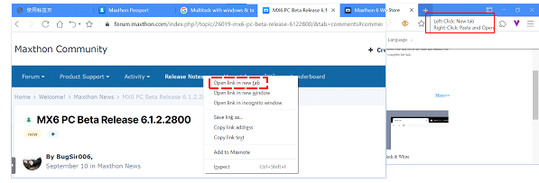

 

## Open a new tab in a new window

You could open a few browser windows from desktop:

1. Click on the upper right corner menu button to open the menu. Under the “New” section, click “Window”

2. Right-click on the tab to open the menu and move the cursor to [ **Move tab to incognito window** ] and select [ **Move tab to new window** ] If multiple windows are opened at that time, you will be able to select the window for the new tab.

3. Right-click on the link on the website and select [ **Open link in new window** ]

4. Drag and move the tab out of the current browser window.

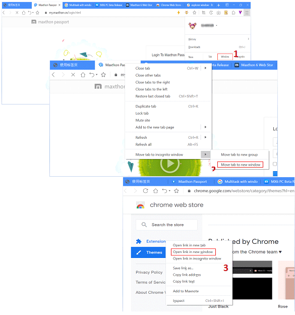

 

## Customizing quick access thumbnail

#### Edit thumbnail

1. Add to the new tab page

- You could right-click on the tab and select [**Add to the new tab page** ] ;
- Or go to new tab and click the [ **Add** ]  button, select [**Custom**] at the top tab to input title, website URL, and how the thumbnail shall be created:
    - **Hot**: use the pre-selected picture from the gallery. If the URL does not have a picture assigned, it will fall back to color block mode.
    - **Screenshot**: use the snapshot of the website as the thumbnail
    - **Color block**: website title + color will be used as thumbnail

2. Managing quick access thumbnail

- Move the cursor to the quick access thumbnail left click on the edit button to edit, click the close button to delete.
- Right-click on the quick access thumbnail and select [ **Edit**], [**Delete**] from the menu.
- Right-click on quick access thumbnail could:
    * Open in a background tab and not affect the current page
    * Open in a new window: URL will be open in a new window
    * Open in the private window: URL will be open in a new/current private window selected.

3.Arranging thumbnails

Drag and drop the thumbnail to a different position within the page. 

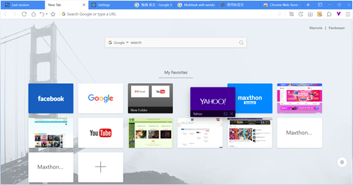

#### Use the folder to organize thumbnails

Maxthon new quick access page allows you to organize thumbnails using folders.

1. Create a new folder

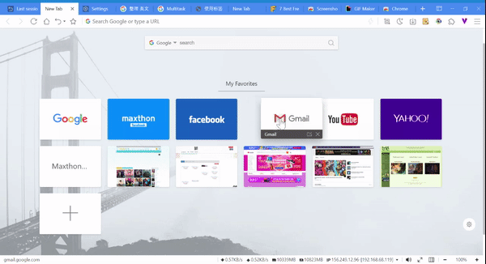

Click and drag one thumbnail to another. Once the background appears darker, drop it and a new folder will be created.

2. Dragging thumbnail out of a folder

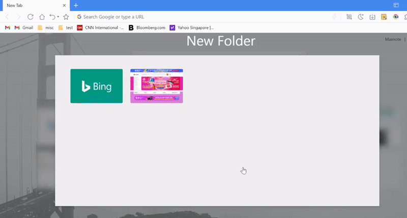

Drag and drop the thumbnail out the folder to the main page.

*Note: When the last thumbnail from the folder has been dragged out, the folder will be deleted. 

 

#### Quick access page setting

You could customize the quick access page background by clicking on the cog icon  at the bottom right corner to go into [ **Settings** ]. In settings, you could choose the background picture or click on the plus icon to add a background picture from the computer.

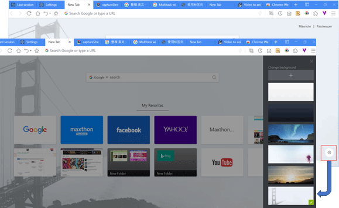

## Arranging and Locking tabs

1. You could drag-n-drop a tab to a different position to reorder it within the same window.

2. Right-click on the tab and select [ **Lock Tab** ] from the menu and you will see the lock icon  appearing on the tab. The locked tab can not be closed unless it's unlocked. Right-click on the tab again and select [ **Unlock tab**], the tab will be unlocked. 

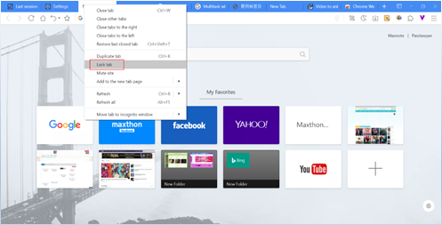

 

## Grouping Tabs

You could organize your tabs by

1. Grouping the tabs

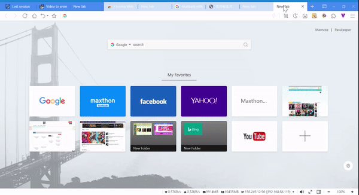

- Select a few tabs ( press Shift button to select more tabs ), right-click and select [ **Move tab to incognito window** ], [ **Move tab to new group** ];
- Click on the group tab to collapse the tabs and the top of the browser window will only show the group name and color selected. If you wish to expand the tabs, just click on the group tab name or color again.
2. Edit group tab

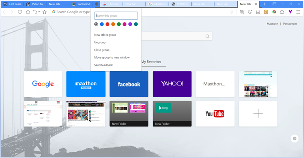

* If you wish to edit the group tab, right-click on the group tab name or color. You could:
    * Name your group
    * Add additional tabs to the group
    * Remove the group
* To add a tab to an existing group, drag the tab into the group.
* To remove a tab from a group, right-click on the tab, then select [ **Remove from group** ]

*Note: [ **Ungroup** ] means to ungroup and expand out all the tabs in the group while [ **Close Group** ] means closing all the tabs in the group.

## Restore closed tabs or windows

In the case if you accidentally close a tab or window, you could restore it via the following:

1. Click on the **Undo** button on the address bar, or use the shortcut [ Ctrl + Shift + T ] to open the last closed page;
2. Right-click on the **Undo**  button and you will be able to see the list of the closed tabs;
3.  Right-click on the **Undo** tab and select [ Restore last closed tab ];
4. Click on the **Menu** button at the upper right corner to open the menu, move the cursor to [ History ], click on [ Recently closed ] can also restore recently closed tabs or windows.

 

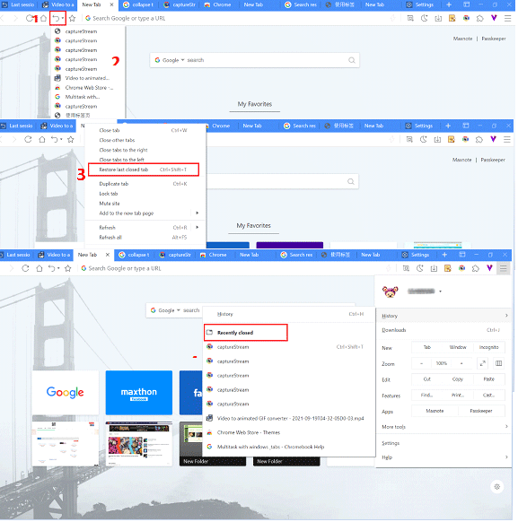

## Closing Tabs

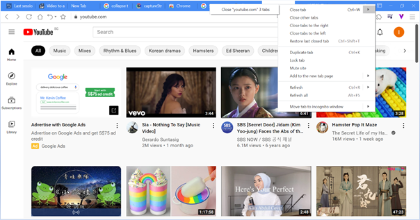

1. Move the cursor to a tab and click on close the button, or right-click and select [**Close tab** ]
2. Closing multiple tabs:
    * Right-click on the tab and select [ **Close tab** ] to show sub-menu, will close all tabs with similar URL;
    * Right-click on the tab and select [**Close other tabs**], will close all tabs except for the current tab;
    * Right-click on the tab and select [ **Close tabs to the right** ], will close all tabs to the right from the current tab;
    * Right-click on the tab and select [**Close tabs to the left** ], which will close all tabs to the left from the current tab.

 

## Force close non-responding tab or function

If a tab, a window, or an extension is not responding, you could use Maxthon task manager to close it.

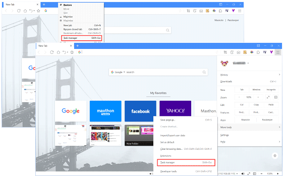

* Use shortcut [ **Shift + Esc** ]
* Right-click on the blank space on the address bar, select [ **Task Manager**];
* Click on the  button on the upper right corner, move your cursor to [ **More tools**] and click on [**Task Manager**]

