# Manage bookmarks

## To add, check and edit bookmarks while browsing websites

While browsing through web pages, you could easily bookmark the website by clicking on the star icon  on the address bar.

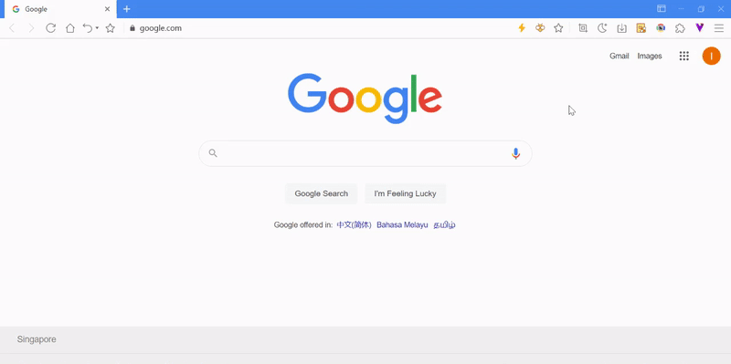

After the bookmark is added successfully, the bookmark icon on the address bar will be updated. By clicking on the icon again you could edit or remove the bookmark.

## Using the bookmark bar as a shortcut

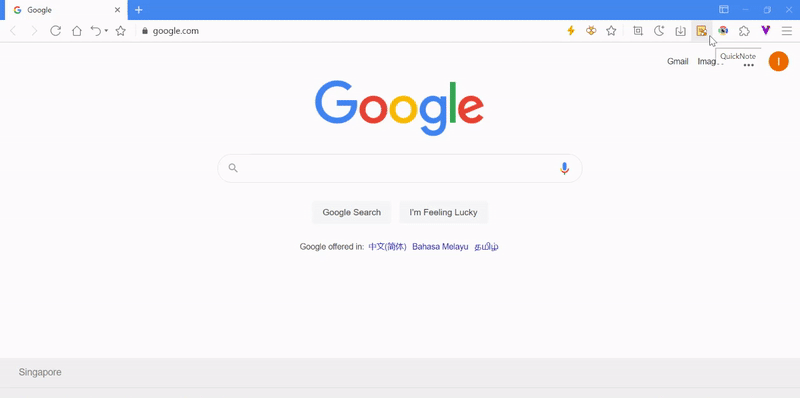

Click on the customize UI button on the upper right corner of the browser and select [**Show bookmark bar**] to show/hide the bookmark bar

Right-click on the bookmark bar for quick access to:

- View bookmark/open all the bookmarks in the folder
  - Open in new window
  - Open in incognito window
- Add page ( current website )
- Add folder
- Replace by current tab
- Edit
  - Delete
  - Cut
  - Copy
  - Paste
- Hide bookmark bar
  - Title only
  - Icon only
  - Title and icon

## Switching between bookmark menu and bookmark button

Other than the bookmark bar, Maxthon supports two methods to access bookmark quickly: use the bookmarks menu under the main menu to show the bookmark button. Once the bookmark button appears at the address bar, the bookmarks option in the main menu will be hidden.

## Using Bookmark Manager to organize bookmarks

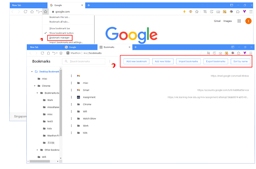

1. Select [ **Bookmark manager** ] in the main menu or on the address bar.
2. In bookmark manager, you will be able to organize your bookmarks in the following ways:
   - Add new bookmark
   - Add new folder
   - Import bookmarks
   - Export bookmarks
   - Sort by name: This sorting will affect the order of all the bookmarks

## Guide to use bookmark feature in Maxthon

#### Add a bookmark

1. Bookmark the current web page by clicking the icon on the address bar

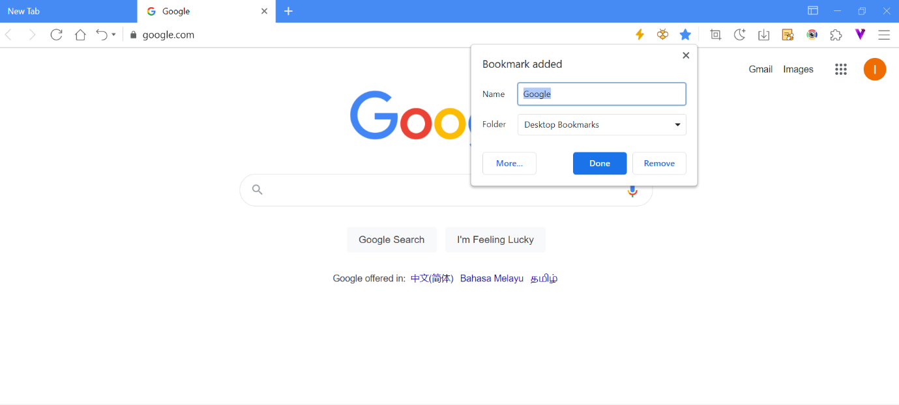

2. Right-click on the bookmark bar and select [ Add page ] to bookmark the current web page

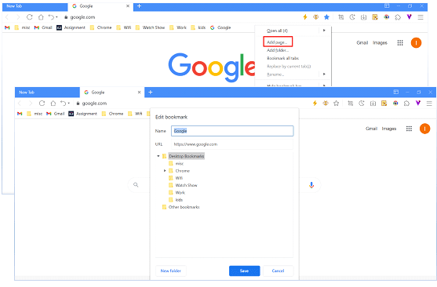

3. Select [ Bookmark this tab ] in the main menu or on the address bar

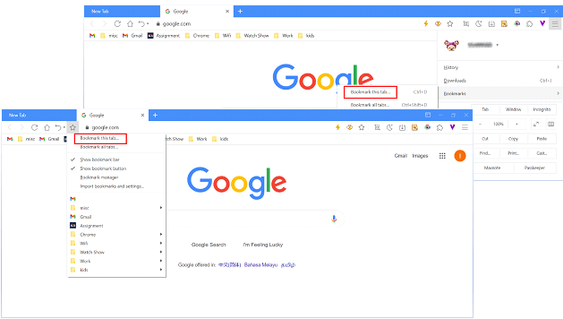

#### Find a bookmark

1. Open a bookmark in the current window

Click on the website URL that is stored under the bookmark bar, bookmark menu, or bookmark button to visit that specific website. The bookmark will be opened in a new tab. You could also do a right-click on the bookmark and select [**Open in new tab** ]

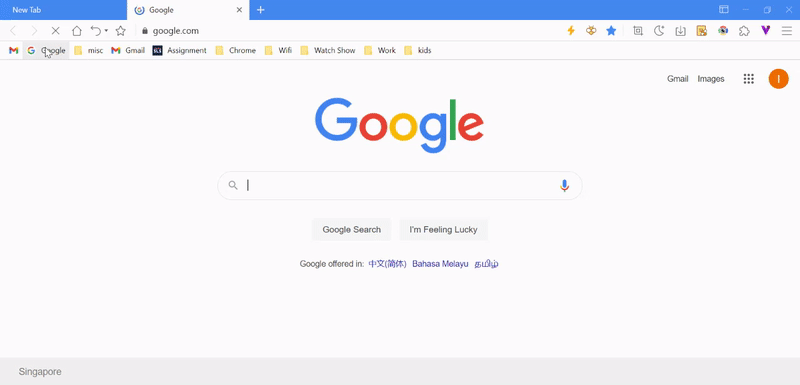

2. Open bookmark in new window

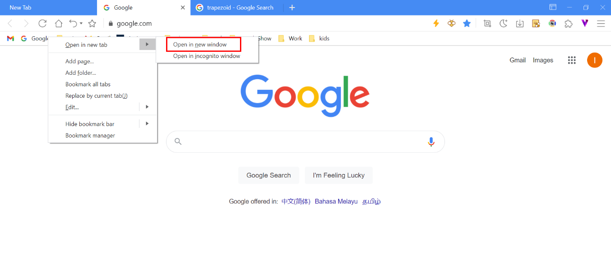

3. Open bookmark in incognito window

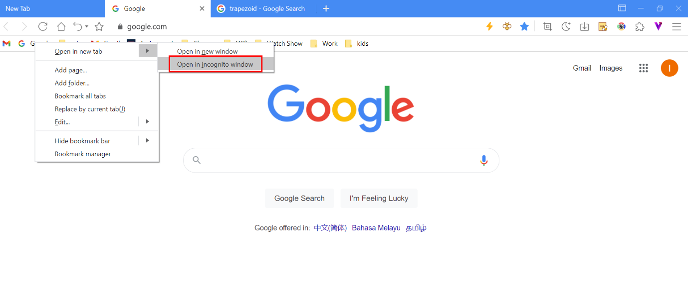

4. Open all bookmarks

Right-click on the bookmark folder that is on the bookmark bar, bookmark menu, or bookmark button and select [ Open all ( x number ) bookmarks ]. This will open all the bookmarks under the folder in a new window. Right-click on the blank area in the bookmark bar to open all the bookmarks.

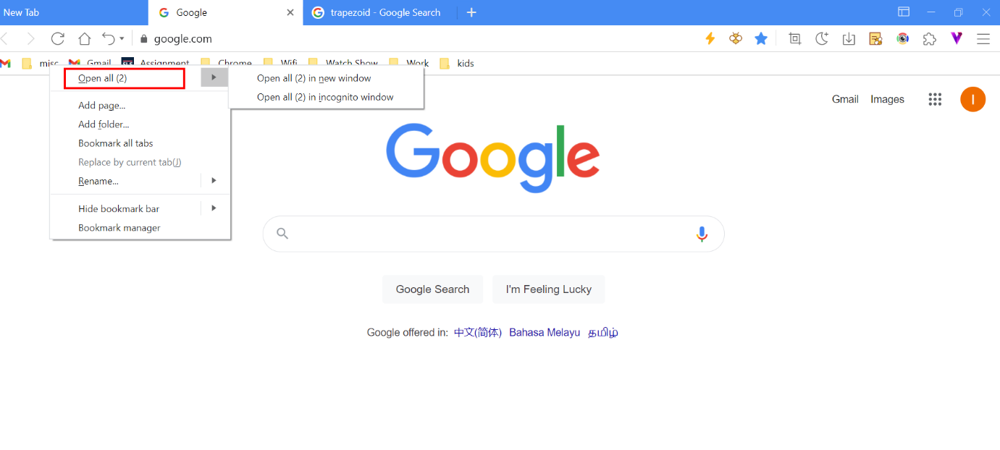

#### Edit bookmark

1. Edit current page’s bookmark

When the current page is saved to bookmark, the address bar will update the icon. Click on the icon again and you will be able to edit the bookmark’s name and folder.

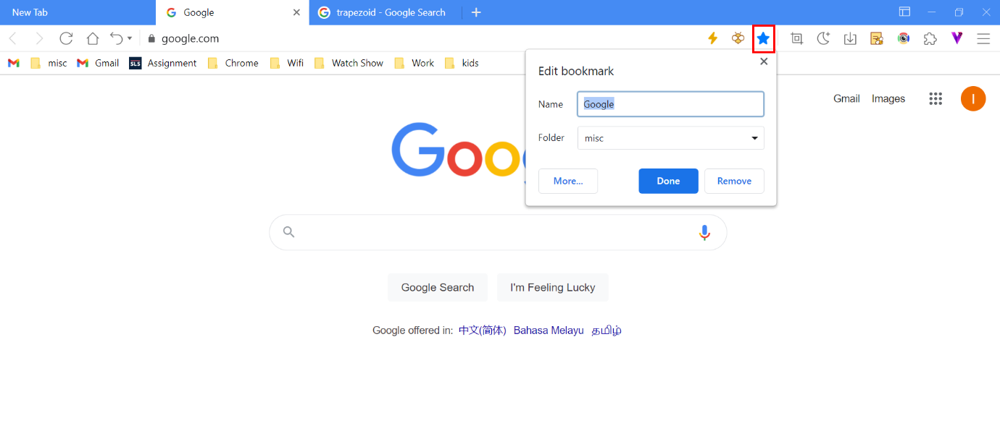

2. Right-click menu to edit bookmark

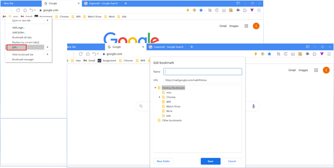

3. Using bookmark manager to edit bookmark

Go to bookmark manager and click on the button, select [**Edit** ] to edit the bookmark name and URL.

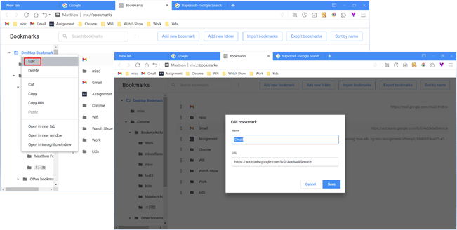

#### Delete bookmark

1. Deleting the current page bookmark

When the current page has been bookmarked, clicking on this icon again and you will be able to remove this bookmark.

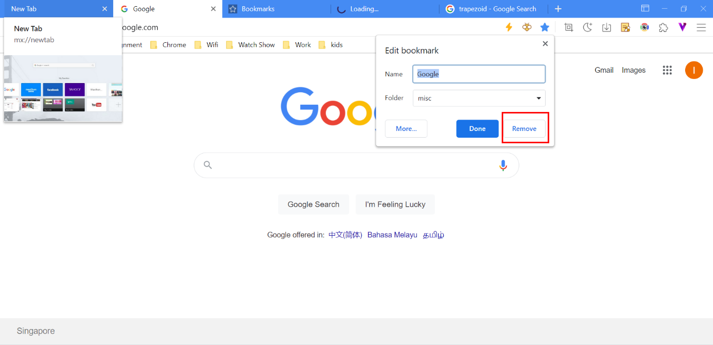

2. Right-click on the menu to delete a bookmark

Under the bookmark bar, bookmark menu, and bookmark icon, right-click on the bookmark and select [**Edit**], followed by [**Delete**] to delete the bookmark.

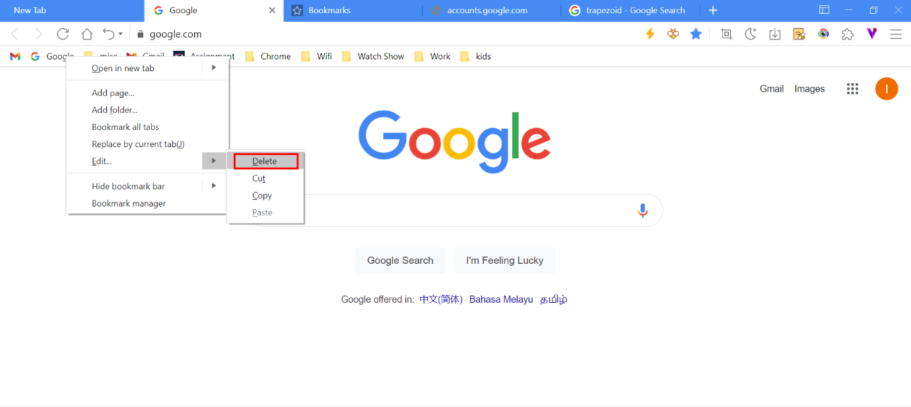

3. Delete bookmark in bookmark manager

Go to bookmark manager and click on the button right beside the bookmark and select [ **Delete** ]

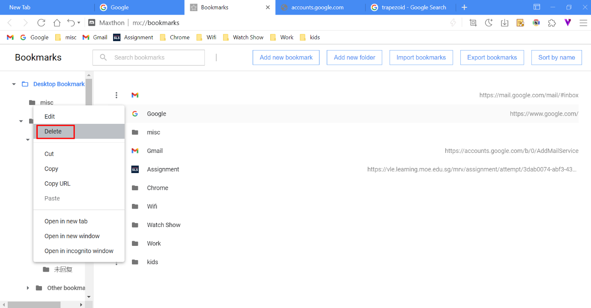

#### Bookmark folder

You could organize your bookmarks by creating folders in the Maxthon browser.

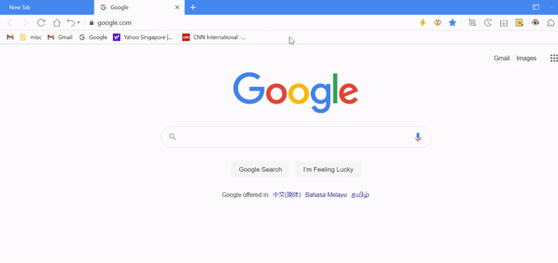

Create a new folder by right-clicking on the bookmark bar or in the bookmark manager. You could also add a new folder when adding/editing a bookmark.

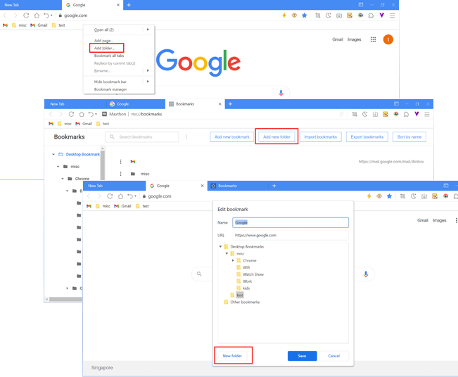

> Note: When a folder is deleted, all the bookmarks in the folder will be deleted as well.

#### Organizing the order of bookmarks

1. Drag and drop

You could drag and drop the bookmark to rearrange the sequence in the bookmark bar, bookmark menu, and bookmark manager.

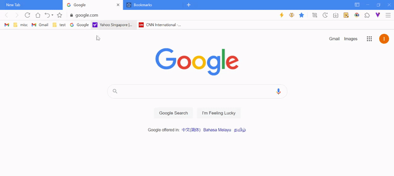

2. Sorting by name

Click on [ Sort by name ] located at the top right-hand corner in bookmark manager and bookmarks will be sorted in alphabetical order. If you would like to revert to the original order, you could click [ Undo ] that is located at the bottom left side.

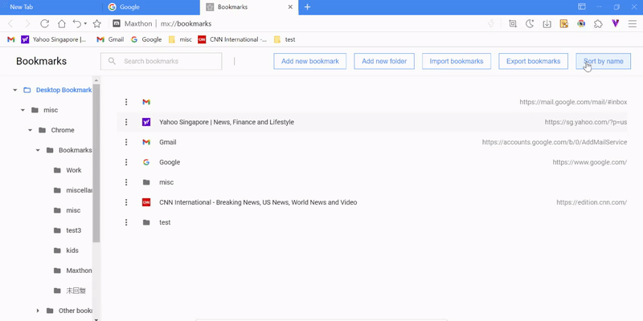

#### Replace by current tab

Visit the new website for replacement, right-click on the bookmark you would like to replace with, and click on [ **Replace by current tab**]. The bookmark will automatically be updated to the new title and URL.

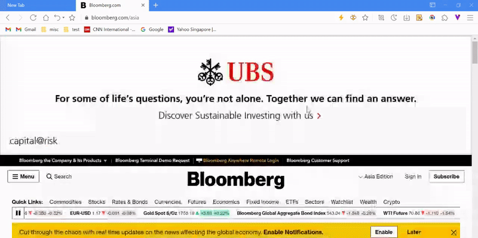

#### Cut, Copy and Paste function of bookmarks

Right-click on the bookmark, move the cursor to [ Edit ] on the menu and you will be able to perform the [ Cut ], [ Copy ], or [ Paste ] function to organize your bookmarks.

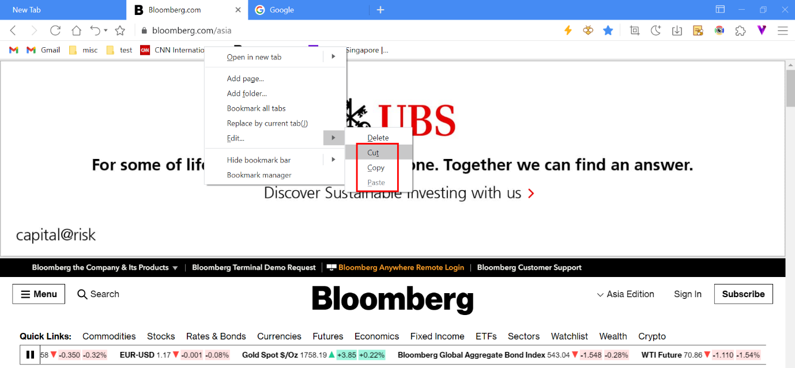
