# VBox <!-- {docsify-ignore} -->

## **VBox enables the user's blockchain identity**

### With VBox <!-- {docsify-ignore} -->

You can

- get an unblockable ID - NBdomain
- pay or get payments
- have access to endless blockchain apps

## What Is Vbox?

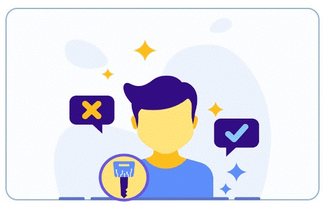

Vbox is a tool for managing blockchain identities. It can help you build encrypted identities on the local device with a simple password. All of the blockchain apps can apply for the signature and the payment via Vbox.

## Register Vbox Cloud And Get A Free NBdomian

- At the top right of the browser, click the Vbox icon  to open the Vbox app.
- On the Vbox startup page, click Sign up Vbox cloud.
- There are two ways to join the Vbox cloud: by mobile phone number or by e-mail address.
- It is highly recommended that you register the account with your mobile phone number. Because you can get a free NBdomain by registering with your phone number.
- NBdomain is a blockchain domain name and a global ID. More info on NBdomain can be found at https://nbdomain.com and https://medium.com/@nbdomain
- You can get the free domain later if you sign up with your e-mail. But a mobile phone number is still needed.
- After registration, you need to customize the ID remark and password, then you will be all set.

## Apply for the Free NBdomain

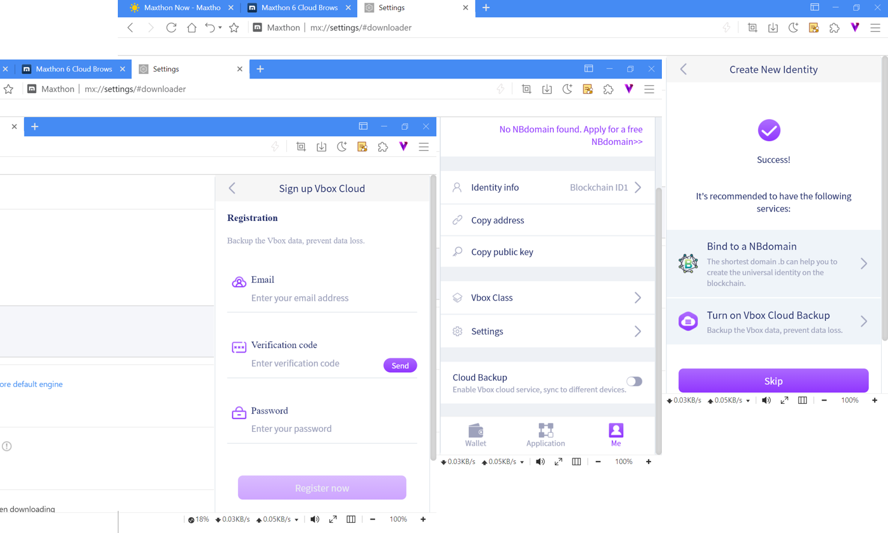

Apply for NBdomain:

- Vbox users can apply for the NBdomain for free with a phone number.
- You can click **Bind to NBdomain** on the registration success page or apply it on the from Vbox > Me.

## Bind NBdomain & Personalize NBdomain

One Vbox ID can bind multiple NBdomains, and you can choose one of them to use as the identity name. To manage it, you can open ME > Bind to an NBdomain to view and customize. 

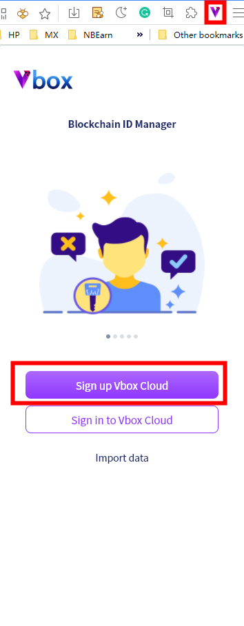

The free NBdomain is a string of numbers. If you want to apply for personalized NBdomains, click **Apply for more super domains** on [Bind to an NBdoamin] page. You can also log in to https://app.nbdomain.com/ to register.

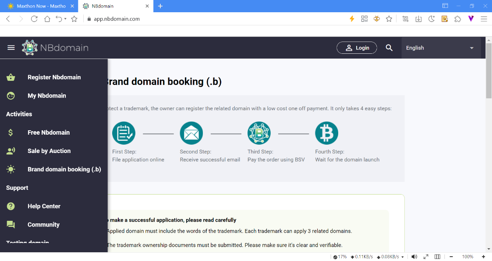

Search the domain you want to register, and if it is not already registered, you can apply for it.

Note: The newly purchased domain name will be bound to the wallet address you use for payment. If you want to modify it, you can use the **Transfer** command in the NBdomain manage page after the successful registration.

## Change NBdomain Avatar

You can set a Avatar of a NBdomain and It will be used as the avatar of your Vbox ID.

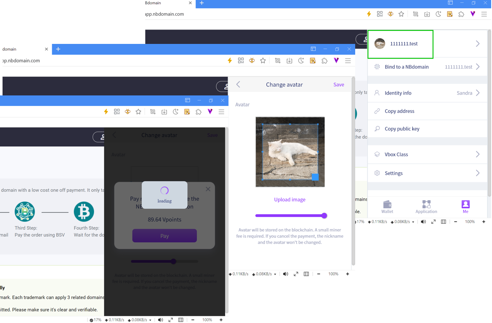

Open ME, then click the domain to customize the avatar.

Note: This operation will storing information on the blockchain and requires a little miner fee. It will be deducted directly from the current account after confirmation. The insufficient balance will cause the modification to fail.

## Manage Digital Assets

Vbox wallet can help you to manage the blockchain assets - Vpoints.

1V point = 1 millionth BSV

Using Vbox wallet can view the total amount of real-time assets and transactions, click on a single transaction to open Transaction Details, where View >> can also open the on-chain transaction details page.

## Vpoint Collection & Top-up

Open Vbox, click Receive to display the collection QR code. Other parties can transfer money through this code.

If you want to buy some Vpoints, you can click Top up Vpoint.

After transferring money to the specified QR code, click Payment Complete, enter the verification code, and click on Confirm to get Vpoints.

## Vpoints Transfer

Open Vbox, click Send to enter the Transfer page, then enter the transfer address or NBdomain.

You can leave a message for each other while transferring money, and the message will display as a conversation in the transaction message.

## Switch Vbox ID

You can create multiple Vbox IDs in Maxthon, and every ID has the individual private key and payment address. The private key and payment address info cannot be modified.

Open Vbox > Me > Identity info, enter Manage Identity:

- Create a new identity: create a new Vbox ID, get the private key and wallet address
- Switch current identity: after switching the identity, it will auto-refresh and display on the external card
- Edit identity 
    - Change remark: change the ID remark 
    - Delete identity: delete all ID information, including encrypted data; the identity can not recover after deletion; please use this function carefully.
 
 At the top of the wallet, you can click the identity to switch it quickly.
  

## Sign in with Vbox

Vbox can be used for identification and signature, and it can be seen as a private key manager. When a website needs to use the private key as authentication for login or authorization, without passing the actual private key to the third-party application, Vbox can perform cryptographic verification and signature for you to prove your identity and asset ownership.

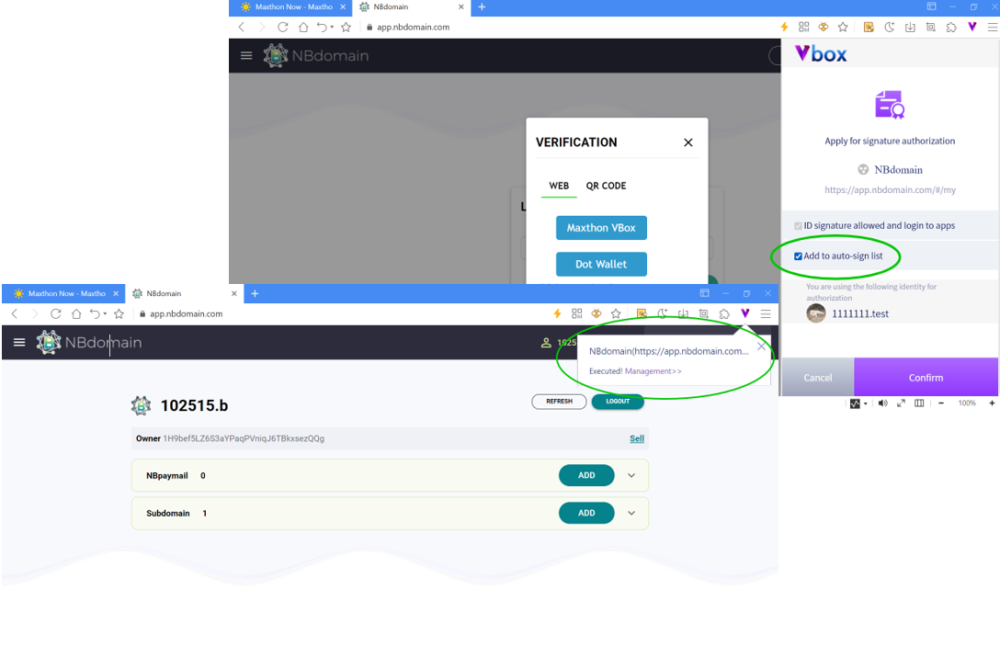

Note: When authorizing, check Add to auto-sign-in list; then Vbox will do the authorization for you automatically in the background in the future for such dApp.

## Use Vbox Payment

One of the core functions of Vbox is to serve as a BSV wallet that responds to BSV payments in the application and completes them quickly.

When making a BSV third-party payment, if you are using Maxthon, you can select Vbox for payment:

1. You can switch the identity to any local wallet.
2. After checking Add to autopay list, payments from this application/domain for transactions within the automatic payment limit can be completed automatically in the background without password verification.

## Authorization & Password-free Settings

Open Vbox > Me > Settings > Auto sign-in/ Automatic payment

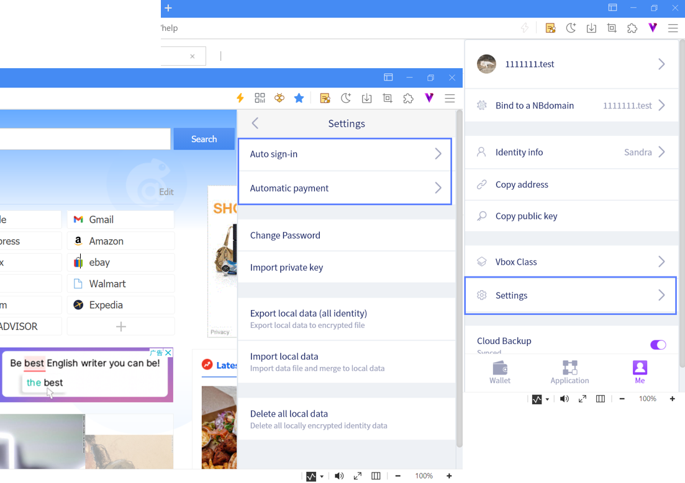

#### Manage Auto Sign-in

1. Items that checked Add to Auto sign-in at the time of authorization will be automatically added here.
2. In addition, you can add a website or application to the Auto sign-in list by the domain.
3. Click on the list item to modify the item domain or remove it from the list.

#### Manage Automatic Payment

1. Items with Add to Auto-pay list checked during the third-party payment will be added here automatically; in addition, you can add websites or applications to the Auto-pay list by the domain.
2. Set Password free limit, the upper limit of the auto-pay, the transaction over this limit needs to be confirmed with the password, and the default is 100 Vpoints.
3. Set Everyday limit of the password-free, the total limit of using free payment per day, the accumulated amount over this limit needs to use password to confirm, the default amount is 1 million Vpoints (1BSV)

## Create Identity by Importing Private Key

If you have the BSV wallet, you can import the private key in Me > Settings > Import private key, then create a new Vbox identity.

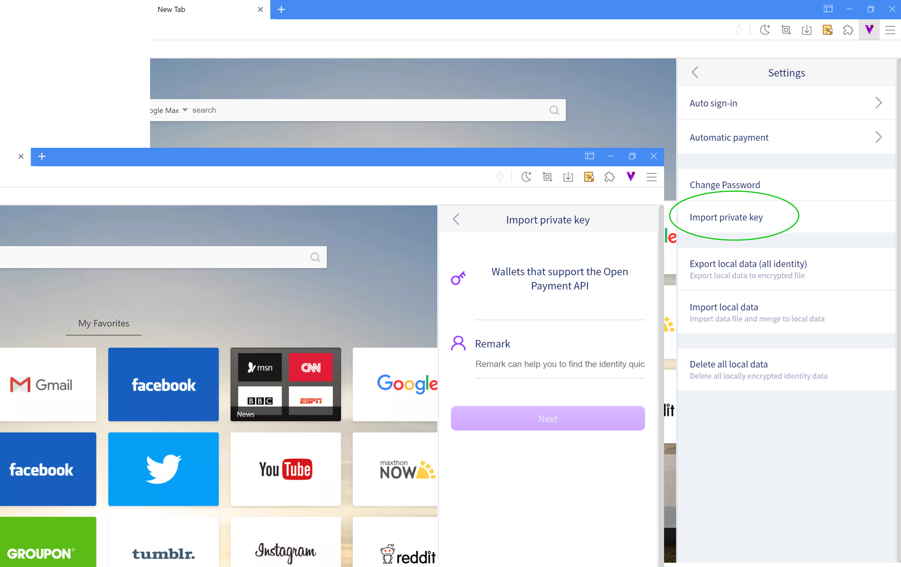

## Auto-sync

For avoiding data loss, Vbox provides the data sync function.
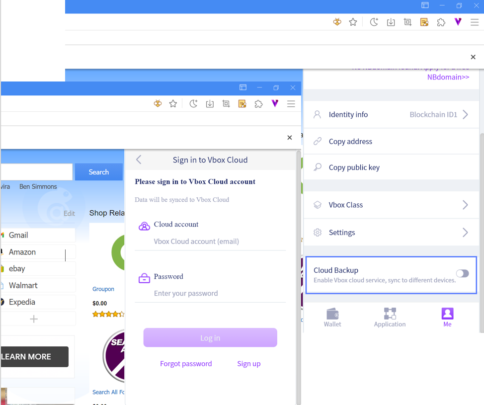

- Open Vbox > Me > Cloud Backup, sign in to your Vbox account.
- Using the Vbox Cloud account, you can sync Vbox identity with multiple devices.
  
  Note: Vbox Cloud account can sync all local data and save all identities. If the local data is not the same as the local data, it will merge the local data to the Cloud data to avoid data loss.

## Import/Export Vbox Local Data

Besides using the cloud backup feature, you can also maintain data security by importing/exporting local data from Vbox. Open Vbox > Me > Settings, select Export local data to export all identity data (.v) files; select Import local data to open the identity data (.v) files saved on the local, and the imported data will be merged with the local data to protect data security if there is any difference.

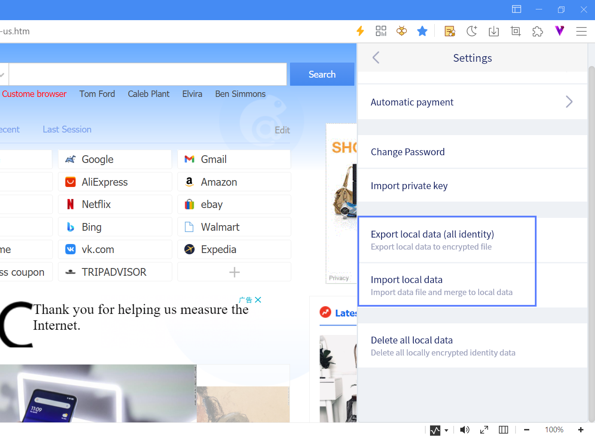

## Clear Vbox Local data

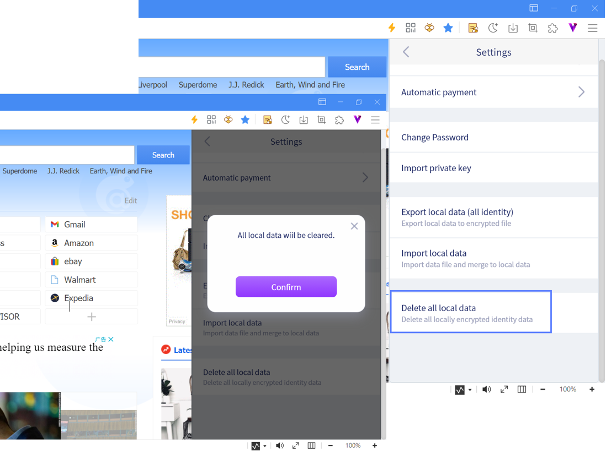

Open Vbox > Me, click Delete all local data, it will clear all local data and restore the Vbox to the unactivated status. Local data cannot recover after deletion, and please use this feature carefully.

Note: If you turn on the Vbox Cloud account, it will pop up the window to let you confirm to delete the Cloud data or not; if you check it, the Cloud data will be deleted also. If you uncheck, the account will turn off sync automatically, then clear the local data.
