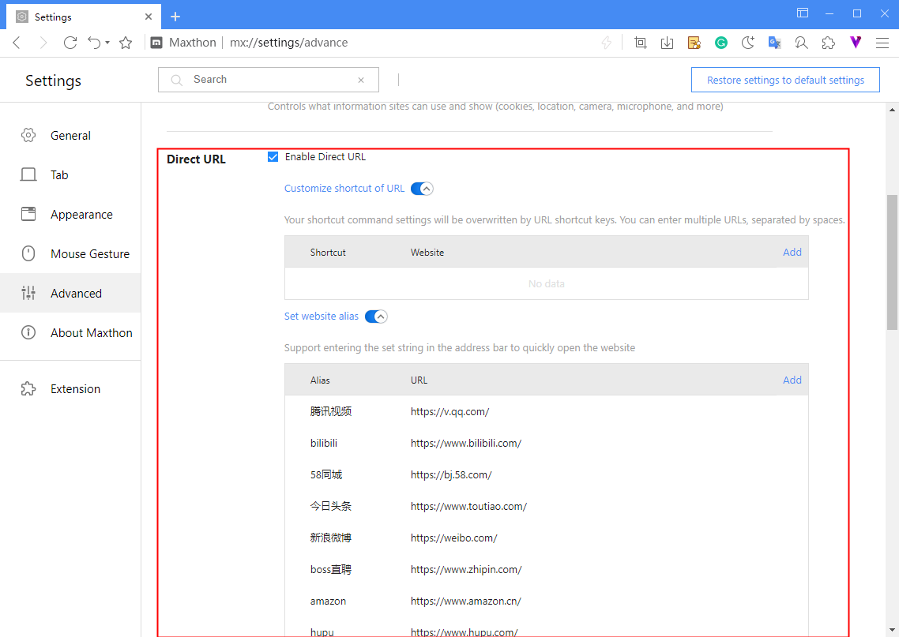
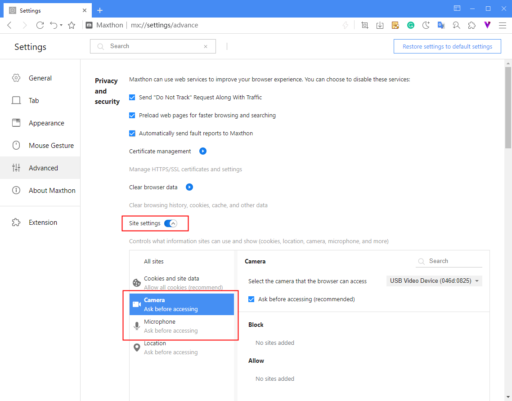

# Settings

## Font

Select the Appearance tab in the setting page to customize the font size. (mx://settings/appearance)

Tip: the most comfortable font size for online reading is 13 ~ 14, which is the recommended medium font. If you find it difficult to read, you can adjust to large font, but it may affect the appearance of some web pages.

## Language

Maxthon 6 supports 55 languages. Select the **General** tab on the settings page, find the **Language** section, and switch the current browser language there. (mx://settings/)
You can add backup languages to the language list through **add language**, and quickly switch languages through the drop-down list above.

## Direct URL

Maxthon 6 supports the Direct URL function as before. Select the **Advanced** tab and find the Direct URL.(mx://settings/advance)

- Customize shortcut of URL: Your shortcut command settings will be overwritten by URL shortcut keys. You can enter multiple URLs, separated by spaces.
- Website alias: Support entering the set string in the address bar to quickly open the website.

## Cameras & Mics

When you use Maxthon to open a website that requires a microphone or a camera,you will be prompted to select allow or block.

- Allow: when you go to the websites in this list, this web page can start recording. If you are browsing another tab or using other software, this site will not be able to start recording.
- Block: some websites will not work properly after being blocked. For example, you will not be able to participate in a video conference on the web if the conference site you use is blocked.

#### Modify Permissions

Select **Advanced** -> **Privacy and security**, click the site settings button at the bottom of this region and modify the permissions.(mx://settings/advance)

## Modify the Cache path

(mx://settings/advance)
If your system disk (commonly C drive) has not had enough spare space, and the system speed is generally slow, you can optimize it by modifying the browser cache path.
Go to **Advanced**->**Cache path**, click **Modify** to set a new folder in another disk for browser cache.

