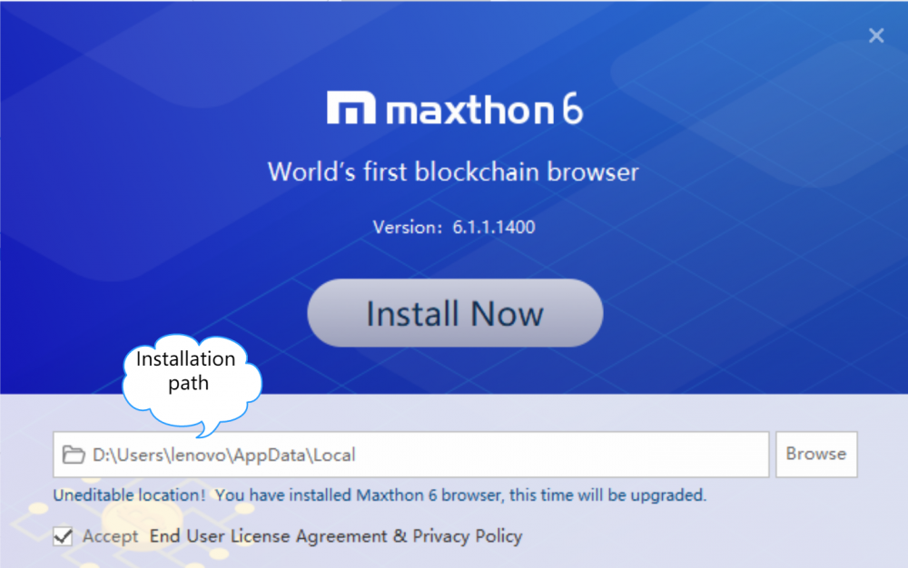
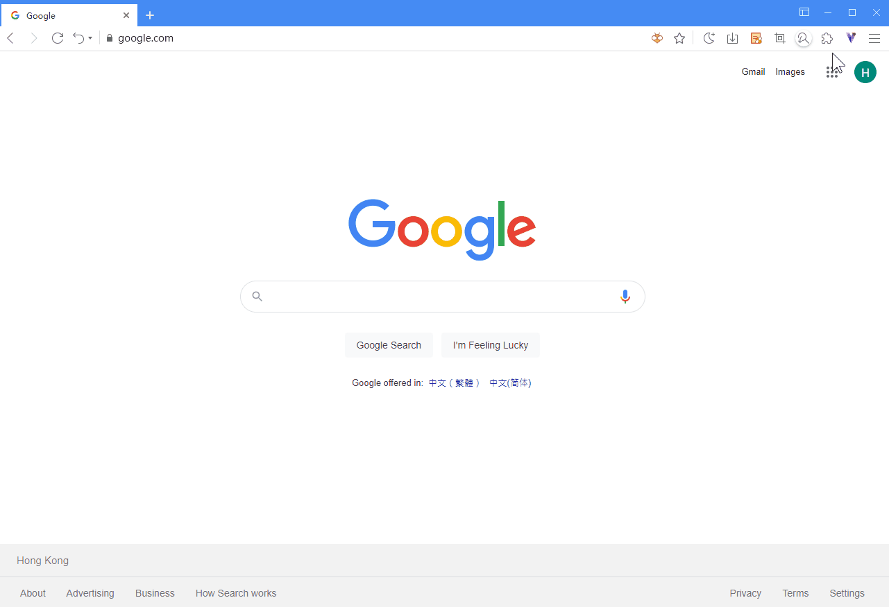
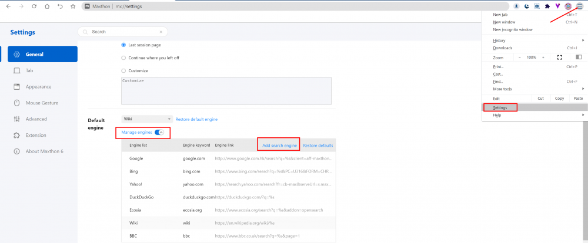
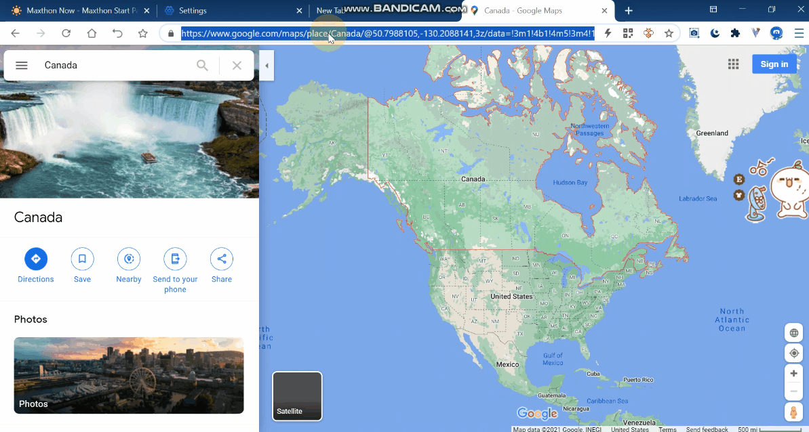
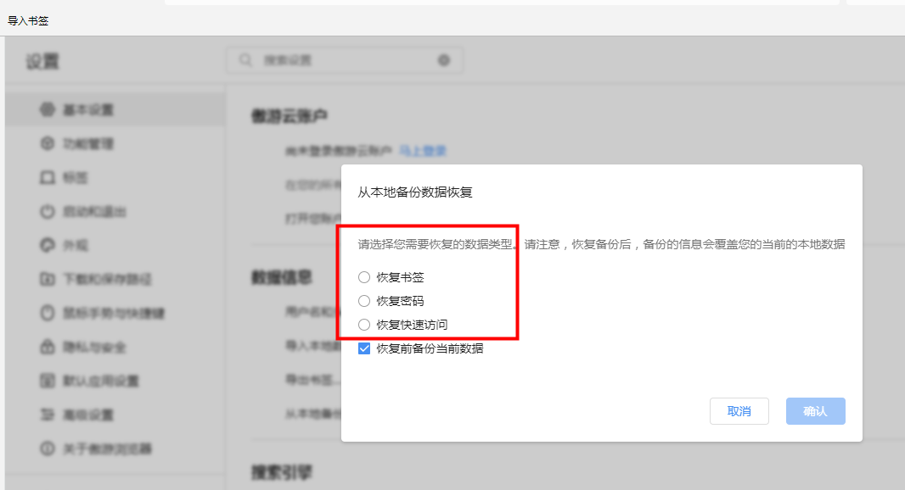
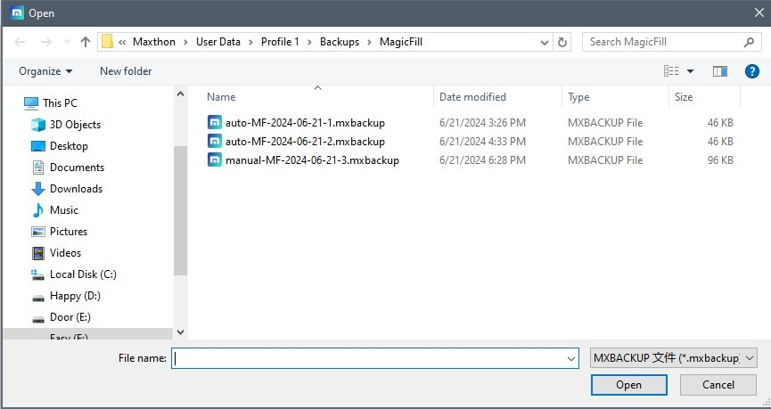

# FAQ

## Browser Crash Handling

- What are the common causes of browser crashes and How to fix?:

  - Too many pages opened that caused resources cost beyond system limits;    
  **Fix:** Close the page that consume most system resources, such as video playing page or gaming page.  

  - Residual process is locked which lead to the browser failing to start or crash;  
  **Fix:** Open task manager to check whether there is a residual Maxthon process. If so, it is necessary to forcibly end the process. If it cannot be ended, restart the computer and then try to restart the browser;  

  - The extension installed is unstable which causes the browser to crash;  
  **Fix:** Try to disable all extensions and restore them one by one to find out the problematic one.

  - The Account abnormal data causing the crash or stuck;  
  **Fix:** Try to switch to **Guest** account or another account.

  - Other software (especially anti-virus software) interception cause the browser to crash;  
  **Fix:** Try to disable anti-virus software temporary. If problem solved, you may want to report to them. 

- Other methods you can try

  1. Try upgrading to the latest version of the Maxthon browser. You can go to the [Maxthon forum](https://forum.maxthon.com/) to check whether it is the latest version.
 
  2. Check whether the current computer has too many open programs, memory occupancy, or high CPU occupancy, which may cause the browser web page stuck. You can close some software to release resources. Show the display status bar in the appearance settings to check the CPU occupancy of your computer at any time.

  3. If the problem still persists, please contact us in the forum where some community member may give you more advices.

## How to Make Maxthon Faster

Various reasons will slow down the browser. Generally, there are several methods to solve this problem.

- Browse using [Incognito mode](05-browse?id=incognito-mode)
- Delete browser cache file
- [Change the cache folder storage disk of the browser](14-setting?id=-modify-the-cache-path)
- Delete unnecessary history (MX://History)
- Each add-on uses a separate process, it will affect the browser speed while improving the user experience, causing the browser stuck. Closing the add-ons that are not in use can greatly alleviate this problem.
- Using VPN or proxy services will slow down the speed of opening pages. If there is no special need, turn off the VPN service.

## Report Problems or Send Feedback on Maxthon

If you encounter any problems during your use, please give us feedback so that we can contact you as soon as possible.
You can access the [Maxthon feedback page](https://www.maxthon.com/mx/bug/post/), fill in the feedback form online. Open the main menu by clicking more buttons in the upper right corner and selecting help > feedback will access the feedback page as well.

## what systems does Maxthon support

- Maxthon PC version supports Windows 7 and above (including Win7 / Win8 / Win10 / Win11 versions), both 32-bit and 64 bit systems.
- Maxthon Android supports Android 5 and above
- Maxthon iOS supports iOS10 and above
- Mac and Linux users can use the [historical version of Maxthon](https://www.maxthon.com/mx6/history/).

## How to Modify the Installation Directory

#### Modify the installation directory during the first installation

In the installation interface, click the folder icon on the right of the path and select the path you want to install. [Check the start file to see more](01-start)

#### The installation directory needs to be modified after installation

Maxthon only supports modifying the installation path in the installation interface. After the initial installation, if you want to modify it, you need to uninstall and install it completely again. Anytime you need to reinstall, please log in to your Maxthon account, synchronize your data before the reinstall, so that your data will be completely retained.
If you move the folder directory directly, you may encounter problems when uninstalling the browser later. 

## How to Enable extensions

- Click the puzzle fragment icon on the right side of the address bar to open the add-on pop-out window. The add-ons enabled are showed there.
- Click the manager button with the cog icon under the floating window or directly open MX://extensions to view the list of add-ons you have installed. Enable, close, or set the detailed permissions of each extension here.
  

Some extensions can be enabled by pre-set shortcut keys. You can directly enter the shortcut keys to enable it.

## How to Add a Custom Search Engine

#### Modify search engine

- Enter the settings page, click the drop-down list in Generals > Search engine to switch to the default search engine.
- Expand the manage engines button to add, delete and modify search engines.

#### Add search engines not included in Maxthon

1. Go to the search engine you want to add.
2. Search for something.
3. Copy and paste the web address of the search results page into the URL field. The address for the search results page is different from the website address.
   - For example, if you search for "soccer," the Google search results URL is http://www.google.com/search?q=soccer.
4. Replace the search term in the URL with `%s`.
   - For example, if you were using the Google search results URL, your search engine address would be `http://www.google.com/search?q=%s`.

## Can Maxthon 5 data be Synchronized to the new Maxthon?

Using the Maxthon account, you can migrate the data in the account Maxthon 5 to Maxthon when installing Maxthon for the first time, while preserving the independence of the data in Maxthon 5.
After this synchronization, the data of Maxthon 5 and Maxthon cannot be interconnected again.
However, the content in Maxnote is always synchronized under the same account.

## How to Recover Lost Data
1. Click the "☰" icon in the top right corner of the browser and select "Settings".
2. In the settings, navigate to "Basic Settings" -> "Data Info" -> "Restore Information from Local Backup".
3. You can choose to restore bookmarks, quick access, or passwords:

4. Select the data item you need to restore, and the system will automatically open the backup folder. The backup folder will display the backup time. Please select the file based on the time. Click the file and then click "Open".

5. After selecting the backup file, the system will automatically restore the backup file. Please note that after restoring the backup, the backup information will overwrite your current local data. The system backup data in the backup folder will be marked "manual".
⚠️ If you need to manually back up the current local data in advance, you can back it up in the following file paths:

- **Bookmarks**: Click the "☰" icon in the top right corner of the browser and select "Settings". In the settings, navigate to "Basic Settings" -> "Maxthon Cloud Account" -> "Open Your Account's Local Folder". In Windows, it will directly open the local profile folder of your account. In the opened file manager, find the "Bookmarks" file. If you need to back up before restoring data, you can copy this file and save it elsewhere.
- **Quick Access**: Click the "☰" icon in the top right corner of the browser and select "Settings". In the settings, navigate to "Basic Settings" -> "Maxthon Cloud Account" -> "Open Your Account's Local Folder". In Windows, it will directly open the local profile folder of your account. In the opened file manager, find the "QuickAccess" folder, which contains your quick access data. If you need to back up before restoring data, you can copy these files and save them elsewhere.
- **Passwords**: Click the "☰" icon in the top right corner of the browser and select "Settings". In the settings, navigate to "Basic Settings" -> "Maxthon Cloud Account" -> "Open Your Account's Local Folder". In Windows, it will directly open the local profile folder of your account. In the opened file manager, find the "MagicFill" folder, which contains your encrypted Passkeeper data. If you need to back up before restoring data, you can copy these files and save them elsewhere.

#### How to recover **PassKeeper** after data loss

If the **PassKeeper** data is lost, log in to http://www.uu.me and enter **PassKeeper**. There is a View Backup button at the bottom. You can restore your password to any backup in 30 days.

## About Web Indexing ( powered by Bright Data)

You will get extra golds in exchange for safely using some of your device’s resources, and only in a manner that will not substantially affect the device's operation (you can see exactly how on [https://bright-sdk.com/faq#sdk_app_connect](https://bright-sdk.com/faq#sdk_app_connect)). You may turn this off from the settings menu. Please see our [TOS](https://www.maxthon.com/en/docs/eula/) and the SDK Privacy Policy at [https://brightdata.com/legal/sdk-privacy](https://brightdata.com/legal/sdk-privacy) for further information.

