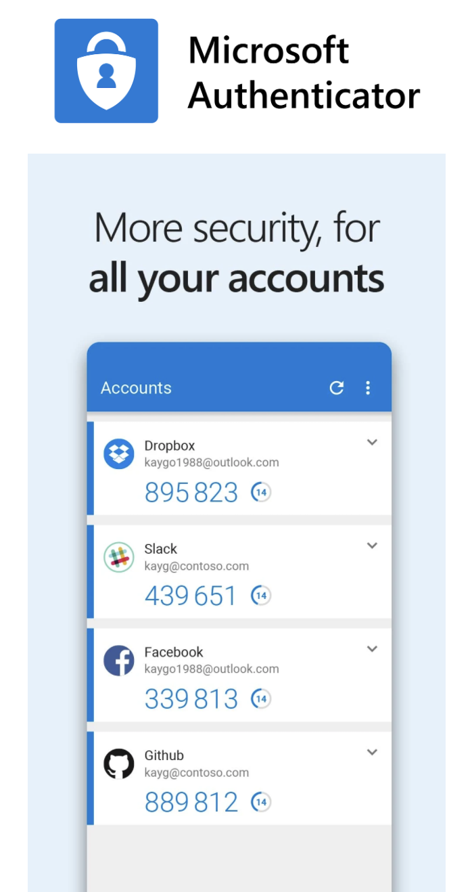
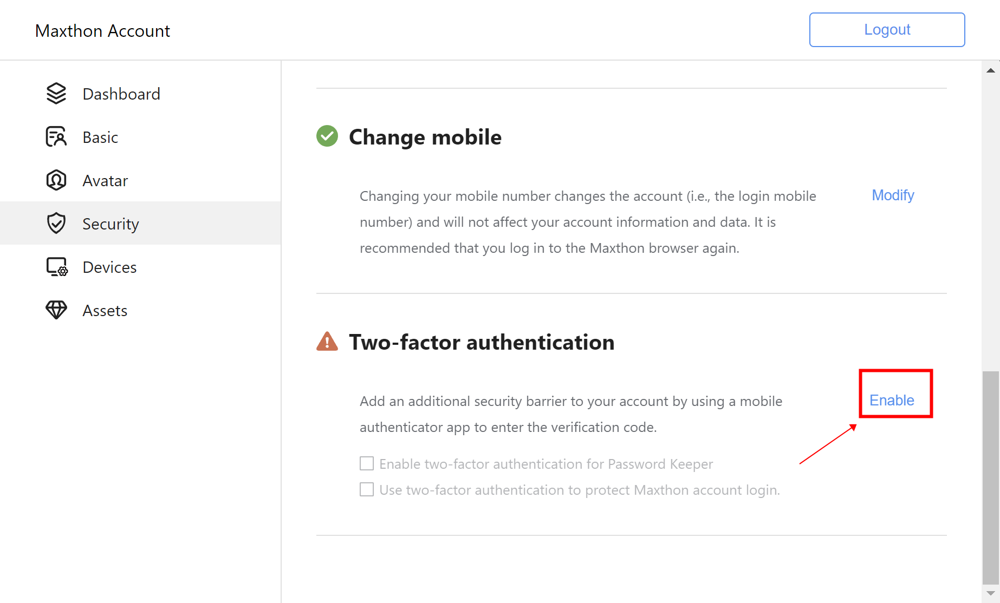
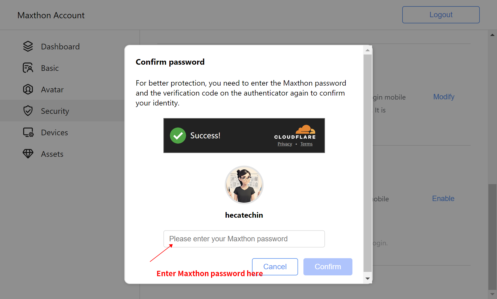
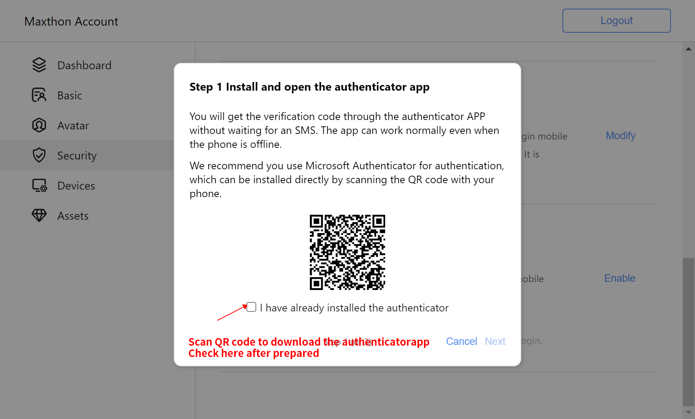
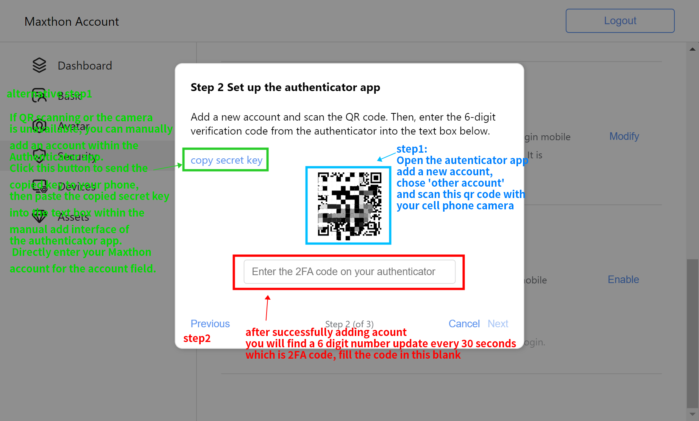
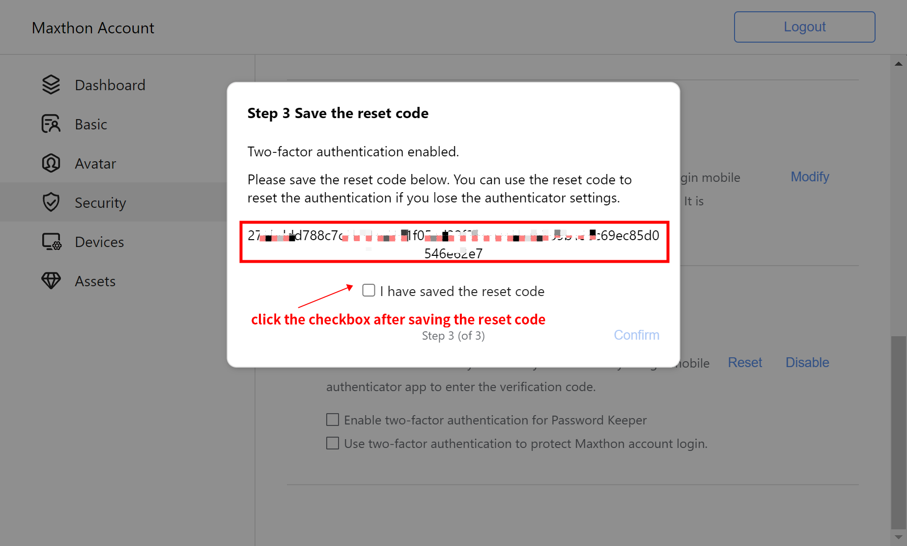
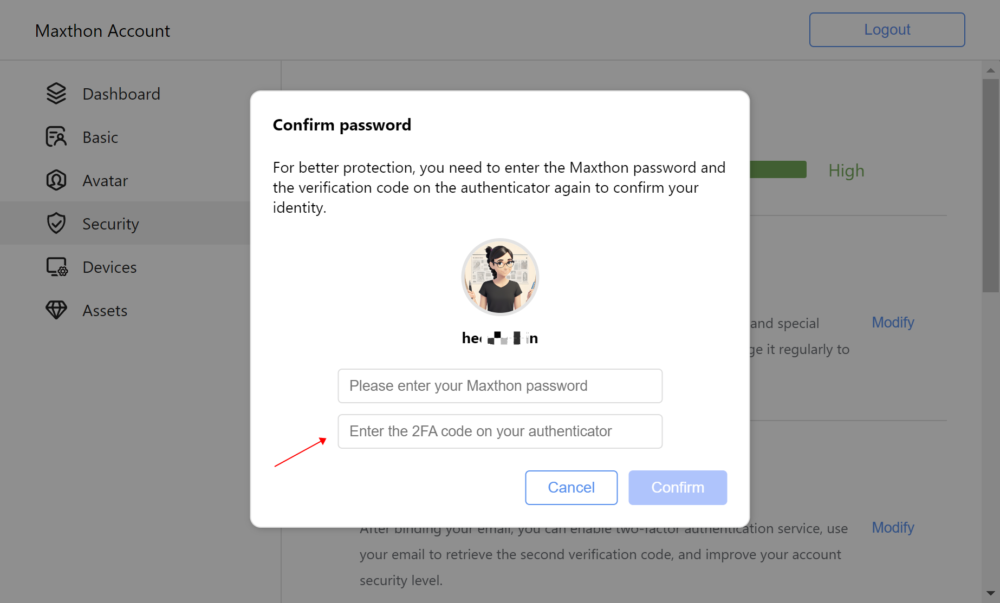

## Two-Factor Authentication (2FA) Feature

This document provides a detailed introduction and user guide for the two-factor authentication feature of Maxthon Browser, aiming to help users enhance the security of their accounts. With two-factor authentication, even if someone obtains your password, without the second verification, they will find it difficult to log into your account.

### What is Two-Factor Authentication (2FA) ?

Two-factor authentication (also known as 2FA) is a security measure that requires users to provide a second form of verification information in addition to their password. This often involves receiving a text message with a verification code or using a dedicated authenticator to generate a code.

#### What is an Authenticator?

An authenticator is an application that generates secure verification codes for the two-factor authentication process. We recommend using the **Microsoft Authenticator** app, which can generate a temporary, periodically changing digital code for login verification.

#### Verification Code, Secret Key, and Reset Code

- **Verification Code**: A one-time, periodically changing digital password generated by the authenticator. It's typically regenerated every 30 seconds and used for verifying identity during login or when performing sensitive operations.
- **Secret Key**: A special string used to generate one-time passwords (OTPs), ensuring that even if a password is compromised, attackers cannot bypass the two-factor authentication to access your account without this key. During the authenticator addition process, you can manually enter the key to add an account or use a QR code scan. The key is provided to the authenticator app via the QR code.
- **Reset Code**: A string provided by the system after successfully setting up two-factor authentication, used to reset the two-factor authentication settings if you lose access to your authenticator. This code is very important and should be securely stored.

### Enabling Two-Factor Authentication

#### Preparation

Before enabling two-factor authentication, please ensure that your Maxthon account is linked to both a mobile number and an email address.

#### Activation Process

1. **Identity Verification**
   - Path: Maxthon Account -> Account Security -> Two-Factor Authentication section, click "Enable".
   - 
   - First, verify your Maxthon account password to confirm your identity.
   - 

2. **Download Authenticator**
   - Scan the QR code displayed on the page to download the Microsoft Authenticator app from the app market.
   - 

3. **Set Up Authenticator**
   - **In the authenticator app, tap "Add new account" or click "+", select "Other account", and the app will activate the camera. Use your phone's camera to scan the QR code on the Maxthon account page to add your account.**
   - If QR code scanning is not available, you can opt to manually enter the account and secret key. Click on manual addition below the app scanning interface. Enter Maxthon (or your account name) and then fill in the secret key provided in the Maxthon account's authenticator dialogue box (copy the key from the dialogue box, send it to your phone via instant messaging software, and paste it in the secret key text input field on the authenticator app's account addition page).
   - **After successful addition, if the interface does not display a verification code, you can click on the corresponding account to enter its subpage, where the authenticator will generate a 6-digit numeric verification code. Enter this code in the verification code input box on the Maxthon account dialogue box to complete the binding process.**
   - 

4. **Secure the Reset Code**
   - After successful binding, the system will email you a reset code, which is critical for resetting your two-factor authentication if you lose access to your authenticator. **If you do not receive the reset code in your email, please check the spam folder.** The email subject is Important: Reset Code for Two-Factor Authentication from Maxthon Account
   - 

5. **Refresh the page to verify that 2FA is effective**
   - After binding, please refresh the account page. Then, click once to check the two-factor authentication protection for Password Master. If the confirm password dialogue box requests a two-factor verification code, then the binding of two-factor authentication is successful. If you do not wish to enable this feature, simply close the dialogue box.
   - 

### Using Two-Factor Authentication
- **Secure Account Operations**: When performing account security-related operations, if you have enabled two-factor authentication, you will be asked to enter a two-factor verification code. Open the authenticator (we recommend using Microsoft Authenticator; if you are using a different authenticator app for 2FA binding, please open the corresponding authenticator app), find your Maxthon account in Authenticator, click to enter the account, and the six-digit number displayed under "One-Time Password Code", which updates every 30 seconds, is your two-factor verification code.
- **Protect Login**: In the Two-Factor Authentication settings under "Account Security", enable "Protect Login". Subsequently, each time you log in, in addition to the password, you will also need to enter the verification code generated by the authenticator.
- **Protect Password Master**: After enabling this option, accessing the Password Master (Maxthon's password manager) will also require two-factor authentication.

### Managing Two-Factor Authentication

#### Disabling Two-Factor Authentication
- If you wish to disable it, go into the Two-Factor Authentication settings, enter your password and the current verification code to pause this feature. After disabling, previous authenticator bindings remain valid and can be used if re-enabled.

#### Resetting Two-Factor Authentication

- If you lose the ability to access your authenticator, you can use the previously stored reset code and the current verification code to reset your two-factor authentication settings. You will then need to re-bind your authenticator. If you have lost your reset code, you can find the email sent to your account's bound email address when you initially set up 2FA.
- If you cannot find the reset code, you can also contact Maxthon customer service for a reset.
- After resetting, if you still need to enable two-factor authentication, the previous authenticator binding will become invalid, and you will need to re-bind.
