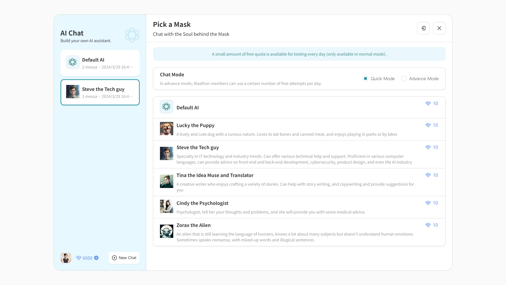
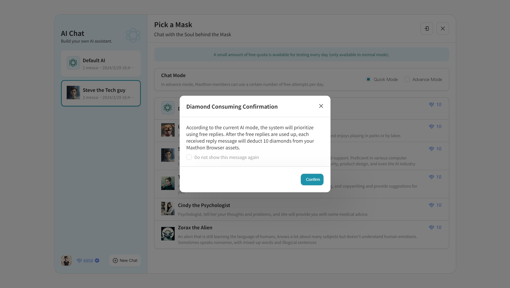
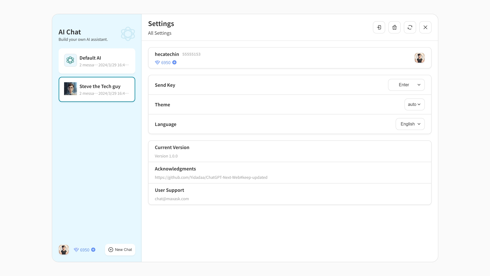
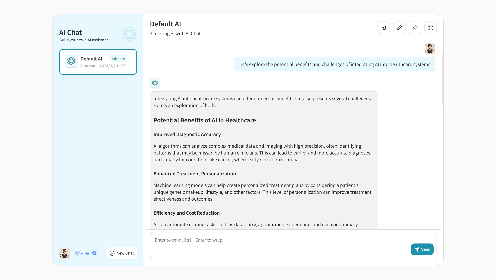

# Maxthon AIchat User Guide 📘

Welcome to Maxthon AIchat! Offering a unique chatting experience with various AI personas, AIchat lets you interact for assistance or entertainment within the Maxthon browser. This guide provides a detailed walkthrough to help you make the most of your AIchat experience.

## Getting Started 🚀

To open AIchat on your PC, look for the AIchat icon in the left sidebar of your Maxthon browser, typically the third icon from the top. You can also find AIchat in the list of apps in the new tab page's upper-left corner. For mobile users, AIchat is accessible from the quick access icons at the top of the home screen. AIchat is available on Windows, Mac, iOS, and Android platforms.

### Choose Your AI Persona

Select from a variety of AI personas, each with a unique expertise:

- **Default AI**: Your versatile chat companion.
- **Lucky the Puppy**: Ideal for playful, light-hearted interactions.
- **Steve the Tech Guy**: Tech and IT guidance at your fingertips.
- **Tina the Idea Muse and Translator**: A creative ally for writing and translation.
- **Cindy the Psychologist**: Psychological insights with a virtual sympathetic ear.
- **Zorax the Alien**: A quirky character with unconventional wisdom.

To choose an AI persona, click on their profile.

## Chat Modes

Engage with AIchat in two ways:

- **Quick Mode**: A daily quota of free tries for brief chats.
- **Advance Mode**: Deeper conversations at the cost of diamonds.

### Chat Interface

The top right buttons in the chat interface allow you to:

-  **Log Out**: Securely leave your AIchat session.
-  **Edit Chat Title**: Customize the chat window title.
-  **Export Chat**: Save your chat history in Markdown format.
-  **Fullscreen Mode**: Experience chat in fullscreen.

### Managing Your Diamonds

Diamonds are the currency for continued chatting in both Advance Mode and Quick Mode after your free trials run out. Low on diamonds? Click the '+' to buy more at $1 for 1,000 diamonds.

## Chat History

Your chat history is listed on the left. If logged into your Maxthon cloud account, AIchat will sync your chats across devices.

## Settings

Access settings by clicking your avatar in the lower left corner. Adjustments include:

- **Send Key**: Choose from `Enter`, `Shift + Enter`, `Ctrl + Enter`, `Alt + Enter`, or `Meta + Enter`.
- **Theme**: Switch between Dark and Light modes to match your browser.
- **Language**: Select Simplified Chinese or English for the interface.

The settings menu top right buttons are:

- 🔒 **Log Out**: Exit your AIchat account.
- 🧹 **Clear Data**: Erase all chat data.
- 🔧 **Reset Settings**: Return to default settings.
- ❌ **Close Settings**: Leave the settings menu.

## Chat Tips and Tricks 😊👍

When crafting prompts for AIchat, these strategies can enhance your experience:

- **Clarity** 🎯: Articulate your topic or question distinctly.
- **Context** 📖: Supply any pertinent background info that might be relevant to the conversation.
- **Open-endedness** 🌟: Pose questions that allow for a broad spectrum of responses.
- **Specificity** 🔍: Be detailed about what you're aiming to learn or achieve.
- **Conciseness** 📏: Stay direct and succinct to prevent any misunderstandings.

For example, to inquire about AI in healthcare, you might say: "Let's explore the potential benefits and challenges of integrating AI into healthcare systems." This approach is transparent, targeted, and invites an expansive dialogue.

## User Support

Need assistance or want to give feedback? Reach out to help@maxthon.com.

---

Note: Chat interactions are subject to a token limit (about 900), representing chunks of language like words or phrases. Exceedingly long messages may be condensed to fit this limit, which can affect the AI's response context.

