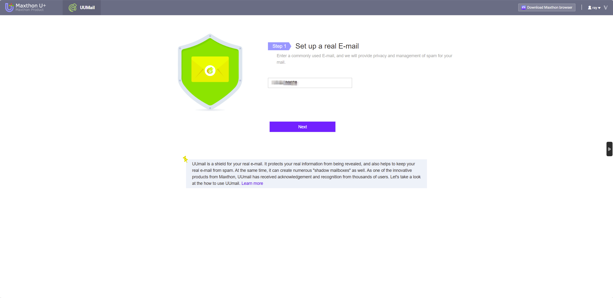
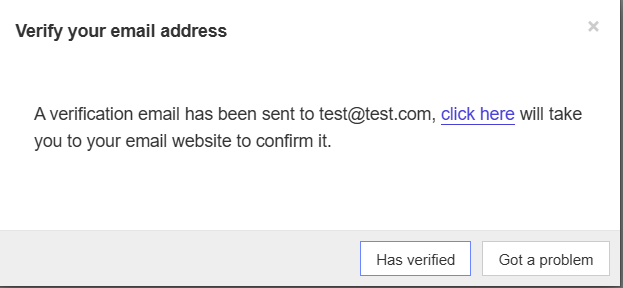
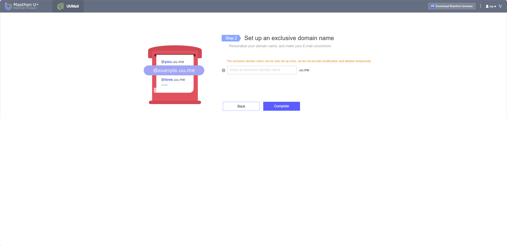
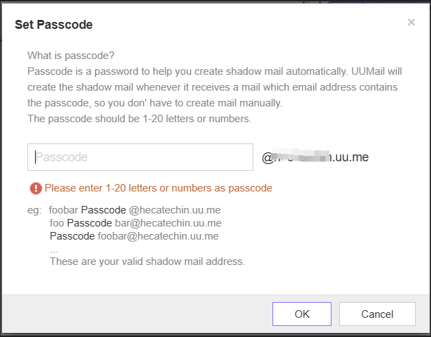
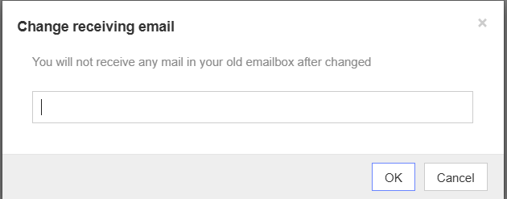

# UUMail Help Documentation 📧

### 1. What is UUMail? 🤔

UUMail is a privacy protection email service. With shadow email addresses 🕵️‍♂️, you can hide your real email, avoiding spam and preventing your personal information from leaking. You can create multiple shadow emails for different scenarios while keeping your real email safe and private! 🎉

### 2. What is a regular email address? 📬

Your regular email address is your real personal email, used to receive forwarded messages from your shadow email addresses. You need to bind and verify your regular email before using UUMail services.

#### **How to bind a regular email**:

1. Enter your regular email address and click **Next**.
2. The system will send a verification email 📩 to that address.
3. Open the email and click the verification link to complete the binding. 🔗

### 3. What is a shadow email address? 🕶️

A shadow email address is a virtual email provided by UUMail, and all incoming messages will be forwarded to your regular email. Shadow emails allow you to manage your communications without exposing your real email.

- You can create up to **20 shadow email addresses**. 📧
- Messages sent to shadow emails are automatically forwarded to your regular email 📥.

### 4. Practical Uses of Shadow Emails 💡

1. **One-time account registration**: When registering on websites where you don’t want to expose your real email, shadow emails are extremely useful. For example, if you register on site A, you can use `A@jack.uu.me`. If you start receiving spam from this address, you can tell that your information was leaked by site A. If you no longer need the email, simply delete the shadow email to stop receiving spam.

2. **Registering multiple accounts**: Some games require you to register multiple accounts with different email addresses. Shadow emails make this easy as you can create up to **20 accounts** without needing multiple real email addresses.

3. **Avoid advertising spam**: If you sign up on various websites, you can create a dedicated shadow email like `promo@jack.uu.me`. If this email starts receiving too much spam, you can delete it and prevent further unwanted emails.

4. **Privacy in online shopping**: When registering on e-commerce platforms or shopping websites, you can use shadow emails to protect your privacy. For example, use `Bshop@jack.uu.me` when shopping on site B. If you no longer wish to receive promotional emails, simply delete the shadow email.

5. **Managing social media accounts**: If you have multiple social media accounts across different platforms, you can create separate shadow emails for each. For example, use `twitter@jack.uu.me` for Twitter and `fb@jack.uu.me` for Facebook. This helps you manage notifications and identify the source of any information leaks.

6. **Trying new services**: Use shadow emails when signing up for free trials or new services. This allows you to try the service without worrying about future spam emails. Once the trial ends, you can delete the shadow email to stop receiving further communications.

7. **Managing multiple projects or clients**: If you are a freelancer or manage multiple projects, you can create individual shadow emails for each project or client. For example, use `projectA@jack.uu.me` for Project A and `projectB@jack.uu.me` for Project B, making it easier to track communications.

8. **Small business email management**: If you run a small business, UUMail allows you to create a free email domain with your business name as the suffix (e.g., `@yourbusiness.uu.me`), without needing to register an actual domain. This provides a professional look while avoiding domain registration costs.

9. **Prevent data breaches**: If a website reports a data breach and you used a shadow email to register, you can delete the shadow email immediately to prevent further exposure of your information.

### 5. Where can I view messages received by shadow emails? 👀

All emails sent to your shadow emails are **automatically forwarded to your regular email**, so you will need to check them in your regular email inbox. 💌

### 6. Custom Domain Setup 🏷️

You can set up a unique custom domain to use as the suffix for your shadow emails (e.g., `@yourname.uu.me`). Once set, **the custom domain cannot be changed or deleted**.

### 7. Why am I not receiving emails from shadow addresses? 📭

There are several reasons why you might not receive emails:

1. **Emails sent from your regular email to a shadow email** will not be forwarded. Shadow emails are designed for external communications.
2. **Server issues** might cause email delivery problems. 🚨
3. **Forwarding delays**: Email forwarding might take **1-20 minutes**, and longer queues might cause delays. ⏳

### 8. What is a passcode? 🔑

A passcode is a keyword that quickly creates shadow emails. Once set, whenever you use an email address containing that keyword during registration, the system will automatically create a shadow email.

#### **Passcode Example**:

If your custom domain is `jack.uu.me` and you set the passcode to "abc", when you register with an email like `abc1@jack.uu.me` or `sabce@jack.uu.me`, the system will automatically create a shadow email and forward the emails to your regular email. 📤

### 9. How to manage shadow email addresses? 🧹

When you reach the shadow email limit, you can delete unused shadow emails to free up space and create new ones. ♻️

### 10. Can I change my regular email? 🔄

Yes! You can change your bound regular email at any time. After changing, the old email will no longer receive forwarded messages from your shadow emails. ✉️

### 11. What if I don't receive the activation email for my regular email? 📧

1. Add `uu.me` to your email whitelist and check your spam folder. 📂
2. If the issue persists, you can resolve it through the user feedback system: [User Feedback](https://www.maxthon.com/report).

### 12. What if I can't log in to uu.me? 🚫

Sometimes, uu.me may experience login issues due to server problems. If this happens, you can report the issue through the user feedback system: [User Feedback](https://www.maxthon.com/report).

### 13. Is there a limit to daily email forwarding? 📬

Yes, each account has a daily email forwarding limit of **100 emails**. Please manage your forwarded messages accordingly.

### 14. UUMail VIP Service 🎖️

UUMail also offers VIP services for users who need higher limits on shadow email addresses and forwarding. The pricing is as follows:

**English prices**:

- **$14.9/month**: Up to **500 shadow emails** and a daily forwarding limit of **1500 emails** (total send/receive).
- **$29.9/month**: Up to **2000 shadow emails** and a daily forwarding limit of **3000 emails** (total send/receive).
