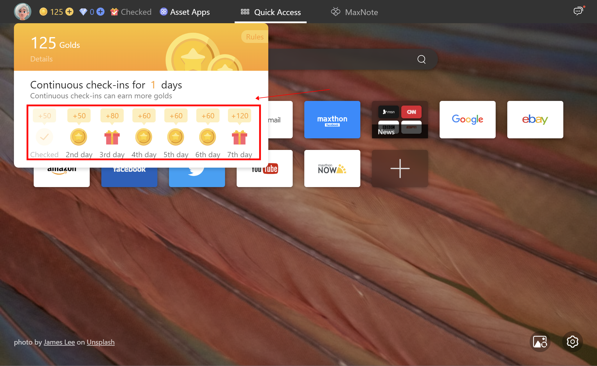

## Maxthon Gold Activity Guide
Maxthon has always been committed to providing users with a better online experience. In order to give back the support of the majority of users, Maxthon launched a gold activity, allowing users to get gold rewards while using the browser. This article will introduce four methods and specific rules for obtaining gold.

1. PC end check-in:

Use Maxthon on the PC to sign in for 7 consecutive days, and you can get rich gold rewards. The check-in position of the new tab is in the upper left corner, to the right of the gold and diamond numbers. If you use the extension program related to the new tab, it may affect your normal use of the check-in function. The specific check-in rewards are as follows:
- Day 1: 50 
- Day 2: 50 
- Day 3: 80 
- Day 4: 60 
- Day 5: 60 
- Day 6: 60 
- Day 7: 120 
It is worth noting that if there is one day during which no check-in occurs, the number of consecutive check-in days needs to be recalculated from the first day. Therefore, it is recommended that users insist on checking in every day to receive more gold as reward. Sign in for 7 consecutive days and receive a total of 480 gold.

2. Mobile check-in:

If you use Maxthon on the mobile end to sign in for 7 consecutive days, you can also get rich gold rewards. The check-in location is in the upper right corner of the mobile homepage. Click on the Aoyou icon in the middle of the control bar below the mobile terminal to enter the homepage. The specific check-in rewards are as follows:
- Day 1: 20 
- Day 2: 20 
- Day 3: 40 
- Day 4: 20 
- Day 5: 20 
- Day 6: 20 
- Day 7: 80 
Similarly, if there is one day during which no check-in occurs, the number of consecutive check-in days needs to be recalculated starting from the first day. Therefore, it is recommended that users adhere to checking in on the mobile end every day to obtain more gold. Sign in for 7 consecutive days and receive a total of 220 gold.
If mobile and PC devices maintain continuous check-in, they can receive 700 gold in 7 days, with an average of 100 gold per day.

3. New Tab Message Notification:

The new features and messages of Maxthon will be recommended in the upper right corner of the new PC tab. When users read these messages, they will receive an additional 5 gold rewards. Users only need to click on the message to view detailed content and receive gold rewards.

4. Purchase Gold Gift Pack:
The gold gift package is settled in US dollars, and you can directly purchase and open it to receive gold. Each gift pack contains 3000 gold.
Through the above four methods, users can easily receive gold rewards, thereby improving their membership level. Please note that the usage and exchange rules of gold may be adjusted according to activity changes. Users are advised to follow the official announcement at any time for the latest information.
