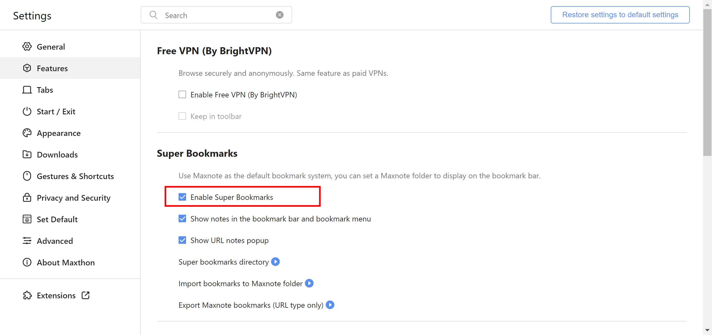

## Super Bookmarks User Guide

Maxthon browser has introduced a new feature called "Super Bookmarks". This feature allows users to manage URLs and notes in one place, creating a personal knowledge base. Below is a detailed introduction on how to use the Super Bookmarks feature.

1. Activate Super Favorites:
      Super Bookmarks is a VIP feature that requires activation of Maxthon browser's VIP subscription to use. Go to Settings > Features > Super Bookmarks to enable this feature.
	

2. Set up Super Bookmarks:
   - Maxthon Notes folder displayed on the bookmarks bar: After enabling Super Bookmarks, you can display any folder from "Maxnote" in your Maxthon account on the bookmarks bar. The directory displayed on the bookmarks bar can be modified under Settings > Features > Super Bookmarks > Super Bookmarks Bookmark Directory.

  
   - Note type record display settings: In Features, you can also set whether to display note type records from Maxnote on the bookmarks bar. When "Show notes in the bookmark bar and bookmark menu" is not checked, only URL type Maxnote will be displayed in the bookmarks bar and bookmarks menu.

3. Import bookmarks to Maxnote:
   When activating Super Bookmarks for the first time, it is recommended to import browser bookmarks into Maxnote. Choose "Import bookmarks to Maxnote folder" in Features > Super Bookmarks.

4. Using Super Bookmarks:
   - Bookmark item color marking: If using Super Bookmarks, items on the bookmarks bar will be marked with different text colors in Maxnote, indicating the user-set "My Favorites" items. This includes folders, notes, and URLs.

 
   - Manage Maxnote: After activating Super Bookmarks, the Maxnote management interface will replace the original bookmark manager. Adjusting the order of URLs and notes in the Maxnote management interface will also take effect in the bookmarks bar and bookmarks menu.

   - URL Note: Compared to traditional bookmarks, URLs in Super Bookmarks have an additional note field, where users can write notes about the site.

5. Disable Super Bookmarks:
   If you don't like Super Bookmarks, you can disable it in Features. After disabling, the bookmarks bar will revert to the original bookmark manager data.

6. Export Maxnote bookmarks:
    If you've created quite a few URLs in Super Bookmarks, you can choose "Export Maxnote bookmarks (URL type only)" to export all bookmarks in Maxnote. Then go to the bookmark manager to re-import these bookmarks.

7. Upgrade to Maxthon VIP membership:
  If you're not yet a Maxthon VIP user, you can choose "Upgrade to Maxthon member" in the main menu, to become a Maxthon member at a subscription price of 2980 gold per month.

8. Buy Gold:
   If your current gold balance is insufficient, you can check your gold amount on a new tab page, click the plus sign next to the gold, to buy gold on the coin activity page.

Conclusion:
Above is a comprehensive introduction to the Super Bookmarks feature of Maxthon browser. We hope this guide can help you make better use of this powerful feature and improve your web browsing efficiency. If you have any questions, feel free to ask us at any time.