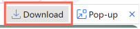
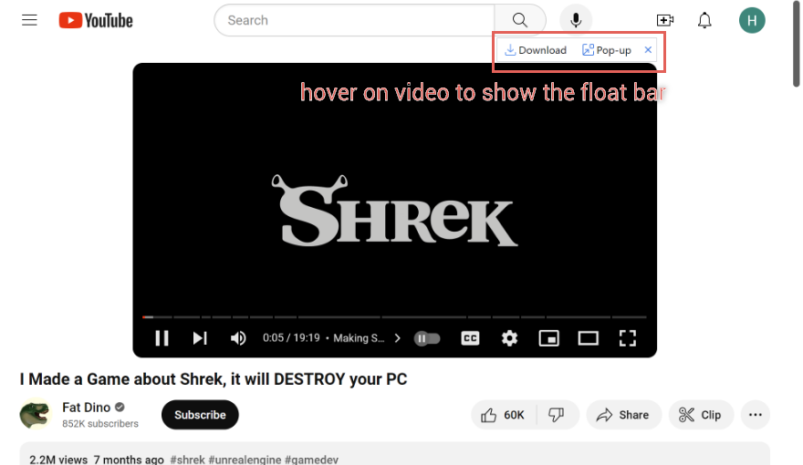
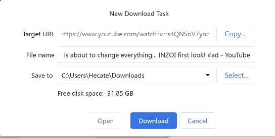
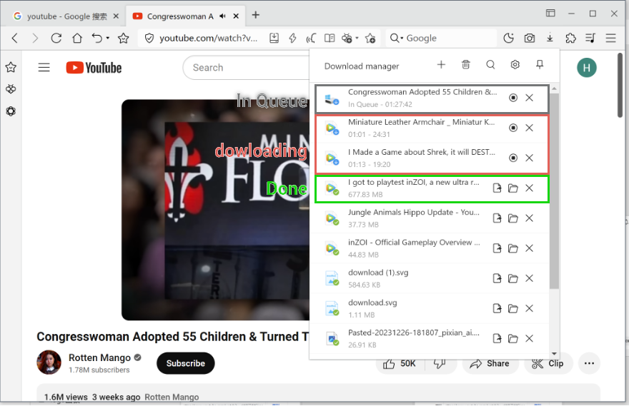
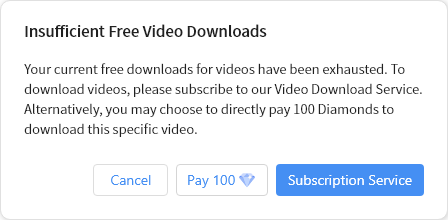

# Video Download Help

## 1. Introduction 🎉

Welcome to the video download feature of Maxthon Browser! With the video floating toolbar, you can easily download video files playing in your browser. Regardless of the webpage you're on, simply click the download button on the floating toolbar to save the currently playing video locally. This feature is available to all logged-in users and allows a few free trial downloads for everyone.

## 2. Usage 📽️

### 2.1 Video Download Button

On the floating toolbar, locate the download button . Clicking this button will initiate the download of the currently playing video.

Please note that full videos can only be downloaded from the complete video playback interface. While the floating toolbar appears in the video list, videos cannot be downloaded correctly from there.

### 2.2 Edit Download Information

In the pop-up download window, you can edit the video's name and download path. Ensure the correct information is set, then click download. 

## 3. Maxthon Membership Benefits 💎

Maxthon members enjoy more free download opportunities. As a Maxthon member, you can use the video download feature more frequently.

## 4. Download Manager 📁

Use the Maxthon Download Manager for video downloads. After completion, video files will have special markers for easy identification. Please be mindful of the limited number of videos that can be downloaded simultaneously, indicated by the queue status. Click the stop download button on the Download Manager to halt the download. Stopping a video download may result in incomplete downloads. Exercise caution.

## 5. Free Trial Tips ⚡

If you run out of free trial download opportunities, the system will prompt you with a pop-up. 
You can choose to:

- Pay separately to download the current video.
- Subscribe directly to the video download service.

## 6. Video Download Service Subscription 💳

The video download service offers the following subscription options:

- Monthly Subscription: $4.98 USD
- Yearly Subscription: $14.98 USD
- One-time Payment: $29.8 USD

If you choose the monthly or yearly subscription, you need to pay with a credit card, ensuring sufficient credit for deduction. The third-party payment platform will automatically deduct the amount from your account.

After subscribing, previous download tasks may need to be restarted. Find the previous video, and click the download button on the floating toolbar.

In addition to subscribing, you can also download a single video without a subscription. **Note that in a single download, do not close the browser during the download. If there is a download failure due to network issues, re-downloading requires another payment.**

### 6.1 Maxthon Diamond Payment 💎

You can also choose to pay with Maxthon Diamonds, 29800 Diamonds equivalent to $29.8 USD.

## 7. Subscription Success Email 📧

After a successful subscription, the system will send an email to your mailbox. If you don't have an email, please bind one to your Maxthon account. The email contains basic information about the video download service and provides an unsubscribe address for monthly and yearly subscribers.

## 8. Unsubscribing from the Service 🚫

Click the unsubscribe link in the subscription success email sent by the system to complete the video download service unsubscribing process. Please keep this email safe. If you haven't received the subscription success email, you can unsubscribe in "Settings" -> "Download and Save Paths" -> "Complete Video Download Floating Toolbar" following the instructions.

## 9. Notes 🚨

- Before clicking the download button, ensure you are logged in or subscribed to the necessary website account.
- Downloaded videos will record all content during normal playback on the webpage, including ads.
- If the webpage selects playback speed, the downloaded video will also retain the accelerated effect.

Thank you for choosing Maxthon Browser's video download feature. We hope you enjoy a pleasant downloading experience! If you have any questions, feel free to contact our support team.

## 10. FAQs 🤔

### Free Trial Count Issue 🆓
**Question**: I just registered a Maxthon Browser account. How do I check my remaining free download count?

**Answer**: After the first login, you can check the remaining free download count on the video download feature page or account settings.

### Subscription and Payment 💳
**Question**: How do I purchase and activate a subscription for the video download service?

**Answer**: After exhausting the free trial count, the system will display a pop-up where you can directly pay and subscribe. You can pay a certain fee for a single video download or subscribe to the function without download limits.

### Download Limit 🚀
**Question**: What is the maximum number of videos that can be downloaded simultaneously? Can this limit be adjusted?

**Answer**: There is a current limit on the number of concurrently downloaded videos, set to 2 videos. In the future, users may be allowed to customize the number of simultaneous downloads.

### Download Failure or Interruption 🚨
**Question**: What should I do if there is an error or interruption during video download?

**Answer**: If there is a network interruption during the download, it may result in only the first half of the video being downloaded. If a video download fails, check if the network connection is stable, and attempt to redownload. If the issue persists, check the download logs and seek solutions in Maxthon Browser's help center.

### Video Quality and Format 🎥
**Question**: Is the quality of downloaded videos consistent with playback on the webpage? What formats are supported for download? Can download speed be increased?

**Answer**: Downloaded video content matches webpage playback, including resolution and ads. However, to ensure normal video downloads, only resolutions up to 1080P are currently supported. The video format for downloads is currently webm, compatible with all major browsers. If you need to convert it to another format, you can use conversion software or websites. Generally, based on the current technology used, video download speed is directly related to the video's duration, with download time usually matching the video's duration.

### Unsubscribing Process 🚫
**Question**: I subscribed to the monthly service. How do I cancel auto-renewal before the next month begins?

**Answer**: You can cancel auto-renewal through the unsubscribe link in the subscription success email or manually through the subscription management interface in your Maxthon account. The unsubscribe method is still through email. Please bind your email promptly if you are an unbound Maxthon user.

### Website Compatibility 🌐
**Question**: Does this download feature work with all online video websites?

**Answer**: Maxthon's video download feature supports most mainstream video websites. However, due to technical protection measures on some websites, there may be situations where downloads are not possible. In such cases, please contact customer service for confirmation.

