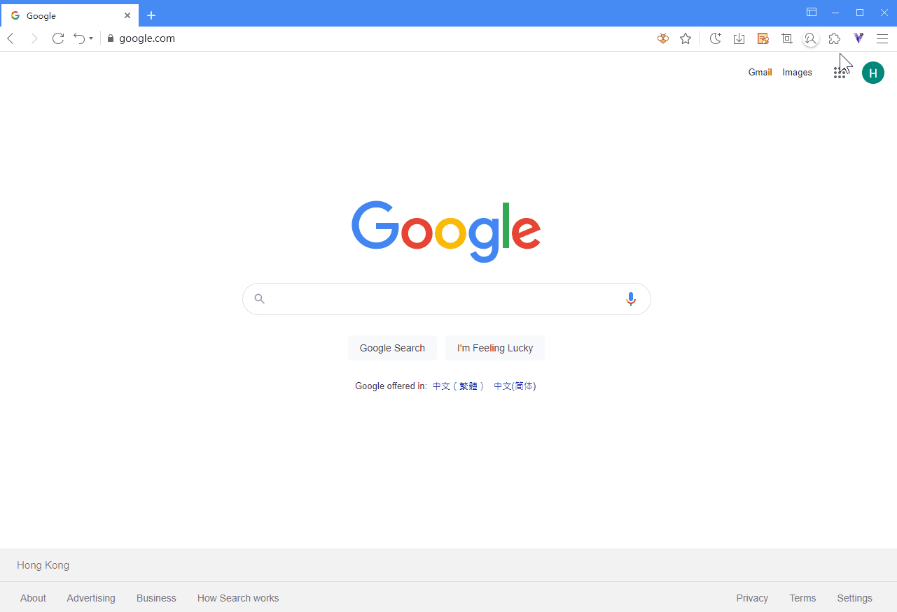

## Welcome to Maxthon

The brand new Maxthon is available now! Faster, smoother, snappier, and classic as always. As the first blockchain browser in the world, Maxthon presents:

**THE CLASSICS**

- [**The powerful Maxnote to collect everything**](08-mxnote)

- [**The Most popular addon - Resource Sniffer**](#Resource-sniffer)

- [**Passkeeper for your passwords management**](10-password)

- [**Maxthon account for your data sync**](02-cloudsync)

- [**Split screen browsing**](05-browse?id=webpage-zoom-full-screen-split-screen)

- [**Custom UI and Themes**](00-introduction?id=-customized-interface)

**THE CUTTING EDGE**

- [**Support Chrome Extensions**](12-extensions)

- [**Incognito window**](05-browse?id=incognito-mode)

- [**Vbox to manage your blockchain identity**](11-vbox)

- [**NBdomain - The very first blockchain domain and global ID**](11-vbox?id=apply-for-the-free-nbdomain)

Maxthon is still on the way to perfection. If you got any problem, please [contact us](https://www.maxthon.com/contact/) or [send your feedback](https://www.facebook.com/maxthon). Your pickiness is the most valuable treasure for us.

**Thank you for your constant companionship**

## Exciting New features
#### AI Chat
Start AI Chat using the Maxthon sidebar or by clicking the app in the new tab page. For logged-in users, AI Chat offers a certain number of free uses daily in normal mode. Expert mode requires payment based on the number of chats. For more details, see [AI Chat Help](19-aichat.md).

#### Video Download
The new [Video Download](video-dowload-help.md) feature is a paid service that provides free usage to each user. Based on web recording, it allows saving and downloading videos from any video website. You can subscribe monthly or pay per use.

#### Asset System and Maxthon Membership
The Maxthon Asset System includes gold and diamonds. Gold can be earned through Maxthon activities such as check-ins and using enhanced translation, and it can be used to pay for Maxthon membership monthly fees. For more details about gold, see [Gold Activity](goldactivity.md). Diamonds are used for paid downloads, AI Chat, and AI search scenarios.

#### New Note Sorting System
The new Maxthon Note supports custom sorting as well as sorting by name, creation time, and modification time. You can also drag and drop files to create a custom order based on the orderly sorting by creation time, modification time, name, etc.

#### Support Chrome extensions

The new Maxthon supports all chrome extensions. In developer mode, you can develop and debug your extensions. Use the **Chrome Webstore**（ [https://chrome.google.com/webstore/category/extensions](https://chrome.google.com/webstore/category/extensions) ）to install the extensions directly to Maxthon. Chinese mainland users may enjoy the **Mathon addon center** ([https://webstore.maxthon.cn/](https://webstore.maxthon.cn/) ）to download the add-ons you need.

For more information, please check [**Extensions**](12-extensions)

#### Stronger privacy protection

Maxthon provides three ways to enter the incognito mode. In the incognito window, your browsing data will not be tracked or recorded.

For more information, please check [**browsing web pages without trace using incognito mode**](05-browse?id=browsing_web_pages_without_trace_using_incognito_mode)

#### Vbox

Vbox is the built-in blockchain manager of Maxthon, which generates blockchain identities for you and manages your crypto wallets. Click the V icon on the top right corner to start now.
You can also register an NBdomain name for free with a cell phone number.

For more information, please check [**Vbox**](11-vbox)

#### Tab grouping

You can organize your tabs with groups.

Right-click a tab and then select Add to new group.
To edit your tab group, right-click the colored circle or name to the left. You can:

- Name your group.
- Add additional tabs to the group.

#### Remove the group <!-- {docsify-ignore} -->

- To add a tab to an existing group, drag the tab into the group.
- To remove a tab from a group, right-click the tab, then select Remove from group.

For more information, please go to [**Tabs**](04-tab)

#### Themes

Inherited from Maxthon 5, the new Maxthon provides various UI customization options (mx://settings/appearance). We provide three classic themes, and more themes are available in [**Maxthon add-on center**](https://webstore.maxthon.cn/). You can also apply skins in the chrome extension center.

## Changes about Classic features

The traditional Maxthon functions have been retained in the new Maxthon. Maxthon has made adjustments:

#### Resource sniffer

**Use Resource Sniffer to collect media files from any webpage**
The resource sniffer is turned off by default.  If your resource sniffer has been turned off and you need to use it, you can turn it back on by clicking the Main menu icon on the top right and open the feature manager, enable the resouce sniffer in the pop out window.

#### Passkeeper

The function of the passkeeper (mx://password/) is the same as Maxthon 5, but the general identity information function in the new Maxthon is temporarily unavailable. However, your data in Maxthon 5 is not lost. You can still log in to **UU.Me** [https://www.uu.me/](https://www.uu.me/) to view online.
For more information, please go to [**Passkeeper**](10-passwords)

#### UUmail

UUmail no longer provides a quick entry in Maxthon, but it's fully functional in [**UU.Me**](https://www.uu.me/). You can add [uu.me](https://www.uu.me/) to your bookmarks and continue to use the UUmail.
