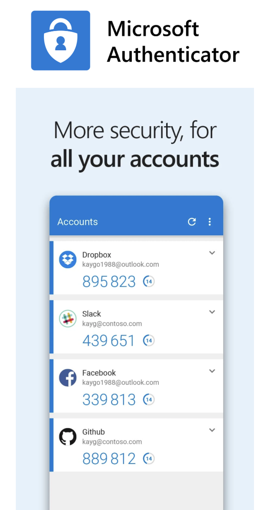
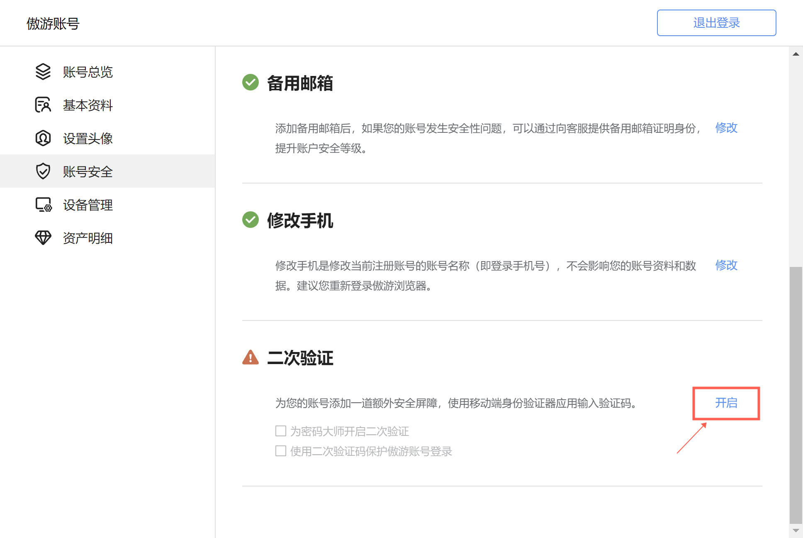
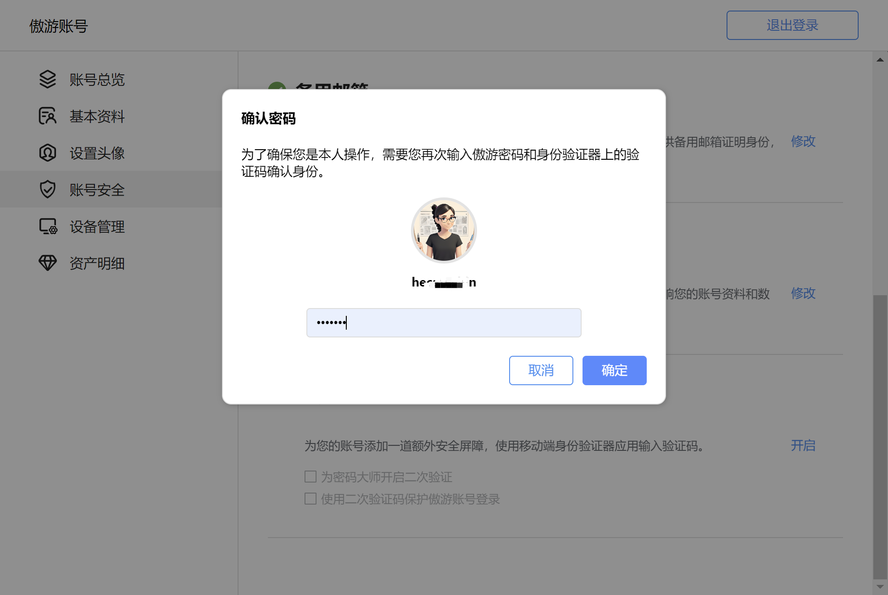
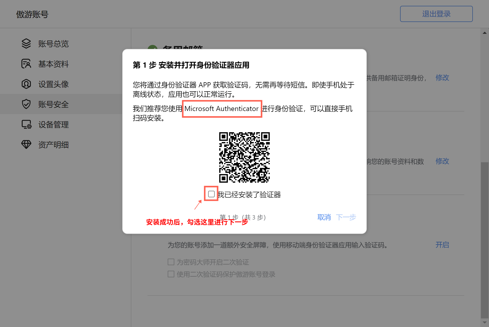
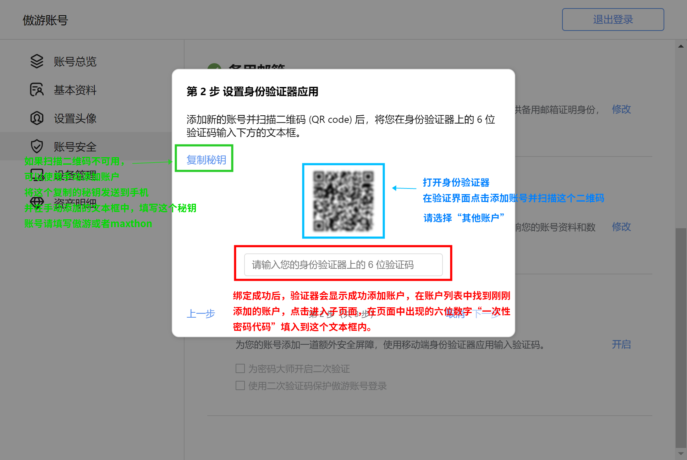
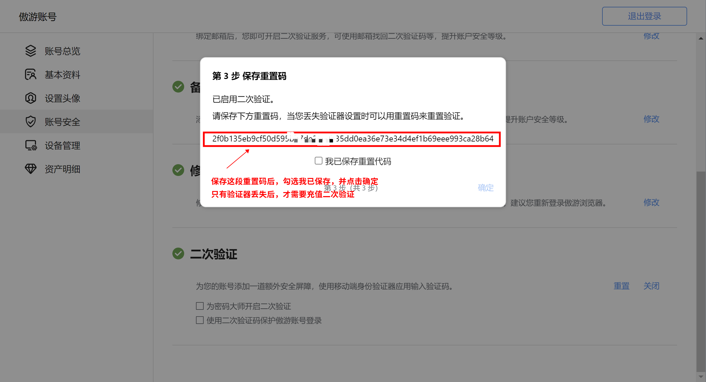
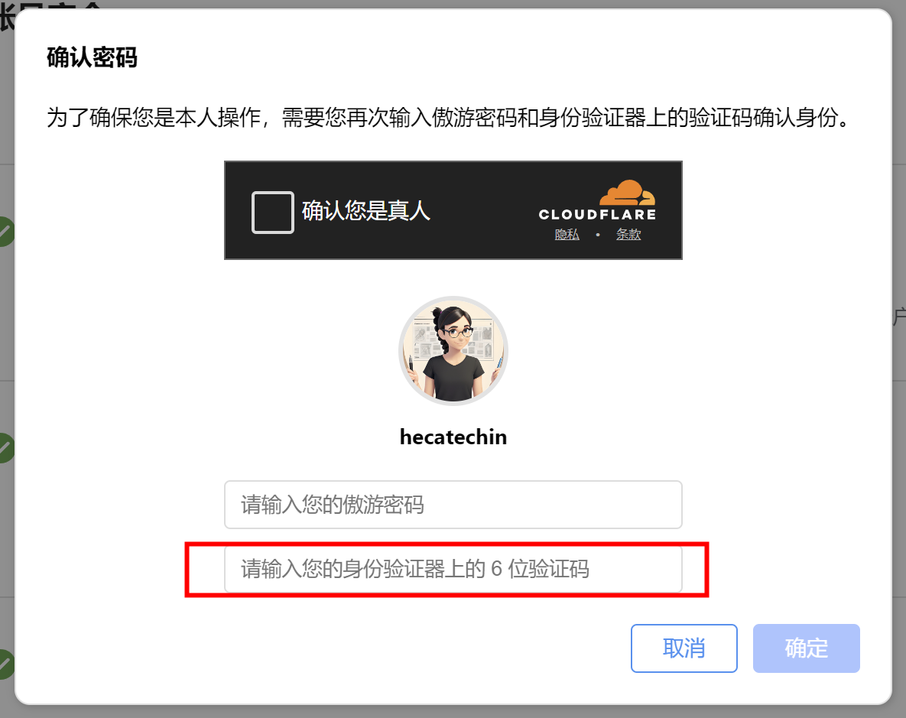

# 傲游账号、云同步和付费服务

欢迎来到 Maxthon 浏览器账号引导。请根据此文档，进行傲游账号的注册、登录、使用、设置以及升级高级服务。

## 注册傲游账号

傲游账号注册需要使用手机号或邮箱。如果您不愿意共享您的个人联系方式，请查看下一节:[使用本地匿名账号](#使用本地匿名账号)

### 使用桌面客户端创建傲游账号
#### 使用手机号创建账号
#### 使用邮箱创建账号

**注意**：傲游账号可以在["傲游账号"->"账号安全"](https://my.maxthon.com/profile/security)页面进行变更。但是仅能变更为当前已经验证过的的手机号或邮箱。

### 使用网页创建傲游账号

### 使用移动端创建傲游账号

### 验证邮箱/手机和账号激活

### 设置登录密码

### 使用第三方账号注册傲游账号

## 使用本地匿名账号

### 什么是本地匿名账号

本地匿名账号是原游客身份账号的升级版。无需密码验证即可登录。每个傲游客户端都有一个自动创建的本地匿名账号。本地匿名账号使用方便，适合用户试用浏览器、游客临时使用浏览器和一般性浏览的用户。

### 本地匿名账号权限

本地匿名账号登录后，几乎可以使用除云同步之外的所有傲游账号功能。包含账号资产相关的操作。

### 本地匿名账号的账号和密码

本地匿名账号在本地创建，会在本地生成一个随机的虚拟邮箱作为账户名，并生成一个复杂密码。账号和密码都不会存储在傲游服务器中，仅做为本地操作的权限验证凭据。本地账号在登录浏览器时，不进行密码验证，密码验证仅在资产操作和账号安全相关操作时生效。

**为什么不生成简单密码？**

_本地匿名账号系统由于涉及到用户的资产处理，所以选择采用略微复杂的密码，保证每个用户密码的随机性和隐秘性，加强资产安全。同时，为了方便用户的使用，基本的浏览器使用时，傲游浏览器并不会要求本地匿名账号的使用者输入密码，最大程度地在方便用户的同时增加了安全系数。_

#### 查看本地匿名账号虚拟邮箱

本地匿名账号创建时，会生成一个虚拟邮箱，

#### 查看本地匿名账号密码
#### 本地匿名账号资产
#### 在其他设备登录本地匿名账号
#### 便携版用户的本地匿名账号
#### 删除本地匿名账号

### 升级至普通账号

- **绑定手机**
- **绑定邮箱**
- **修改密码**

## 登录傲游账号
### 自动登录
### 记住密码
### 忘记密码
### 二次验证器丢失
### 使用备用线路
### 更换登录账号邮箱/手机
### 在多个设备上登录傲游账号
### 远程退出设备上登录的傲游账号

## 登录多个账号
如果您有多个傲游账号（比如区分工作和生活账号），或与家人共用计算机，可登录多个账号。

1. **第一步** 在桌面端浏览器（Windows和Mac版本）登录后，点击右上角，工具栏的“☰”主菜单图标，打开**主菜单**。
2. **第二步** 点击
### 切换账号

## 数据云同步

### 可同步项
- **书签**
- **傲游笔记(超级收藏)**
- **密码大师**
- **快速访问**
- **设置项**
- **拓展程序**
- **账号资产**
- **书签**

### 自动同步

### 手动同步
#### 全量手动同步

#### 单项手动同步
- **快速访问同步**
- **密码大师同步**
- **傲游笔记同步**
- **移动端书签同步**
- **移动端傲游笔记同步**
- **移动端密码大师同步**

## 傲游账号设置

### 账号基本信息
- **账号**
- **UID**
- **绑定手机**
- **绑定邮箱**
- **备用邮箱**
- **钻石接收地址**
- **会员等级**
- **昵称**
- **头像**
- **其他信息**

### 设置头像
- **自定头像**
- **系统头像**

### 账号安全
- **更换账号**
- **修改密码**
- **绑定/修改手机号**
- **绑定/修改邮箱**
- **备用邮箱**
- **二次验证** 用户可以使用附加验证方式进行验证。

### 二次验证

**二次验证（又称两步验证）**是一种安全措施，要求用户在输入密码之外，还需提供第二种形式的验证信息。这通常涉及到接收一个短信验证码或使用一个专用的验证器生成的代码。

**二次验证器**是一个生成安全验证码的应用，用以完成二次验证过程。我们推荐使用 **Microsoft Authenticator** 应用，它可以生成用于登录验证的临时、定期变化的数字代码。

#### 开启二次验证

#### 开启流程

1. **身份验证**
   - 路径：[傲游账号 -> 账号安全](https://my.maxthon.com/profile/security) -> **二次验证**模块，点击“开启”。
   - 
   - 首先验证您的傲游账号密码，以确认身份。
   - 

2. **下载验证器**
   - 扫描页面上显示的二维码，前往应用市场下载Microsoft Authenticator应用。当然，您如果已经有其他验证器应用，也是可用的。
   - 

3. **设置验证器**
   - **在验证器应用中点击“添加新账号”或点击“+”，选择“其他账号”，验证器会调用摄像头。使用手机摄像头扫描傲游账号页面的二维码完成账号添加。**
   - 如果二维码扫描不可用，可选择手动输入账号和密钥方式添加。在应用扫码界面下方点击手动添加。在账号上输入Maxthon（或傲游），然后填入傲游账号设置验证器对话框中的密钥（点击对话框复制密钥，使用即时通讯软件发送到手机，并粘贴在验证器应用上添加账号页面的密钥文本输入处。）
   - **成功添加后，如果界面内没有显示验证码，可以点击对应的账号进入子页面，验证器会生成一个6位数字验证码，需在傲游账号对话框的验证码输入框中输入此验证码以完成绑定过程。**
   - 

4. **保管重置码**
   - 绑定成功后，系统将通过邮箱发送一个重置码，用于在您无法访问验证器时重置二次验证。请妥善保管此码。**如果您的邮箱中没有收到重置码，请查看垃圾箱。** 邮件标题为 Important: Reset Code for Two-Factor Authentication from Maxthon Account
   - 

5. **刷新页面验证二次验证是否生效**
   - 绑定成功后，请刷新账号页面，此时点击一次勾选二次验证保护密码大师，如果确认密码对话框中要求输入二次验码，那么绑定二次验证成功。如果您不需要开启这个功能，直接关闭对话框即可。
   - 

#### 使用二次验证

- **保护账号安全**：在进行账号安全相关操作时，如果您开启了二次验证，将会要求输入二次验证码。您可以打开身份验证器（推荐使用Microsoft Authenticator，如果您当时使用的是其他验证器绑定二次验证，请打开对应的二次验证器应用），在 Authenticator 中找到您的 Maxthon 账号，点击进入账号后，在“一次性密码代码”中显示的，每 30 秒更新一次的六位数字，即为您的二次验证码。
- **保护登录**：在“账号安全”下的二次验证设置中，启用“保护登录”，随后每次登录时除密码外还需输入验证器生成的验证码。
- **保护密码大师**：启用此选项后，访问密码大师（傲游的密码管理器）时，也需通过二次验证。

#### 关闭(暂时停用)二次验证
- 若需停用二次验证，进入[傲游账号 -> 账号安全](https://my.maxthon.com/profile/security) -> **二次验证**模块，点击“**关闭**”按钮，在弹出窗口输入密码及当前的二次验证验证码即可暂停此功能。停用后，以前的验证器绑定保持有效，重新开启时可继续使用。

#### 重置二次验证
- 重置二次验证是一种**永久删除**已绑定的验证器的方式。
- 如果您丢失了访问验证器的能力，可以使用之前保管的重置码和当前的验证码来重置二次验证设置，之后需要重新绑定验证器。如果您丢失了重置码，可在您账号绑定的邮箱中，找到绑定二次验证码时发送的邮件。
- 如果您无法找到重置码，也可以联系傲游客服重置。
- 重置后，如果仍然需要开启二次验证，之前的二次验证器绑定账号就会失效，需要重新绑定。

### 设备管理

### 账号资产

#### 钻石

#### 金币

## 傲游付费服务

### 傲游会员

### 视频下载订阅

### 百变邮箱订阅

## 傲游账号注销

## 账号相关常见问题

### 手机号/邮箱无法注册？
### 已经注册丢失？
### 无法注销账号？
### 无法通过CloudFlare人机验证？
### 金币过期了？
### 金沙如何兑换金币？
### 钻石在中国大陆如何充值？
### 
