# 使用标签页

## -打开新的标签页

1. 在Maxthon6窗口顶部，点击右侧最后一个标签页旁边的【打开新的标签页】图标；右键点击，可以直接在新的标签页中打开已复制的链接。
2. 对网页内的任意链接按住Ctrl的同时点击，或使用右键菜单【在新标签页中打开链接】。

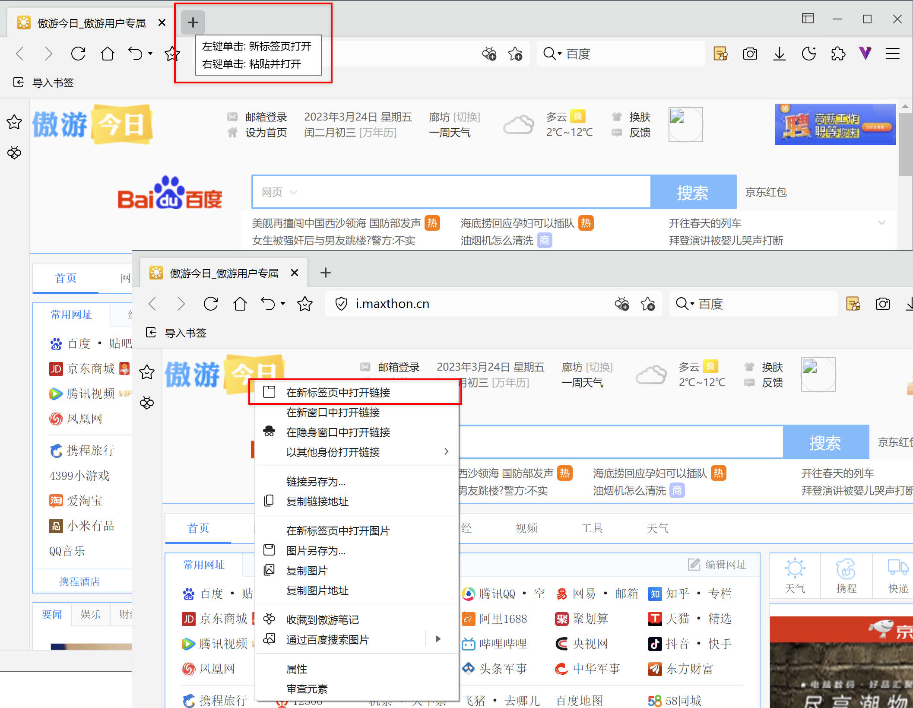

## -在新窗口打开标签页

您可以在桌面打开多个浏览器窗口：

1. 点击右上角更多图标打开主菜单，在新建项目中，点击【新窗口】；
2. 使用新标签页右键菜单【将标签页移至新窗口】，如果此时已打开多个窗口，则可在列表中选择想要移动至的窗口；
3. 网页内任意链接点击右键菜单【在新窗口中打开链接】；
4. 直接将标签页拖出当前浏览器窗口。

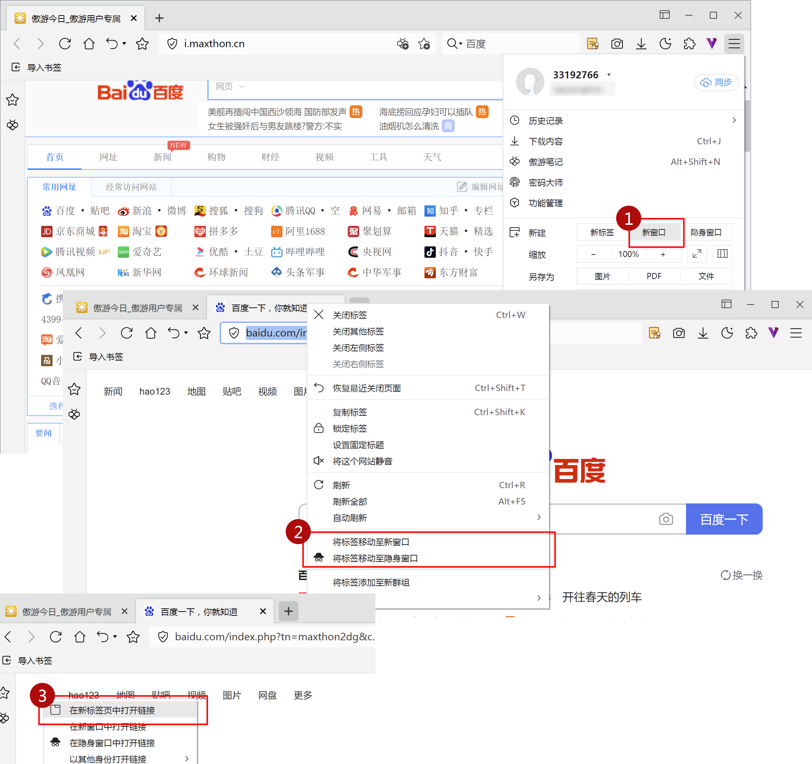

## -自定义属于您的新标签页

#### -编辑标签

1. 添加新的标签至快速启动列表

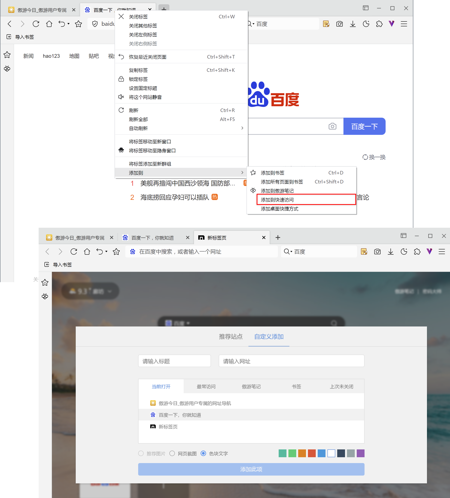

- 您可以直接在标签页使用右键菜单【添加到快速访问】；
- 也可在新标签页，点击列表最末的【添加】，切换至【自定义添加】标签下，可自行设定标题、网址及展示形式：
  - 推荐图片：使用图库中预设图片，如该网址无预设图片自动更改为色块形式。
  - 网页截图：使用当前网址的快照截图作为展示图片
  - 色块文字：网址标题+选定色块的叠加的形式

2. 标签的编辑和使用

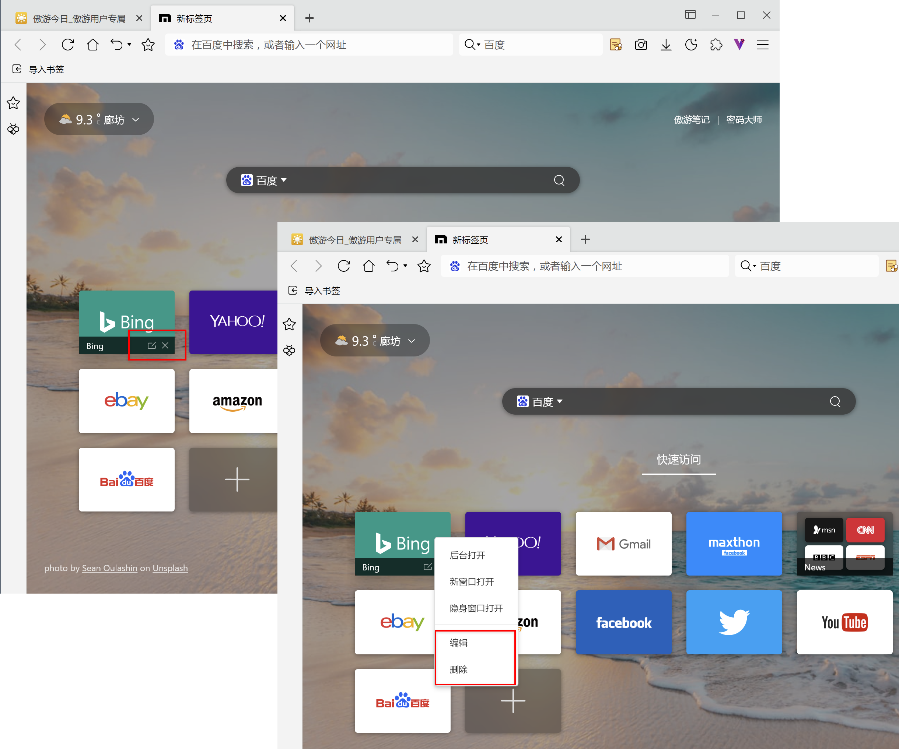

- 鼠标悬浮在快速启动项目上时，点击 进入修改模式，点击删除。
- 可以在再快速启动项使用右键菜单，选择【编辑】、【删除】。
- 点击标签将自动跳转，也可以使用右键菜单：
  - 在后台打开，保持当前页面不切换，在后台新建标签页打开网址
  - 在新窗口打开：新建一个窗口打开网址
  - 在隐身窗口打开：新建/切换 隐身窗口打开网址

3. 拖拽排序

拽图标至两个图标中间位置，当图标自动移动，出现空白位置时松手，即可移动至该位置。

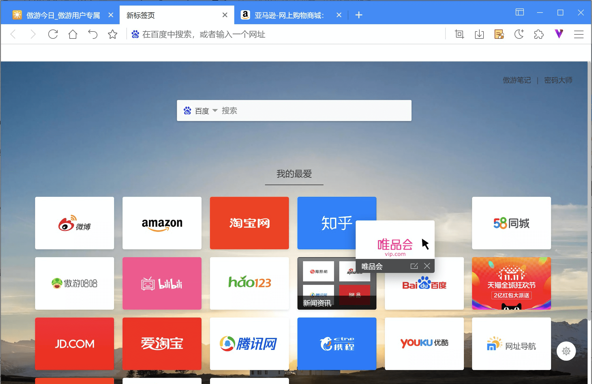

#### -使用文件夹整理标签

Maxthon6的新标签页支持使用文件夹整理标签。

1. 创建文件夹

拖拽标签与另一个标签重合，当后面的标签出现深色阴影时松开鼠标，则自动创建一个文件夹

2. 将标签移出文件夹

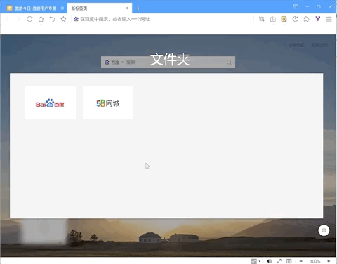

拖拽标签至文件夹外，即可返回主界面，放入适合位置即可。

*注意：当文件夹内最后一个文件被拖拽出后，文件夹将自动删除，即Maxthon6不支持保留空白文件夹。

####  -设置新标签页背景

您可以自定义新标签页背景图，点击右下角的【设置】图标 ，进入新标签页设置选项，你可以选择预设图片作为背景图，也可以通过顶部自定义图标 ，使用一张本地图片作为背景。

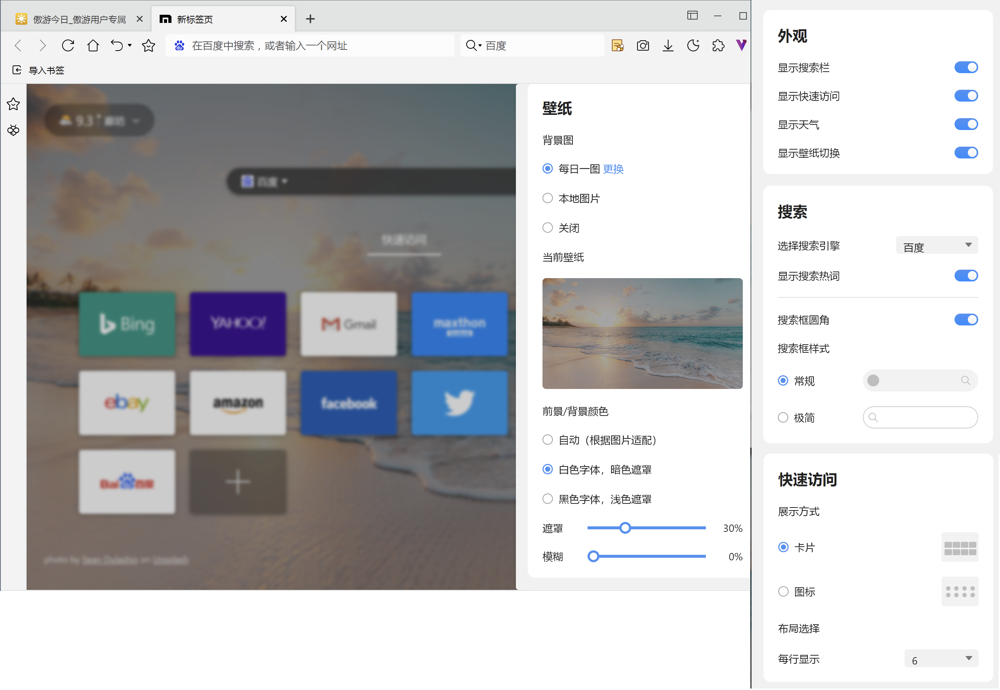

## -标签移动与锁定

1. 如果想要更改标签排列顺序，请沿浏览器窗口方向拖动标签页即可；
2. 标签右键中选择【锁定标签】，标签有边出现标志，此状态下标签将不可被关闭。再次右键【取消锁定标签】，标签恢复正常。

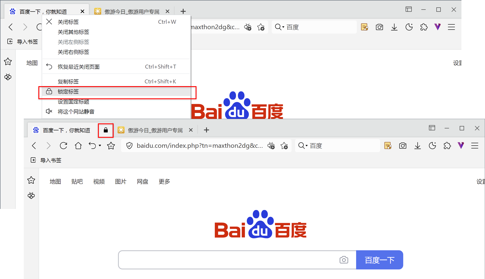

## -为标签页分组

您可以使用群组整理标签页

1. 添加群组：

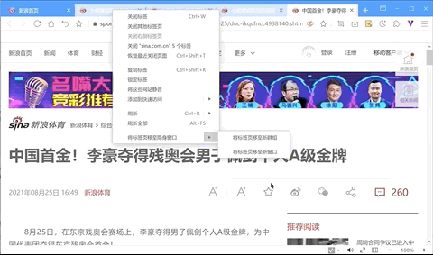

- 选中部分标签（按住Shift在点击可多选标签)，点击鼠标右键【将标签页移至新群组】；
- 您可以收起标签页群组，这样的话，只有群组名称或彩色圆圈会显示在标签栏中。若要展开或收起群组，请选择其名称或彩色圆圈。

2.群组交互

- 若要修改标签页群组，请右键点击左侧的彩色圆圈或名称。您可以：
  - 为该群组命名。
  - 向该群组添加更多标签页。
  - 移除该群组。
- 若要将某个标签页添加到现有群组，请将此标签页拖入该群组。
- 若要从群组中移除某个标签页，请右键点击此标签页，然后选择从群组中移除。

*注意“取消分组”是指释放分组内标签，而“关闭群组”是指关闭群组内的所有标签。

## 恢复标签页或窗口

如果您无意中关闭了某个标签页或窗口，可通过以下方式恢复：

1. 点击地址栏的撤销按钮，或快捷键【Ctrl+Shift+T】打开上一个关闭的页面；
2. 右键撤销按钮，可查看更多已关闭标签列表；
3. 使用标签右键【恢复最近关闭标签】；
4. 点击上角更多按钮打开主菜单，选择【历史记录】中的【最近关闭的标签】也可以恢复已关闭标签或窗口。

## 关闭标签

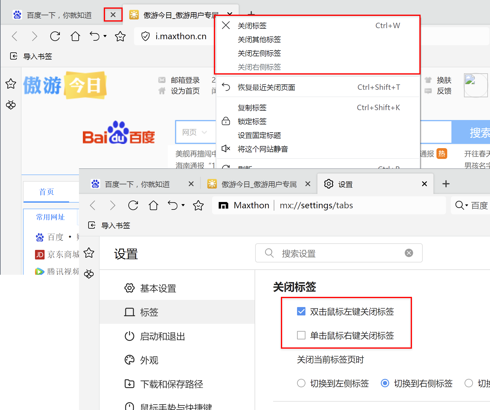

1. 点击标签关闭按钮，或右键菜单中点击【关闭标签】，即可关闭当前标签
2. 批量关闭标签：

- 右键菜单【关闭其他标签页】，将关闭除当前标签外其他所有标签；
- 右键菜单【关闭右侧标签页】，将关闭当前标签页右侧的全部标签；
- 右键菜单【关闭"xxxx"n个标签】，将关闭与单签标签拥有相同根域名的所有标签。

## 强行关闭页面或应用

如果标签页、窗口或扩展程序无法正常运行，您可以使用Maxhotn6的任务管理器将其强制关闭。

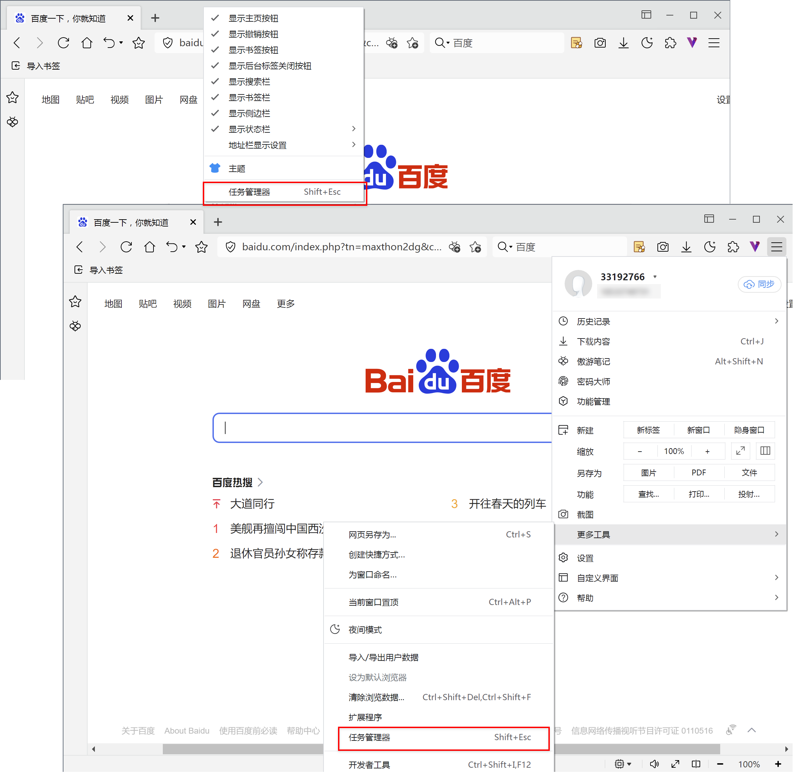

- 使用快捷键【Shift+Esc】；
- 标签栏空余位置点击鼠标右键，选择【任务管理器】项目；
- 右上角更多图标，打开主菜单，选择【更多工具/任务管理器】

