# 使用书签

## 在访问网页时快速的添加、查看和修改书签

您在浏览任意网页时，可以通过地址栏，快速地添加当前网页至书签。您也可以使用快捷键添加书签，Maxthon 默认的快捷键是 Ctrl + D

添加成功后，地址栏图标将变成，此时再次点击，可对书签进行修改或删除操作。

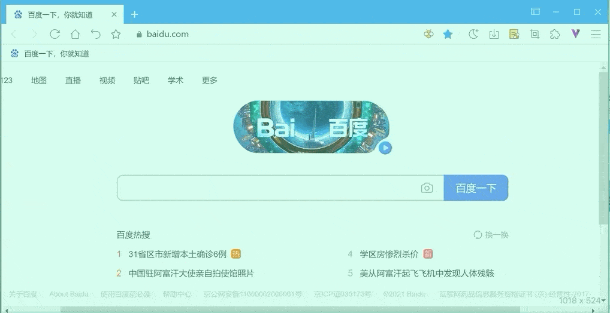

## 使用书签栏快捷使用书签

- 点击浏览器右上角自定义界面按钮，可设置显示/隐藏书签栏；您也可以使用浏览器快捷键切换书签栏显示，傲游默认的快捷键为 Ctrl + Shift + B

- 鼠标左键单击书签栏上的对应书签可以在新标签页打开书签中保存的网址。Ctrl + 鼠标左键，或 Shift + 鼠标左键可以在后台标签打开对应的书签或书签文件夹中的全部书签。

- 使用书签栏右键菜单可快速执行书签操作：
  - 打开书签/批量打开书签
    - 在新窗口打开
    - 在隐身窗口打开
  - 重命名
  - 替换为当前页面
  - 剪切
  - 复制
  - 粘贴
  - 删除
  - 添加当前页面到书签
  - 添加所有页面到书签
  - 隐藏书签栏
    - 仅显示标题
    - 进显示图标
    - 显示标题和图标
  - 管理书签

- 在书签栏删除书签后，如果需要撤销，可以在10秒内点击浏览器右下角撤销框中，对删除操作撤销。

## 书签菜单与书签按钮的切换

除了书签栏，Maxthon还提供三种快速访问书签的方法：使用主菜单书签菜单、使用书签按钮，以及使用侧边栏书签。当显示书签按钮时，主菜单的书签选项将被隐藏。

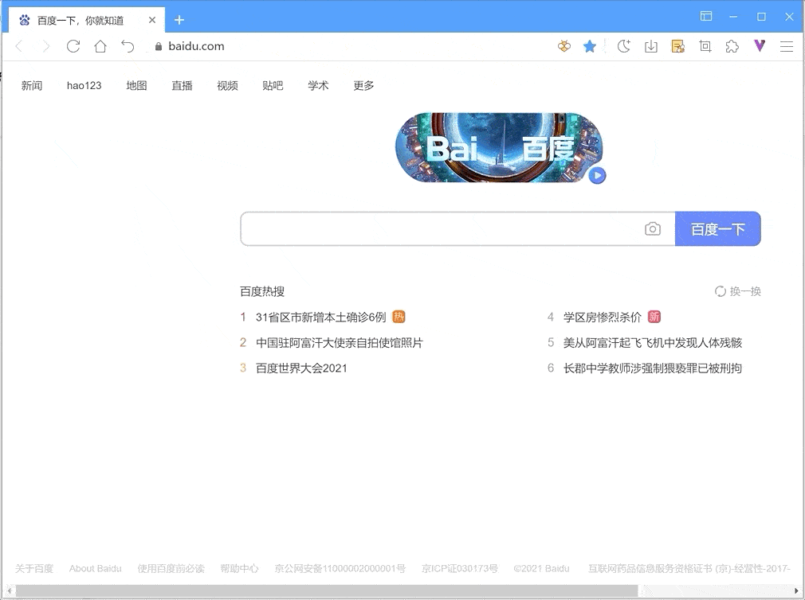

## 使用书签管理器整理书签

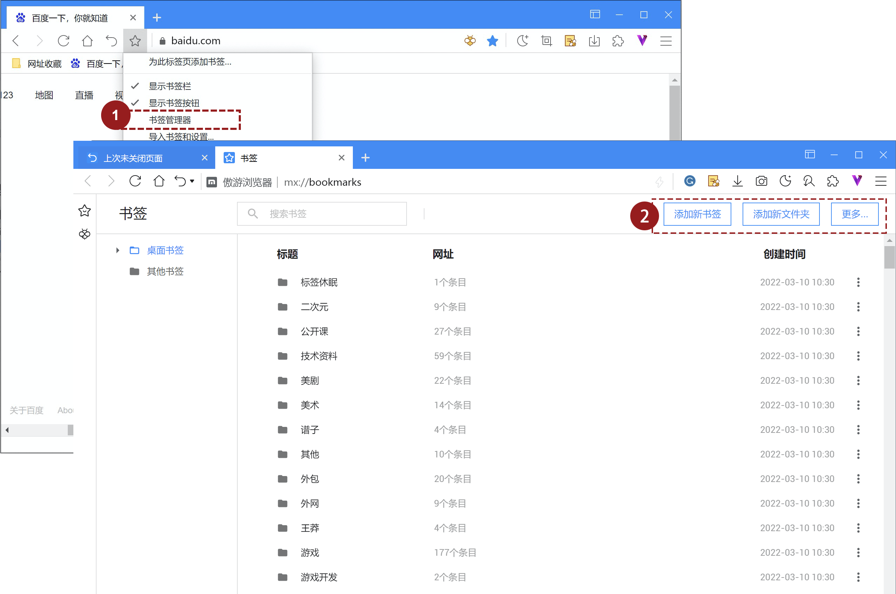

1. 在主菜单或地址栏收藏栏书签按钮，点击【书签管理器】进入书签管理页面。
2. 在书签管理页面可对书签进行：

- 添加新书签：通过输入网址添加新标签
- 添加新文件夹
- 导入书签
- 导出书签
- 按名称排序：排序调整将影响全部书签显示位置的排序
- 站点检测

## 书签的常规操作

####   添加书签

1. 通过地址栏收藏图标添加当前网页至书签

2. 在书签栏使用右键菜单【添加网页】添加当前网页至书签

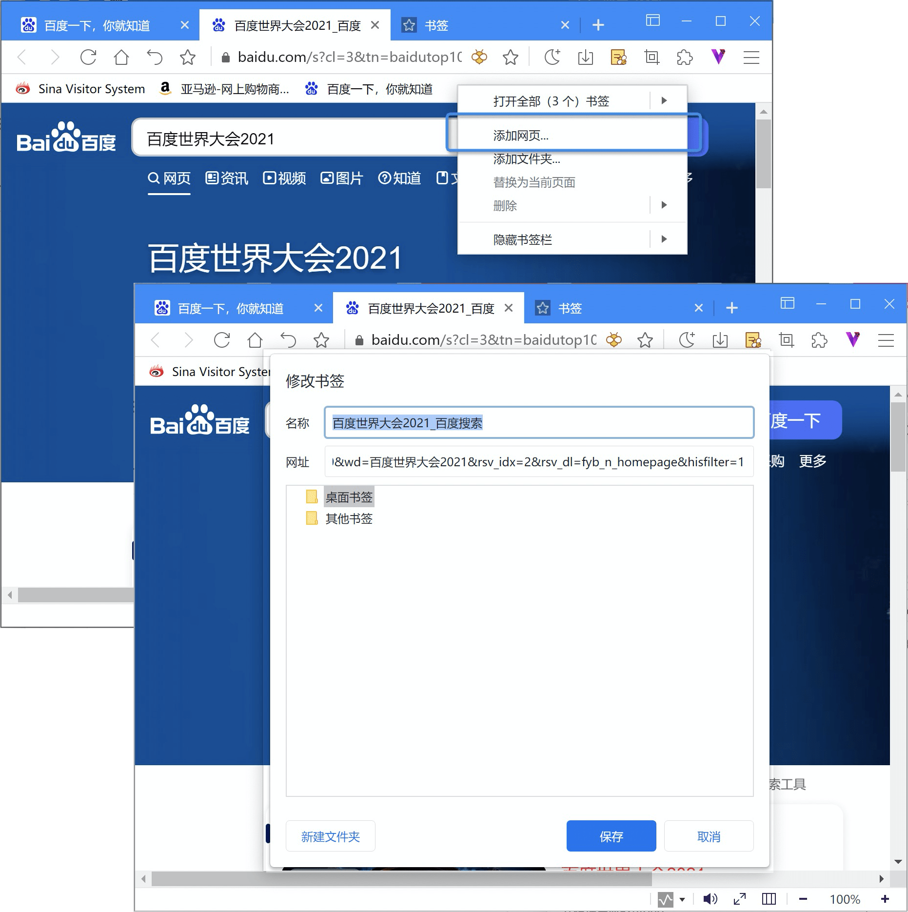

3. 在主菜单或地址栏点击【书签/为此标签添加书签】

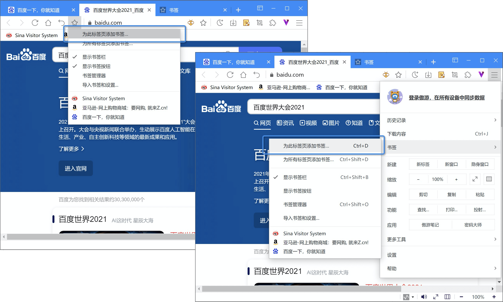

#### 打开书签

1. 在当前窗口打开标签

在书签栏、书签菜单、书签按钮直接点击网址，将按照设置在当前页或新标签页中打开网页。通过书签栏右键菜单【在新标签页中打开】同样可以打开。

2. 在新窗口打开书签

3. 在隐身窗口打开书签

4. 打开全部标签

在书签栏、书签菜单、书签按钮右键点击书签文件夹，在右键菜单中选择【打开全部（x个）书签】，将在新标签中打开选中文件夹中的全部书签。如在空白位置使用右键菜单【打开全部（x个）书签】，则打开全部书签。

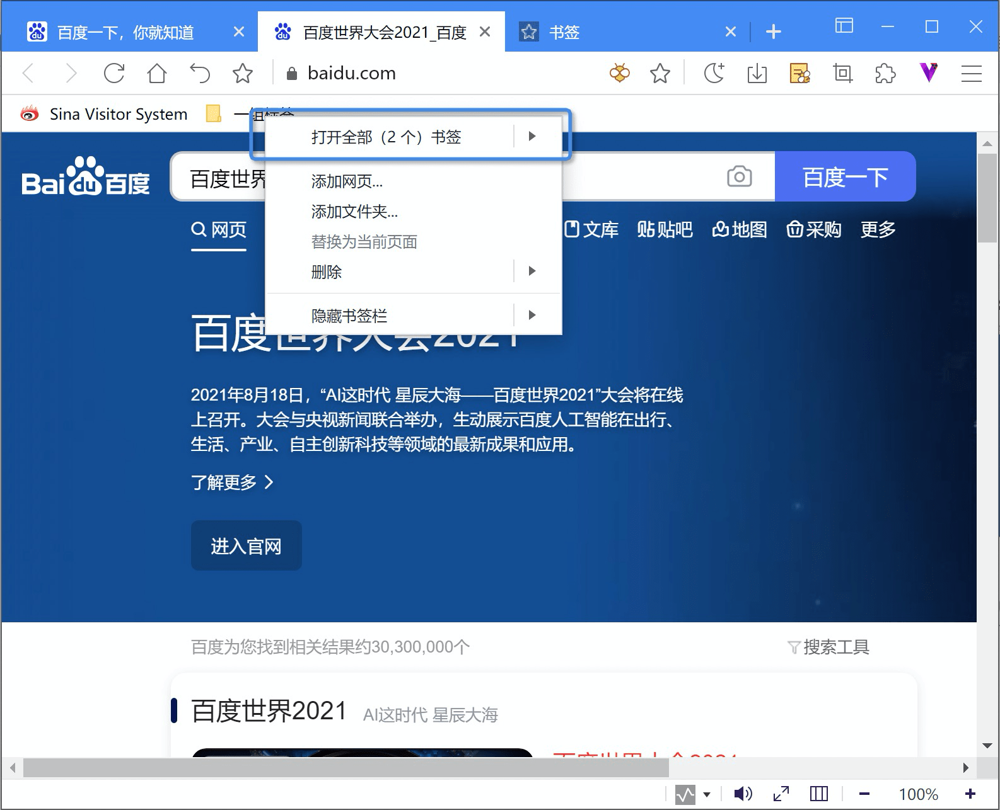

#### 修改书签

1. 编辑当前页面的书签

当前页面被收入书签后，地址栏图标显示为，此时再次点击，可对修改书签的名称、存储位置。

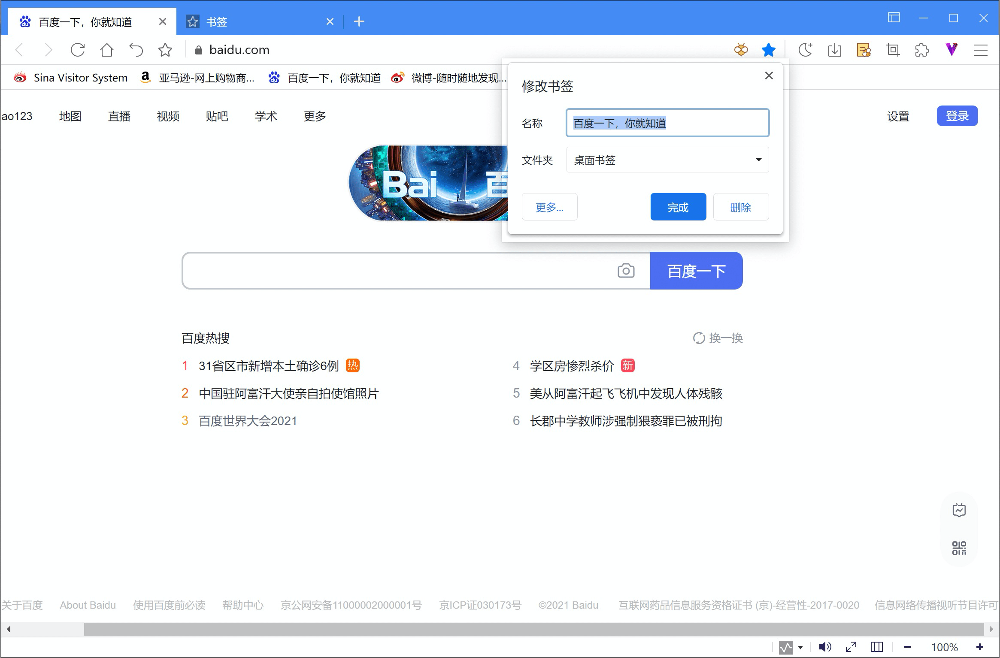

2. 通过右键菜单修改书签

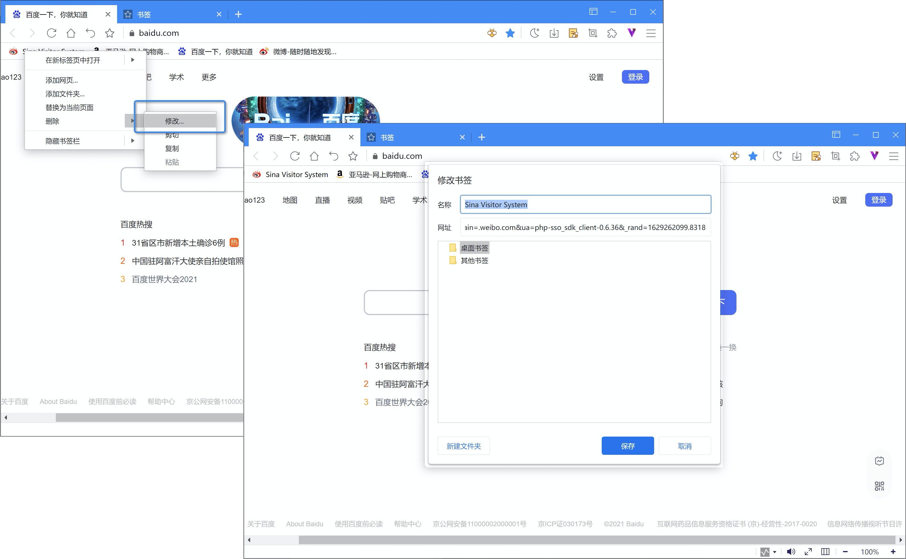

3. 使用书签管理器修改菜单

进入【书签/书签管理器】，点击书签更多按钮，选择【修改】，可修改书签的名称及URL。

#### 删除书签

1. 删除当前页面的书签

当前页面被收入书签后，地址栏图标显示为，此时再次点击，，在弹出窗口中选择【删除】即可。

2. 通过右键菜单删除书签

在书签栏、书签菜单、书签按钮右键点击书签，选择【删除】

3. 在书签管理器中删除书签

进入【书签/书签管理器】，点击书签更多按钮，选择【删除】。

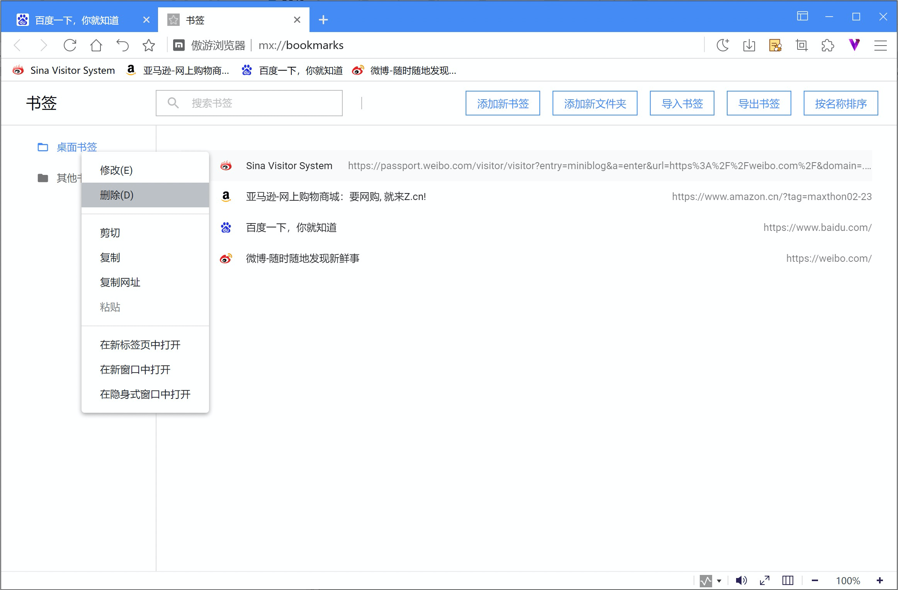

#### 书签文件夹

在Maxthon的书签中可以创建书签文件夹，存入多个书签。

通过右键菜单、书签管理器均可新建文件夹，在添加/修改书签时，也可通过编辑器新建文件夹。

*注意：文件夹删除时，文件夹内的全部标签将同时被删除。

#### 书签排序

1. 通过拖拽排序

在书签栏、书签菜单、书签管理器中，均可通过拖拽对标签进行排序。

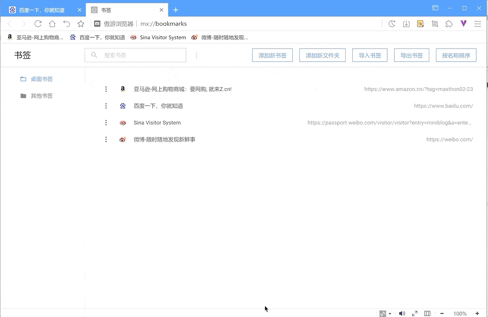

2. 按照名称排序

在书签管理器中，点击右上角【按名称排序】，当前书签将按照名称进行重新排序。排序完成后，如对当前排序效果不满意，可通过左下角【撤销】操作，回复原排序。

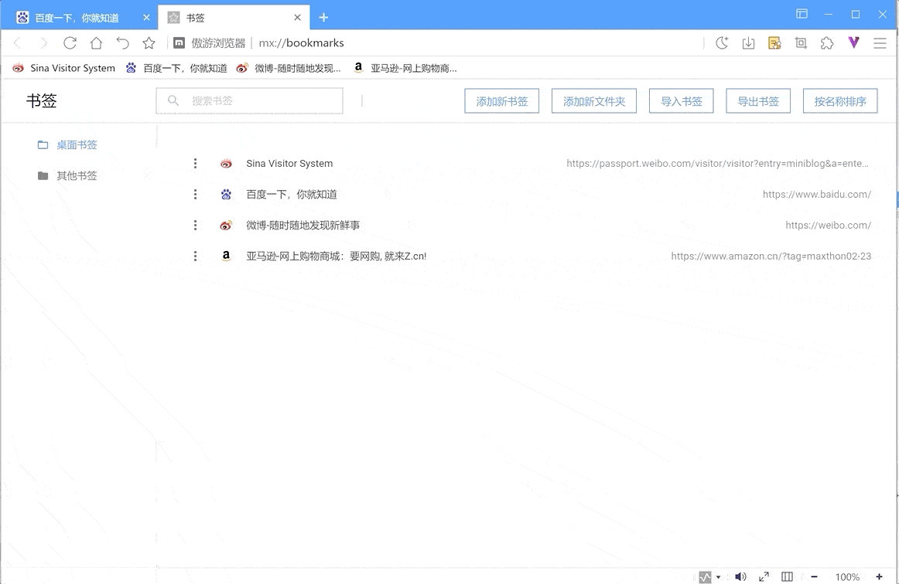

#### 替换为当前页面

选中已有书签，点击右键菜单【替换为当前页面】，在选中书签被替换为当前页面。相当于修改原有标签信息（名称及URL）为当前页面。

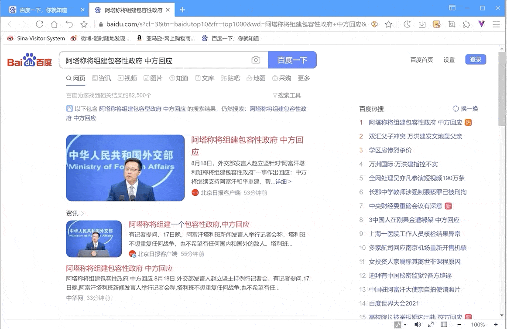

#### 书签的剪切与复制

书签的右键菜单中可以选择对书签进行剪切、复制、粘贴操作，灵活使用这些功能可以快速整理您的书签

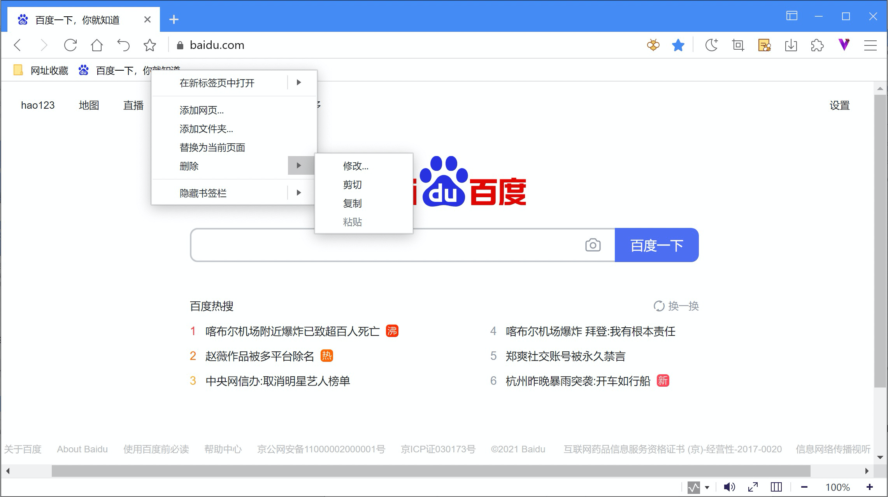

#### 站点检测

在书签管理页面右上角点击更多按钮，选择站点检测。点击开始检测，将遍历您的所有书签，并自动选择无法打开失效网页。

*请注意，如果您当前的网络状态无法连接至国外的一些网站，请将这些网站的勾选取消，以免造成误删。

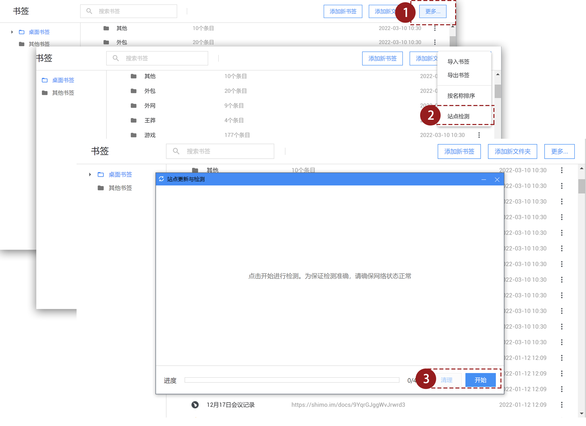

