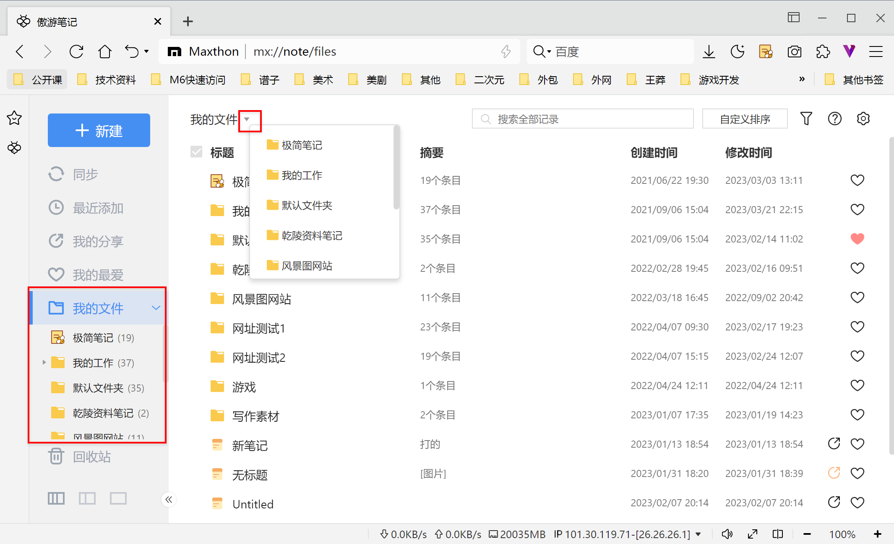
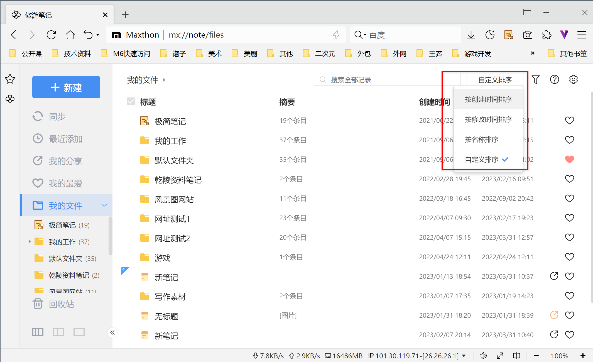
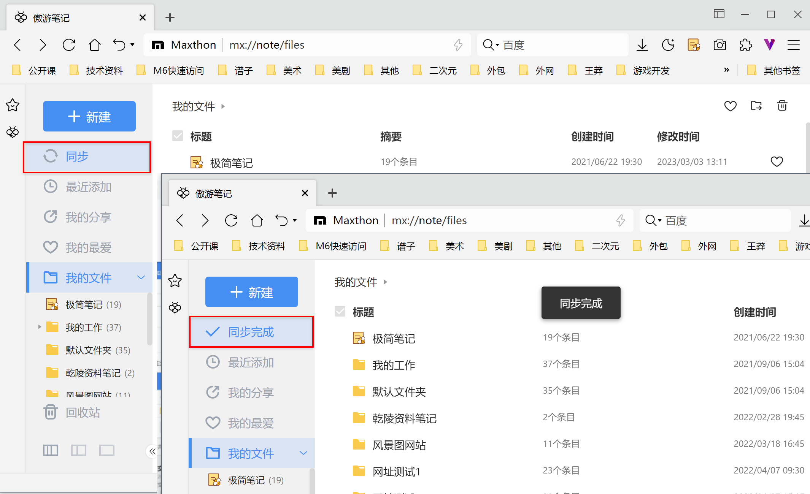
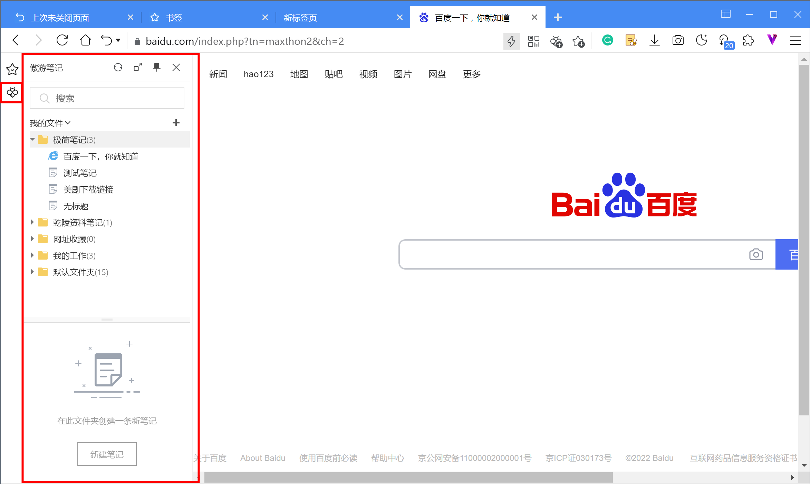

# 使用傲游笔记

傲游笔记是 Maxthon 的特色功能，为您随时随地将网络内容一键藏尽。

使用傲游笔记保存网页，点击地址栏收藏到按钮，在弹窗的对话框中设置：

- 笔记名称

- 笔记存储位置

- 笔记类型

  - 网址 ：仅保存网址
  - 正文 ：网页正文内容部分将被解析并保存
  - 截图 ：将自定义屏幕截图保存至傲游笔记
  - 选择 ：在当期网页上选择内容，然后保存至傲游笔记
  - 图片 ：将当前网页作为图片保存至傲游笔记

  

## 保存网址至傲游笔记

傲游笔记支持网址收藏，点击地址栏收藏到按钮，在弹出的对话框中选择只收藏网址，网址类型的笔记仅保存【名称+URL】，在笔记点击将直接跳转。

## 保存网页正文至傲游笔记

1. 点击地址栏收藏到按钮，选择网页正文按钮；
2. 进入笔记预览模式，点击笔记工具条上的按钮，可关闭预览，点击【保存】完成
3. 进入笔记详情页，对笔记进行编辑。

## 将截图保存至傲游笔记

1. 点击地址栏收藏到按钮，选择截图按钮；
2. 进入屏幕截图模式下，并对截图进行设置及编辑，点击确认；

3. 进入预览模式确认截图效果，点击保存完成。点击笔记工具条上的按钮，可关闭预览。
4. 进入笔记详情页，对笔记进行编辑。

## 将选中的的内容保存至傲游笔记

1. 点击地址栏收藏到按钮，选择选择内容按钮；
2. 进入内容选择模式，选中想要保存的内容后，点击【完成】

3. 进入预览模式确认效果，点击保存。点击笔记工具条上的按钮，可关闭预览。
4. 进入笔记详情页，对笔记进行编辑。

## 将网站保存为图片存入傲游笔记

1. 点击地址栏收藏到按钮，选择图片按钮；
2. 预览截好的图片，点击保存。点击笔记工具条上的按钮，可关闭预览。
3. 进入笔记详情页，对笔记进行编辑。

## 傲游笔记的常规管理功能

进入傲游笔记，对笔记进行编辑及管理

您可以通过以下方式进入傲游笔记：

1. 点击右上角更多按钮，在主菜单中点击【傲游笔记】
2. 在新标签页右上角点击【傲游笔记】
3. 点击地址栏收藏到按钮，在对话框中点击右下角【傲游笔记】

#### 笔记界面及展示形式

- 默认会进入您上次保存或编辑笔记的目录，可通过我的文件左侧目录树切换。
- 左侧目录树收起时，您也可以直接在上方文件路径中点击上级文件夹的后方的三角图标切换至对应文件夹。
- 如果需要进入最近添加、我的分享、我的最爱等位置，直接在左侧目录树点击即可。

#### 新建空白笔记

1. 在左侧目录展开时，点击页面点击左上角按钮，新建一个空白笔记；
2. 在左侧目录收起时，点击页面左上角按钮，即可直接新建一个空白笔记。鼠标停驻在新建按钮上，会显示一个下拉菜单，您可以可以在菜单中选择新笔记。
3. 新建笔记默认建立在您当前所在目录下，并直接进入编辑状态。在笔记目录中对应的条目，使用鼠标右键点击，在右键菜单中选择移动至，可以变更笔记条目的文件夹。
4. 在编辑笔记的右上角点击移动至图标，可将当前笔记移动至其他文件夹，在弹出窗口选择对应的文件夹即可。
5. 在目录中的文件夹上单击鼠标右键，在右键菜单中选择新建笔记，也可以在这个文件夹中新建笔记，将笔记直接创建到您需要的文件夹中。
#### 使用文件夹整理笔记

傲游笔记支持多层级文件夹，帮助您整理笔记。

您可以通过以下方式创建文件夹：

1. 鼠标停驻在页面左上角的新建图标或上，在展开的菜单中选择新建文件夹。文件夹会默认创建在当前目录下。如果您需要更换父文件夹路径，可以在弹出的新建窗口中进行修改。
2. 在目录上点击鼠标右键，选择【新建文件夹】，也可以创建对应目录下的子文件夹。

   

#### 笔记的移动与排序

1. 笔记的排序设置

- 傲游笔记提供多种排序方式的组合形式。您可以根据需要，进行选择。
- 在傲游笔记的整理页面右上角点击设置图标，即可打开设置窗口进行笔记排序方式设置。

- 文件夹的排序和展示规则可以分为两种
    - 统一规则：即所有的文件夹应用同一种排序和展示方式。选择此项后，在列表中切换排序展示规则，将会应用到所有文件夹和子文件夹中。
    - 分别设置：即文件夹分别应用不同的排序和展示规则。选择此项后，每个文件夹所应用的排序和展示规则可以分别设置。在列表上方选择下拉菜单中的排序方式，仅会改变当前文件夹的排序，不影响其他文件夹（包含子文件夹）
- 在文件夹中，所有子文件夹将排在最前，笔记和网址排在文件夹后面，笔记和文件夹都会按照您设置的排序方式进行排列。
- 排序方式一共分为7种，共两个类型：确定规则排序和自定义排序。其中，确定规则的排序分为按创建时间正序；按创建时间倒序；按修改时间正序；按修改时间倒序；按名称正序；按名称倒序。

2. 自定义排序
- 自定义排序和其他排序方式不同，每个文件夹都会建立一套您自己设置的自定义排序顺序。当您切换到自定义排序时，文件夹的排序方式将会自动切换至自定义排序的顺序。
- 在自定义排序时拖动文件或文件夹，将调整您的自定义排序顺序。
- 点击列表项前方的勾选，可以多选文件。多选文件时，可以将多个文件一起拖动。
- 在确定规则的排序方式，即非自定义排序的排序方式下，也可以拖动文件改变顺序，此时，将会提示您变更排序方式为自定义排序，并覆盖原本的自定义排序规则。即在非自定排序方式下拖动文件改变顺序相当于使用确定的排序规则整理自定义排序的排序方案。

3. 筛选工具

在笔记界面点击右上角筛选按钮，可对笔记进行筛选。根据筛选项的不同，将显示不同的图标角标。

#### 删除笔记与最爱笔记

- 您可以通过鼠标右键选择对笔记进行删除或标记为最爱；
- 也可以选中多个文件后，通过右上角设置最爱按钮或删除到回收站按钮完成交互；
- 设置为最爱的文件，可在目录栏中查看，再次点击红心，即可取消设置最爱；
- 删除文件放在，您可在回收站中执行恢复或彻底删除操作。

#### 笔记同步

- 如果您登录了傲游云账户，笔记将被实时同步；
- 当同步状态正常时，将在左侧菜单同步位置显示同步完成，或图标；
- 点击同步按钮也可手动激活一次同步。

## 使用笔记侧边栏

- 在界面设置中打开侧边栏后，可以点击侧边栏上的蜜蜂按钮，打开笔记侧边栏。
- 在笔记侧边栏中点击网址类型可以直接打开笔记中的网址。
- 笔记类型可以在下方的简易编辑框中编辑

