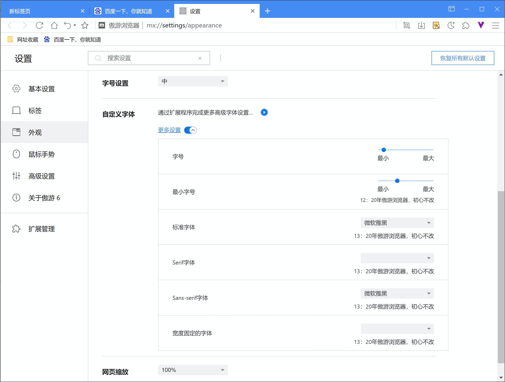
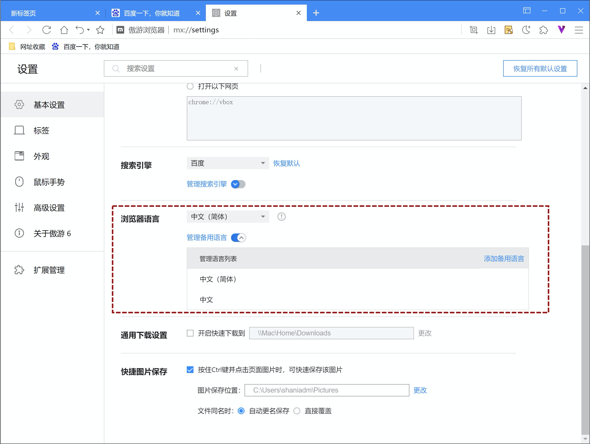
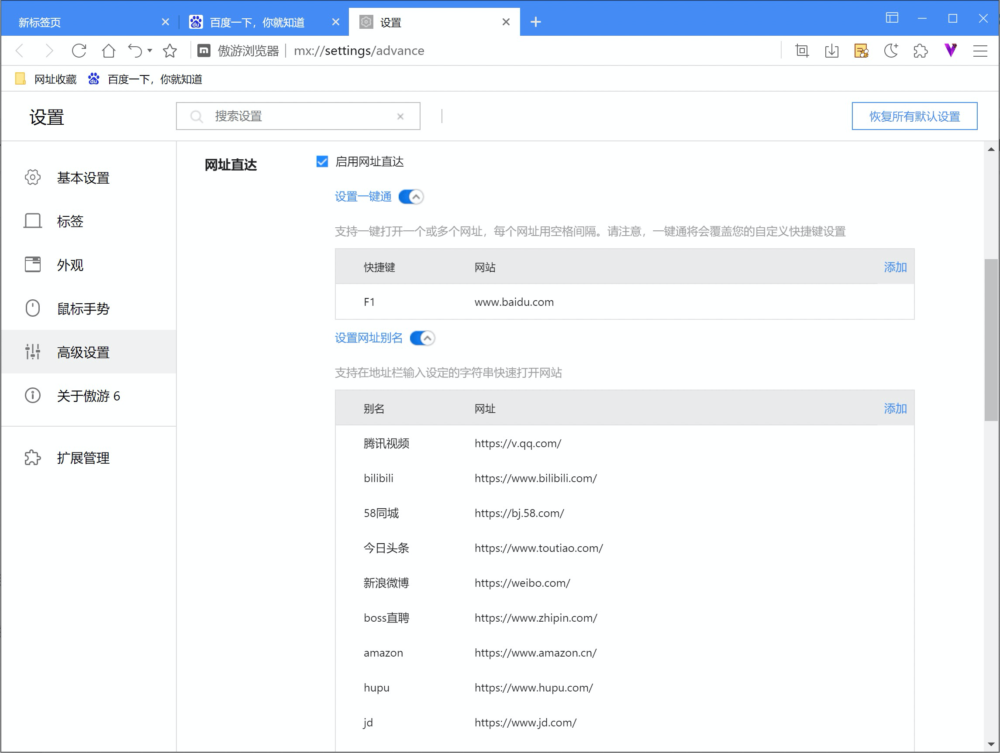
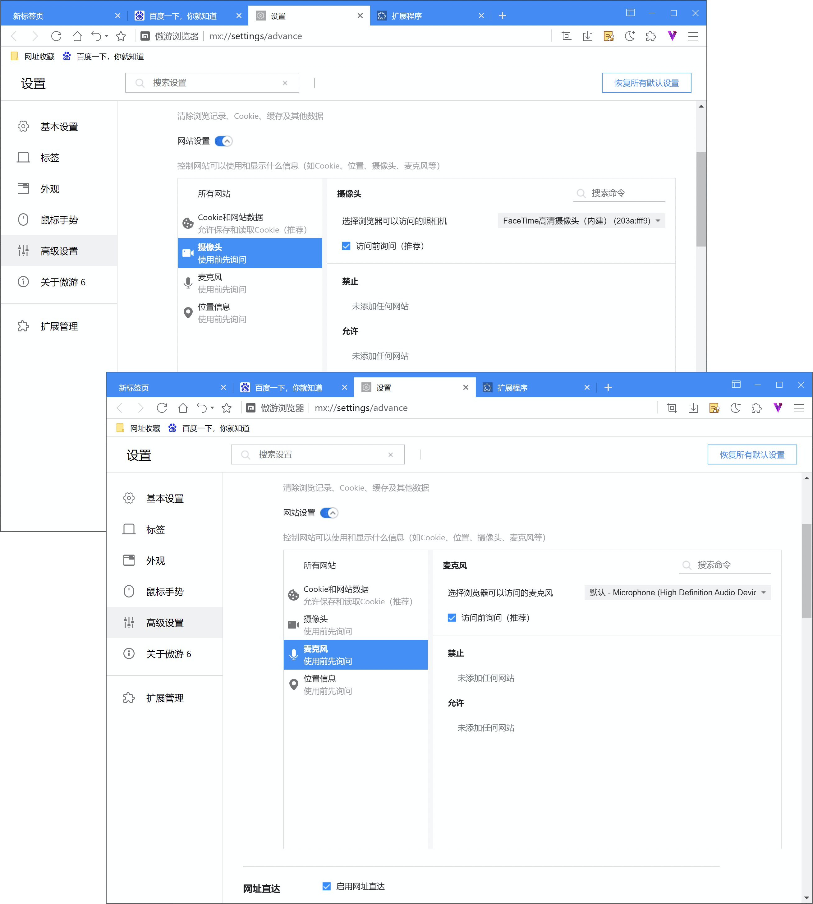

 # 更改设置

## -修改文字显示样式

在设置页面，选择【外观】标签，可对字号及字体进行详细的自定义设置。

小窍门：网络阅读最舒适的字体为13~14号，即推荐的中号字体，如果如有阅读困难，可调整至大号字体，但或许会有损于部分网页展示。

## -更改Maxthon的语言

Maxthon支持55种语言，在设置页选择【基本设置】标签，在其中的【浏览器语言】设置中，可切换当前浏览器语言。

您可以通过【添加备用语言】将常用语言加入备用语言列表，即可通过下拉列表快速切换语言。

## -使用网址直达快速访问网站

Maxthon继续支持【网址直达】功能，在设置页点击【高级设置】标签，滚动至【网址直达】。

- 网址直达：是指将快捷键与网址绑定，直接通过快捷键即可快速打开网页；
- 网址别名：设置网址别名后，在地址栏输入定义的别名，可直接跳转至网页，而非激活搜索功能。

## -使用您的摄像头和麦克风

当您使用Maxthon打开需要使用麦克风和摄像头的网站。将会弹出系统提示，选择允许或屏蔽：

允许的网站：当您转到相应网站时，此网站便可开始录制。如果您正在浏览另一标签页或正在使用另一应用，此网站将无法开始录制。

已屏蔽的网站：某些网站在遭到屏蔽后将无法正常运行。例如，您将无法参加视频会议

#### 更改网站的摄像头和麦克风权限

在设置页面，进入【高级设置】标签，在隐私与安全项目中，打开【网站设置】，即可对摄像头和麦克风修改权限。

## -更改系统配置及缓存位置

如果您的C盘存储内容过多大致系统速度缓慢，可通过修改浏览器缓存位置优化这一现象。在设置页面，选择【高级设置】标签，在缓存目录项目中，点击【更改】可选择浏览器缓存位置。

