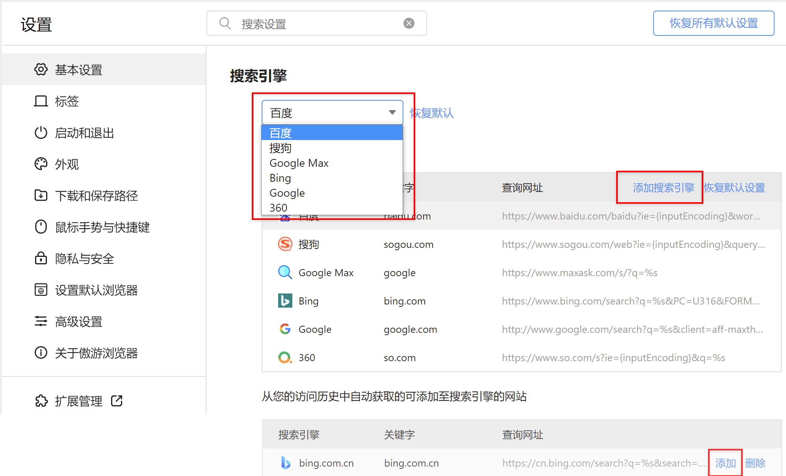
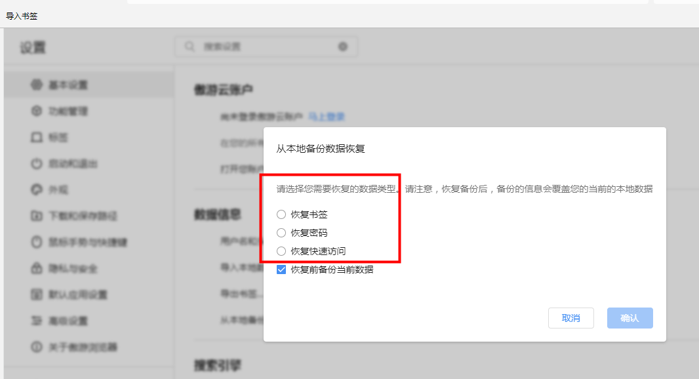
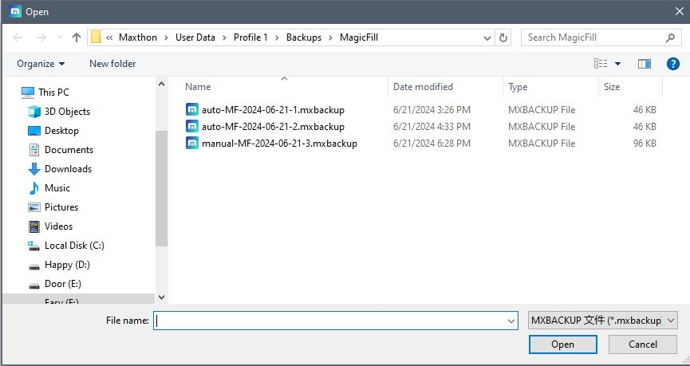

Maxthon# 常见问题

## 浏览器崩溃问题处理

- 浏览器崩溃一般有哪些原因：

  - 页面过多，资源被强占，内核负载量过多；
  - 存在残留进程被锁定，导致再次启动浏览器时无法启动或崩溃;
  - 用户安装的扩展导致浏览器不稳定，从而闪退；
  - 账号数据异常触发了浏览器的非正常处理，导致浏览器崩溃或卡死;
  - 其他软件（特别是管家安全类软件）拦截或其他浏览器拦截导致；
  - 广告过滤插件功能陈旧导致广告拦截异常（可尝试手动更新或禁用广告拦截类插件）。

- 浏览器崩溃问题解决
  1. 打开任务管理器，查看是否存在残留的 Maxthon 进程，如果存在则需要强制结束此进程，无法结束的请重启电脑，然后再尝试启动浏览器；
  2. 如果问题未能解决，请尝试升级到最新版本的 Maxthon 浏览器。您可以打开浏览器帮助页(mx://settings/help) 或点击右上角的菜单> 帮助 > 关于傲游浏览器，在该页面查看是否为最新版本的傲游。
  3. 检查当前电脑是否安装了安全防护软件、网页注入软件等，如果有，请先行关闭对应软件，观察崩溃现象是否有缓解
  4. 检查当前电脑是否打开程序过多，内存占用或 CPU 占用较高，这些都可能导致浏览器网页卡顿，可以关闭部分软件以释放资源，您可以在外观设置中点击显示状态栏，随时查看您的电脑 CPU 占用情况。
  5. 如果问题还未解决，欢迎在论坛或反馈中联系我们，我们会尽快回复并帮助您解决问题。

## 如何提提升 Maxthon 运行速度

有各种各样的原因会导致浏览器运行速度下降，一般有几种方法可以解决此问题。

- 使用[隐身模式](05-browse?id=使用隐身模式无痕浏览网页)浏览
- 删除浏览器缓存文件
- [变更浏览器的缓存文件夹存储盘](14-setting?id=-更改系统配置及缓存位置)
- 删除不需要的历史记录(mx://history)
- 插件由于使用单独的进程，提升使用体验的同时会影响浏览器速度，造成浏览器卡顿，关闭不在使用中的插件可以很大程度上缓解这一问题。
- 使用 VPN 或代理服务会使浏览器打开页面的速度下降。如无特别需要，可关闭VPN服务。

## 在 Maxthon 上报告问题或发送反馈

在您的使用过程中，如果遇到了任何问题，请及时向我们反馈，以便于我们第一时间联系你们。
您可以访问：[https://www.maxthon.cn/mx/bug/post/](https://www.maxthon.cn/mx/bug/post/)，在线填写反馈意见表，也可以通过右上角更多按钮打开主菜单，选择【帮助/反馈】，同样可以可以打开反馈意见表。

## 傲游支持哪些系统

- 傲游 PC 版支持 windows7 及以上版本（包含 win7/win8/win10/win11 各个版本），支持 windows32 位和 64 位系统，
- 傲游安卓端支持 Android 5 及以上版本
- 傲游 ios 端支持 ios10 及以上版本
- mac 和 Linux 用户可以使用傲游的历史版本。

## 如何修改安装目录

### 在首次安装时修改安装目录

在安装界面点击路径右边的文件夹图标，选择您需要安装的路径即可。直接输入路径也可以安装。

### 安装后需要修改安装目录

目前我们仅支持在安装界面修改安装路径，初次安装后，如果想要修改，需要卸载，全新安装，才能修改。如果需要重新安装，可以登录傲游账户，同步您的数据之后再卸载重装，重装后您的数据都将完整保留。
如果直接挪动文件夹目录，后续可能卸载浏览器会遇到问题，我们不推荐。

## 如何启用插件

点击在地址栏右侧的拼图碎片图标即可打开插件浮窗，查看您已经启用的插件。
点击浮窗下方的管理拓展按钮，或直接打开 mx://extensions 都可以查看您已经安装的插件列表，并在此启用、关闭、或设置每个插件的详细权限。
部分插件启用可以设置快捷键。设置完成后，在页面内直接输入快捷键即可启用。

## 如何自定义添加搜索引擎

### 修改搜索引擎
您可以切换默认搜索引擎，也可以添加新的搜索引擎。

- 进入设置页面，在【基本设置/搜索引擎】中，点击下拉列表可切换默认搜索引擎；切换成功后将影响所有使用默认搜索引擎的功能，比如新标签页内置搜索功能，及右键菜单的选词搜索功能。
- 展开【管理搜索引擎】，可对搜索引擎进行增删改操作。

### 添加傲游未收录的搜索引擎
1. 打开要添加的搜索引擎。比如百度知道
2. 在这个网站做一次搜索。 
3. 将搜索结果页面的网址复制并粘贴到URL字段中。部分URL会对中文搜索词进行编码，需要一定的技巧
    - 例如，如果你搜索“傲游”，百度知道搜索结果的URL是https://zhidao.baidu.com/search?lm=0&rn=10&pn=0&fr=search&ie=gbk&dyTabStr=null&word=%B0%C1%D3%CE
    - 在上面这个例子里，%B0%C1%D3%CE就是编码后你的搜索词“傲游”。中文编码后的字符串会包含很多%和字母数字的组合。
4. 将URL中的搜索词替换为“%s”。 
    -例如，在上面的例子里，您的搜索引擎地址将是`https://zhidao.baidu.com/search?lm=0&rn=10&pn=0&fr=search&ie=gbk&dyTabStr=null&word=%s`. 
5. 将这个搜索引擎设置为你的默认搜索引擎，这样在地址栏、划词右键搜索和新标签页里，你的默认搜索都会改变。

## 傲游 5 和 新版傲游数据可以同步么？

使用傲游账户即可在首次安装新版傲游时，将账号傲游 5 内的数据迁移到全新傲游，同时保留了傲游 5 数据的独立性。
在这次同步之后，傲游 5 的数据与新版傲游无法再次互通。
但是，傲游笔记中的内容在相同账号下，无论使用的是傲游 5 还是新版傲游，都是始终同步的。

## 丢失的数据如何恢复
1. 打开浏览器右上角的“☰”图标，选择“设置”。
2. 在设置中，找到“基本设置”->“数据信息”->“从本地备份信息恢复”。
3. 您可以选择恢复书签、恢复快速访问或者恢复密码：

4. 选择您需要恢复的数据项，系统会自动打开备份文件夹。在备份文件夹中，会显示备份的时间。请根据时间选择文件。点击文件后，单击“打开”。

5. 选择备份文件后系统会自动恢复备份文件。请注意，恢复备份后，备份的信息会覆盖您的当前的本地数据。系统备份数据在备份文件夹里都会标注“manual”
⚠️ 如果需要提前手动备份当前的本地数据，可以在以下文件路径中备份：

 - 书签：打开浏览器右上角的“☰”图标，选择“设置”。在设置中，找到“基本设置”->“傲游云账户”->“打开您账户的本地文件夹”。在Windows系统中，会直接打开本地的账号的profile文件夹。在打开的文件管理器里，找到“Bookmarks”文件。如果需要数据恢复前备份，可以复制这个文件，另存在其他位置。
 - 快速访问：打开浏览器右上角的“☰”图标，选择“设置”。在设置中，找到“基本设置”->“傲游云账户”->“打开您账户的本地文件夹”。在Windows系统中，会直接打开本地的账号的profile文件夹。在打开的文件管理器里找到“QuickAccess”文件夹，文件里即为您的快速访问数据。如果需要数据恢复前备份，可以复制这些文件，另存在其他位置。
 - 密码：打开浏览器右上角的“☰”图标，选择“设置”。在设置中，找到“基本设置”->“傲游云账户”->“打开您账户的本地文件夹”。在Windows系统中，会直接打开本地的账号的profile文件夹。在打开的文件管理器里找到“MagicFill”文件夹，文件夹里就是加密过后的您的密码大师数据，如果需要数据恢复前备份，可以复制这些文件，另存在其他位置。

## 关于 Web Indexing ( Bright Data 提供支持 )

开启Web Indexing之后，作为使用设备资源的交换，你将会获得额外的金币，并且只会以不会对设备运行产生重大影响的方式进行 (你可以在[https://bright-sdk.com/faq#sdk_app_connect](https://bright-sdk.com/faq#sdk_app_connect)上了解具体的操作). 您可以在设置菜单中随时关闭此功能. 请查看我们的 [服务条款](https://www.maxthon.com/en/docs/eula/) 和SDK隐私政策 [https://brightdata.com/legal/sdk-privacy](https://brightdata.com/legal/sdk-privacy) 以获取更多信息。
