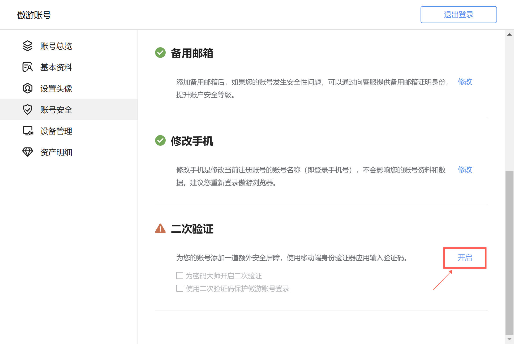

## 二次验证功能

本文档提供傲游浏览器二次验证功能的详细介绍和使用指南，旨在帮助用户增强账户的安全性。通过二次验证，即使他人获取了您的密码，没有第二重验证，也难以登录您的账户。

### 什么是二次验证？

二次验证（又称两步验证）是一种安全措施，要求用户在输入密码之外，还需提供第二种形式的验证信息。这通常涉及到接收一个短信验证码或使用一个专用的验证器生成的代码。

#### 什么是二次验证器？

二次验证器是一个生成安全验证码的应用，用以完成二次验证过程。我们推荐使用 **Microsoft Authenticator** 应用，它可以生成用于登录验证的临时、定期变化的数字代码。

#### 验证码、密钥与重置码

- **验证码**：是指由二次验证器生成的一次性、定期变化的数字密码，一般每30秒重新生成一个，用于在登录或执行敏感操作时验证身份。
- **密钥**：密钥是一种用于生成一次性密码（OTP）的特殊字符串，确保即使密码泄露，攻击者在没有该密钥的情况下也无法通过二次身份验证来访问您的账户。验证器添加过程中，可以手动输入密钥添加账号，也可以使用扫码二维码添加账号，密钥会携带在二维码里提供给验证器应用。
- **重置码**：是在您成功设置二次验证后由系统提供的一串字符，用于在丢失访问二次验证器时重置二次验证设置。此码非常重要，需要妥善保管。

### 开启二次验证

#### 准备工作

在启用二次验证之前，请确保您的傲游账户已绑定手机号和邮箱。

#### 开启流程

1. **身份验证**
   - 路径：傲游账号 -> 账号安全 -> 二次验证模块，点击“开启”。
   - 
   - 首先验证您的傲游账号密码，以确认身份。
   - 

2. **下载验证器**
   - 扫描页面上显示的二维码，前往应用市场下载Microsoft Authenticator应用。
   - 

3. **设置验证器**
   - **在验证器应用中点击“添加新账号”或点击“+”，选择“其他账号”，验证器会调用摄像头。使用手机摄像头扫描傲游账号页面的二维码完成账号添加。**
   - 如果二维码扫描不可用，可选择手动输入账号和密钥方式添加。在应用扫码界面下方点击手动添加。在账号上输入Maxthon（或傲游），然后填入傲游账号设置验证器对话框中的密钥（点击对话框复制密钥，使用即时通讯软件发送到手机，并粘贴在验证器应用上添加账号页面的密钥文本输入处。）
   - **成功添加后，如果界面内没有显示验证码，可以点击对应的账号进入子页面，验证器会生成一个6位数字验证码，需在傲游账号对话框的验证码输入框中输入此验证码以完成绑定过程。**
   - 

4. **保管重置码**
   - 绑定成功后，系统将通过邮箱发送一个重置码，用于在您无法访问验证器时重置二次验证。请妥善保管此码。**如果您的邮箱中没有收到重置码，请查看垃圾箱。** 邮件标题为 Important: Reset Code for Two-Factor Authentication from Maxthon Account
   - 

5. **刷新页面验证二次验证是否生效**
   - 绑定成功后，请刷新账号页面，此时点击一次勾选二次验证保护密码大师，如果确认密码对话框中要求输入二次验码，那么绑定二次验证成功。如果您不需要开启这个功能，直接关闭对话框即可。
   - 

### 使用二次验证
- **保护账号安全**：在进行账号安全相关操作时，如果您开启了二次验证，将会要求输入二次验证码。您可以打开身份验证器（推荐使用Microsoft Authenticator，如果您当时使用的是其他验证器绑定二次验证，请打开对应的二次验证器应用），在 Authenticator 中找到您的 Maxthon 账号，点击进入账号后，在“一次性密码代码”中显示的，每 30 秒更新一次的六位数字，即为您的二次验证码。
- **保护登录**：在“账号安全”下的二次验证设置中，启用“保护登录”，随后每次登录时除密码外还需输入验证器生成的验证码。
- **保护密码大师**：启用此选项后，访问密码大师（傲游的密码管理器）时，也需通过二次验证。

### 管理二次验证

#### 停用二次验证
- 若需停用，进入二次验证设置，输入密码及当前的验证码即可暂停此功能。停用后，以前的验证器绑定保持有效，重新开启时可继续使用。

#### 重置二次验证

- 如果您丢失了访问验证器的能力，可以使用之前保管的重置码和当前的验证码来重置二次验证设置，之后需要重新绑定验证器。如果您丢失了重置码，可在您账号绑定的邮箱中，找到绑定二次验证码时发送的邮件。
- 如果您无法找到重置码，也可以联系傲游客服重置。
- 重置后，如果仍然需要开启二次验证，之前的二次验证器绑定账号就会失效，需要重新绑定。

