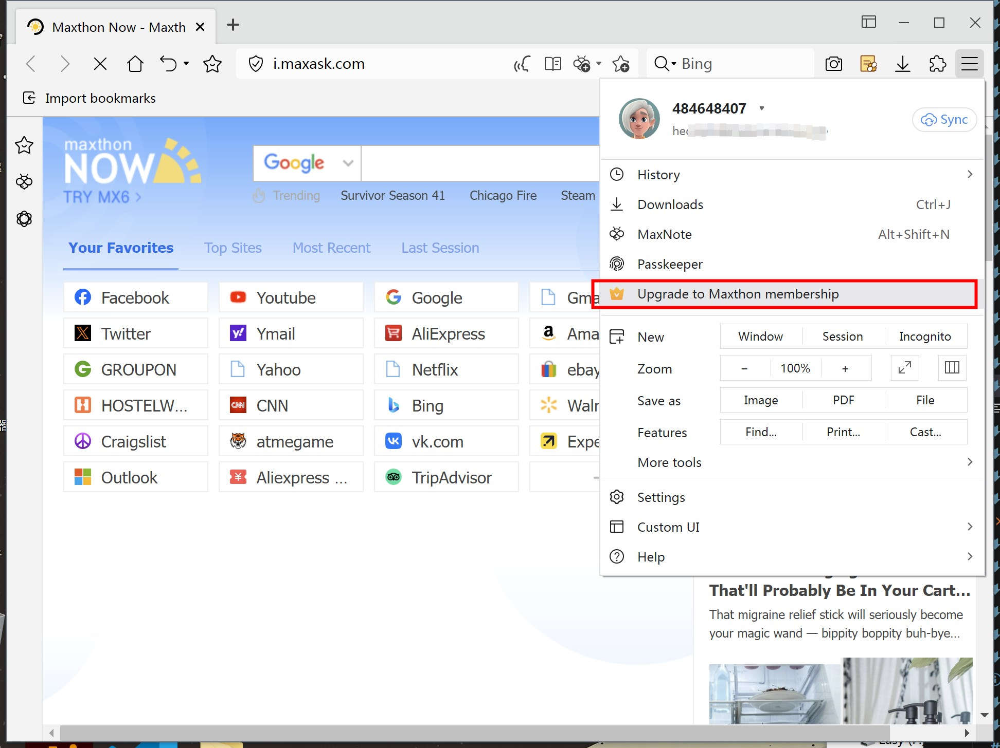
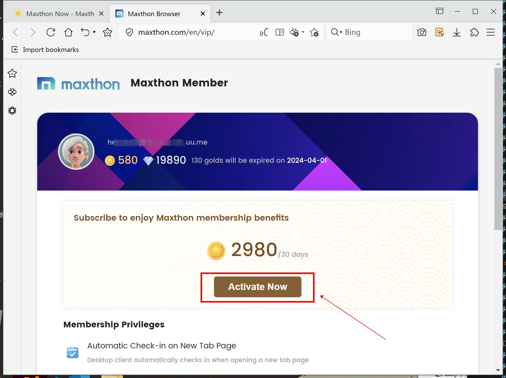

# 傲游浏览器会员 - 如何理解并激活您的会员资格 🌟

欢迎使用本指南，了解如何通过我们的独家会员计划充分利用您的傲游浏览器体验。无论您是想通过高级功能增强浏览体验，还是寻求无广告的浏览体验，本指南都是您迈向更强大和个性化网络导航的第一步。

## 了解傲游会员

傲游浏览器会员提供一套额外的功能和福利，旨在提升您的浏览体验。傲游会员专为那些对浏览器有更高需求的用户设计。

### 主要福利包括：

- **特殊安全权限** 享受更快速的无障碍浏览体验。
- **自动签到** 打开新标签页自动签到啊获取金币
- **独家功能:** 在公开发布之前访问新功能。
- **增强支持:** 在需要帮助时获得我们团队的优先支持。

欲了解福利详情，请访问我们的[傲游会员](https://www.maxthon.com/vip/)页面。

## 如何激活您的会员资格

按照以下步骤激活您的傲游会员资格：

1. **注册或登录:** 如果您是傲游的新用户，需要[创建一个账户](https://my.maxthon.com/)。现有用户可以直接[登录](https://my.maxthon.com/)。游客账户需要设置密码。
2. **访问会员页面:** 前往我们网站上的[傲游会员](https://www.maxthon.com/vip/)页面。
3. **付款:** 完成付款流程以激活您的会员资格。我们支持多种支付方式，以方便您的使用。

 

 

## 常见问题解答 (FAQs)

**问: 我可以随时取消我的会员资格吗？**
答: 是的，您可以随时通过[傲游会员](https://www.maxthon.com/vip/)页面取消您的会员资格续订。

**问: 我如何访问独家会员功能？**
答: 一旦您的会员资格激活，独家功能即可使用。访问[傲游会员](https://www.maxthon.com/vip/)页面了解更多信息。

## 需要帮助？

如果您有任何问题或需要进一步的帮助，请随时联系我们：[support-pc@maxthon.net](mailto:support-pc@maxthon.net)。我们的团队将确保您拥有最佳的浏览体验。

感谢您选择傲游浏览器作为您的网络门户。我们很高兴您成为我们社区的一员，并期待为您提供无与伦比的浏览体验。
