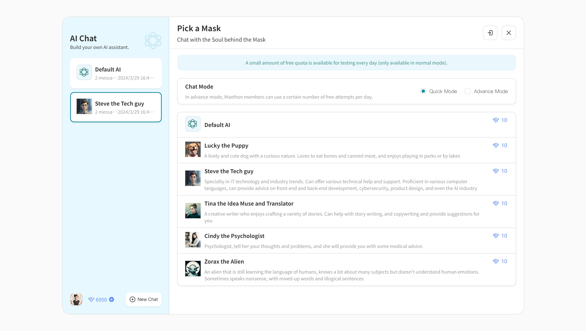
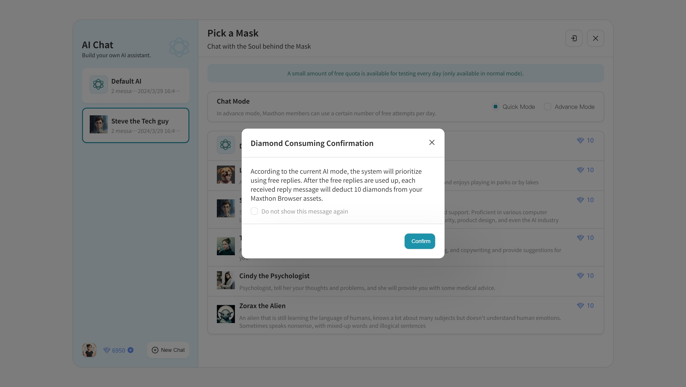
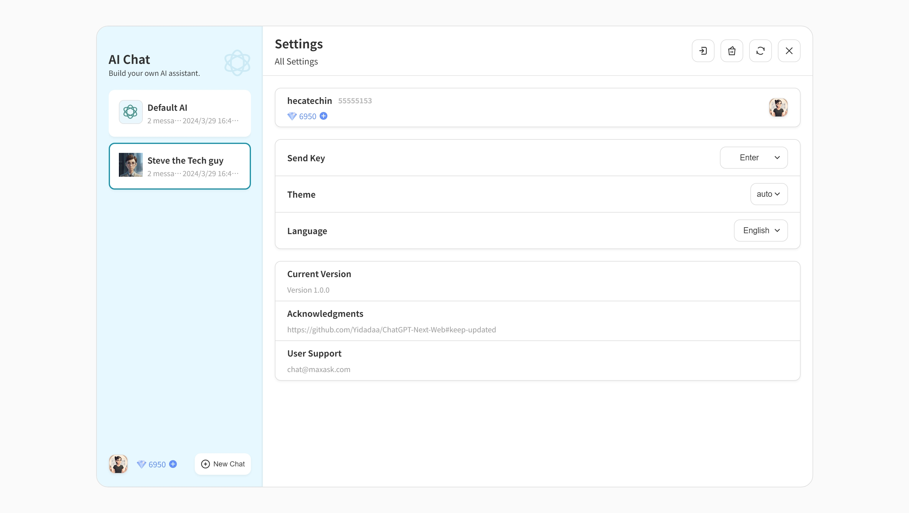
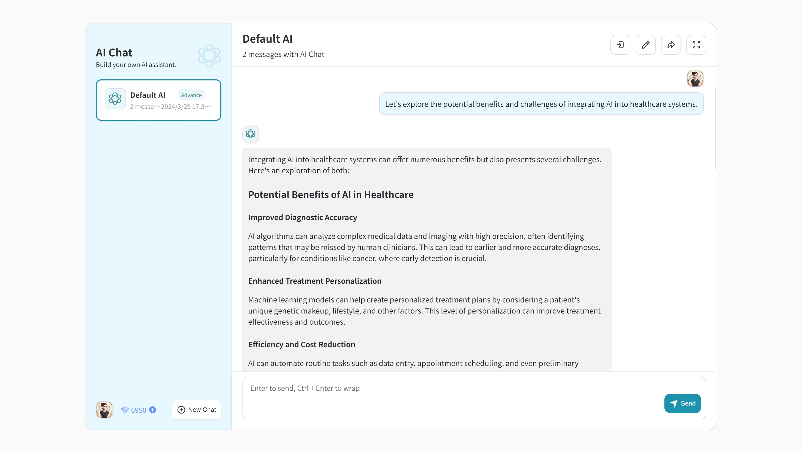

# 傲游 AIchat 用户指南 📘

欢迎来到傲游 AIchat！提供各种 AI 角色的独特聊天体验，AIchat 让您在傲游浏览器中进行互动，以获得帮助或娱乐。本指南提供了详细的操作说明，帮助您充分利用 AIchat 体验。

## 入门 🚀

在您的电脑上打开 AIchat，请在傲游浏览器左侧边栏中找到 AIchat 图标，通常是从上往下的第三个图标。您也可以在新标签页左上角的应用列表中找到 AIchat。对于手机用户，AIchat 可以从主屏幕顶部的快速访问图标中进入。AIchat 可在 Windows、Mac、iOS 和 Android 平台上使用。

### 选择您的 AI 角色

从各种 AI 角色中选择，每个角色都有独特的专长：

- **默认 AI**：您的多功能聊天伙伴。需要您指定任务类型，才能更好的发挥作用。
- **小狗 Lucky**：适合玩乐、轻松的互动，他还有些背景故事哦。
- **技术达人 Steve**：提供技术和 IT 指导。
- **创意灵感与翻译师 Tina**：写作和翻译的创意盟友。
- **心理学家 Cindy**：提供心理洞察和虚拟同情的倾听。
- **外星人 Zorax**：一个具有非传统智慧的奇特角色。

要选择 AI 角色，请点击他们的头像。

## 聊天模式

通过两种方式与 AIchat 互动：

- **快速模式**：每天限量的免费聊天次数。免费次数耗尽后，对话会消耗钻石。
- **高级模式**：以钻石为代价进行深入的对话。

### 聊天界面

聊天界面右上角的按钮允许您：

- **退出**：安全地离开您的 AIchat 会话。
- **编辑聊天标题**：自定义聊天窗口标题。
- **导出聊天记录**：以 Markdown 格式保存聊天记录。
- **全屏模式**：全屏体验聊天。

### 管理您的钻石

钻石是继续聊天的货币，无论是高级模式还是在免费试用结束后的快速模式。钻石不足？点击 '+' 购买更多，价格为 $1 可获得 1000 钻石。

## 聊天记录

您的聊天记录列在左侧。如果已登录傲游云账号，AIchat 将在设备间同步您的聊天记录。

## 设置

点击左下角的头像进入设置。调整选项包括：

- **发送键**：选择 `Enter`、`Shift + Enter`、`Ctrl + Enter`、`Alt + Enter` 或 `Meta + Enter`。
- **主题**：在深色模式和浅色模式之间切换以匹配您的浏览器。
- **语言**：选择简体中文或英文作为界面语言。

设置菜单右上角的按钮有：

- 🔒 **退出登录**：退出您的 AIchat 账户。
- 🧹 **清除数据**：删除所有聊天数据。
- 🔧 **重置设置**：恢复默认设置。
- ❌ **关闭设置**：离开设置菜单。

## 聊天提示与技巧 😊👍

在为 AIchat 构建提示时，以下策略可以提升您的体验：

- **清晰** 🎯：明确表述您的话题或问题。
- **背景信息** 📖：提供任何可能与对话相关的背景信息。
- **开放性** 🌟：提出允许广泛回答的问题。
- **具体性** 🔍：详细说明您想了解或实现的内容。
- **简洁性** 📏：保持直接简明，以避免任何误解。

例如，询问 AI 在医疗保健中的应用时，您可以这样说：“让我们探讨将 AI 融入医疗系统的潜在优势和挑战。”这种方法清晰、针对性强，并且邀请广泛的对话。

## 用户支持

需要帮助或想要反馈？请联系 help@maxthon.com。

---

注意：聊天互动受限于一个大约 900 个 token 的限制，代表语言片段如单词或短语。过长的信息可能会被压缩以适应此限制，这可能会影响 AI 的回应上下文。
