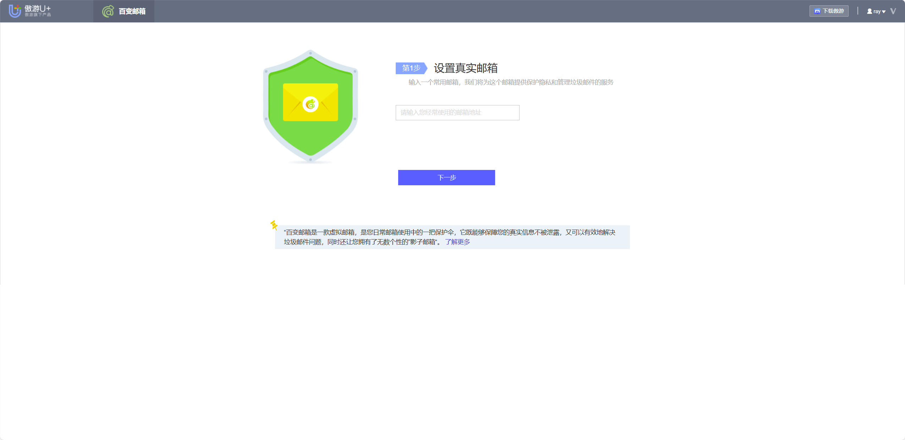
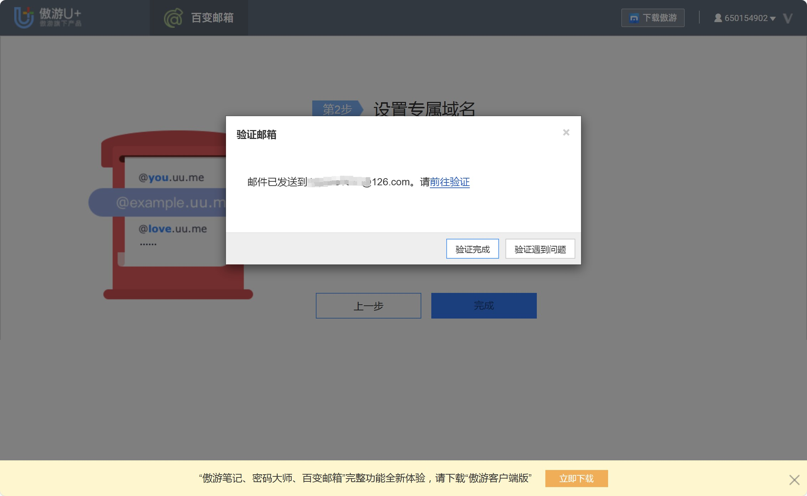
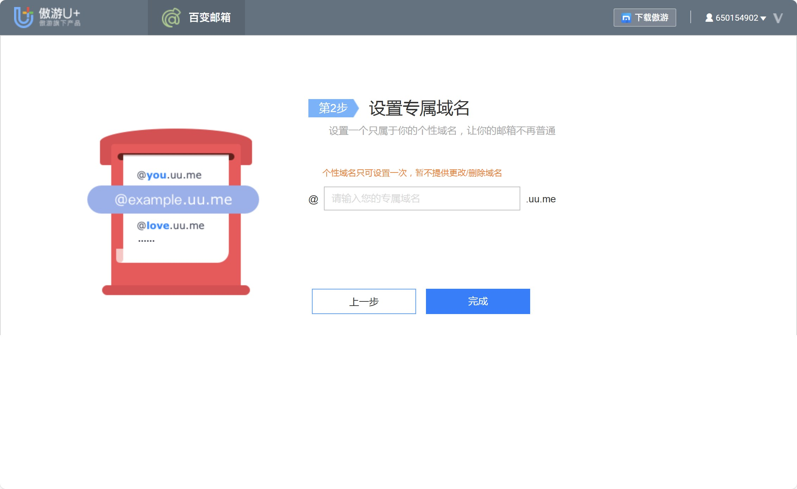
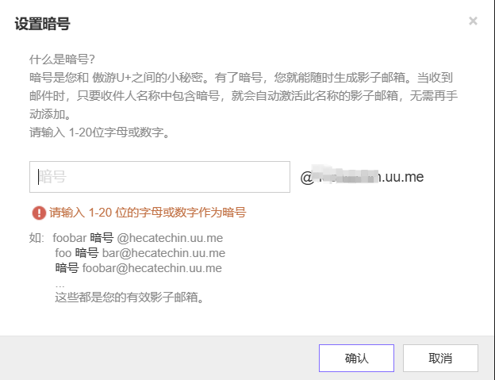
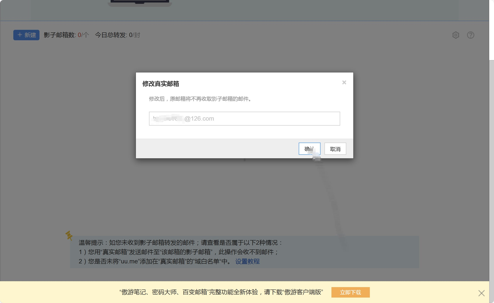

# 百变邮箱帮助文档 📧

### 1. 什么是百变邮箱？🤔

百变邮箱是一款保护隐私的电子邮件服务。它通过影子邮箱 🕵️‍♂️ 帮助用户隐藏真实邮箱，避免垃圾邮件和信息泄露。你可以创建多个影子邮箱，用来在不同场景下接收邮件，完全不用担心隐私问题！🎉

### 2. 什么是常用邮箱？📬

常用邮箱就是你用于接收影子邮箱转发邮件的真实邮箱。需要绑定并验证你的常用邮箱才能正常使用百变邮箱服务。

#### **如何绑定常用邮箱**：

1. 输入你的常用邮箱地址，点击 **下一步**。
2. 系统会发送一封验证邮件 📩 到该邮箱。
3. 打开邮件，点击里面的验证链接完成绑定。🔗

### 3. 什么是影子邮箱？🕶️

影子邮箱是百变邮箱提供的虚拟邮箱服务，所有收到的邮件都会被转发到你的常用邮箱。影子邮箱可以帮助你在不泄露真实邮箱的情况下轻松管理邮件。

- 每个用户最多可以创建 **20 个影子邮箱**。📧
- 影子邮箱的邮件会自动转发到绑定的常用邮箱 📥。

### 4. 影子邮箱的实际用途 💡

1. **一次性账号注册**：有些网站注册需要使用邮箱，但你不想暴露真实邮箱地址时，影子邮箱非常实用。例如，在A站注册时，你可以使用 `A@jack.uu.me` 作为注册邮箱。如果之后收到这个地址的垃圾邮件，便可以判断是A站泄露了你的信息。如果你不再需要这个邮箱，可以直接删除，避免继续收到垃圾邮件。

2. **注册多个小号**：一些游戏可能需要多个邮箱注册多个账号。使用影子邮箱就能轻松解决这个问题，你可以批量注册最多 **20 个账号**，而无需创建多个真实邮箱。

3. **防止广告邮件侵扰**：注册一些网站时，可能会担心接收过多广告邮件。你可以为这些网站创建一个专门的影子邮箱，例如 `promo@jack.uu.me`。如果该邮箱开始接收大量广告邮件，你可以随时删除这个影子邮箱，阻止更多垃圾邮件的发送。

4. **在线购物时保护隐私**：在电商平台或购物网站上注册时，你可以使用影子邮箱来保护隐私。例如，在B网站上使用 `Bshop@jack.uu.me` 注册。当你接收订单确认邮件或促销信息时，这些邮件会转发到你的常用邮箱，但不会泄露真实的邮箱地址。如果购物后不想再接收促销邮件，直接删除这个影子邮箱即可。

5. **社交媒体账号管理**：如果你在不同平台上注册多个社交媒体账号，可以为每个平台创建独立的影子邮箱。例如在Twitter注册时使用 `twitter@jack.uu.me`，在Facebook注册时使用 `fb@jack.uu.me`。这样你可以更好地管理这些平台的通知，并可以轻松识别信息泄露的来源。

6. **试用新服务**：在注册新服务、应用或订阅免费试用时，可以使用影子邮箱。这让你可以尝试新服务而不必担心过后收到大量营销邮件。如果不满意服务，试用期结束后可以删除影子邮箱，避免后续烦扰。

7. **管理多个项目或客户**：如果你是自由职业者或在多个项目上工作，可以为每个项目或客户创建单独的影子邮箱。这样不仅能保持邮件整洁，还可以轻松追踪每个项目的相关通讯。例如，为项目A创建 `projectA@jack.uu.me`，为项目B创建 `projectB@jack.uu.me`。

8. **小生意邮箱管理**：如果你拥有一个小生意，通过 uu.me 你可以免费创建一个带有自己生意名称的域名后缀（例如 `@yourbusiness.uu.me`），而无需实际注册域名。这不仅让你的生意看起来更专业，还避免了额外的域名注册费用，方便且划算。

9. **使用影子邮箱防范数据泄露**：如果某个网站的数据泄露被报道，而你使用了影子邮箱注册账号，你可以立刻删除这个影子邮箱，避免进一步的数据泄露对你产生影响。

### 5. 影子邮箱收到的邮件在哪里查看？👀

影子邮箱的所有邮件都会 **自动转发到你的常用邮箱**，所以你需要在常用邮箱里查看邮件。💌

### 6. 专属域名设置 🏷️

用户可以设置独有的个性域名，用来作为影子邮箱的后缀（如 `@yourname.uu.me`）。一旦设置完成， **个性域名无法更改或删除**。

### 7. 为什么收不到影子邮箱的邮件？📭

有几种原因可能导致收不到邮件：

1. **从真实邮箱发送到影子邮箱** 的邮件不会被转发。影子邮箱主要用于接收外部邮件。
2. **服务器出现故障** 可能会导致邮件无法送达。🚨
3. **转发延迟**：邮件转发可能需要 **1-20 分钟**，队列过长时可能需要稍等。⏳

### 8. 什么是口令？🔑

口令是一种快速创建影子邮箱的关键词设置。你可以设置一个英文字母组成的口令，之后只要在注册时使用包含这个口令的邮箱地址，系统就会自动创建影子邮箱。

#### **口令示例**：

假设你的个性域名是 `jack.uu.me`，并且设置了口令 “abc”。当你在外部注册时，使用邮箱地址如 `abc1@jack.uu.me` 或 `sabce@jack.uu.me`，系统会自动为这些地址创建影子邮箱，并将邮件转发到你的常用邮箱。📤

### 9. 如何管理影子邮箱？🧹

当影子邮箱数量达到上限时，你可以删除不再使用的影子邮箱来释放空间，从而创建新的影子邮箱。♻️

### 10. 可以更换真实邮箱吗？🔄

是的！你可以随时更换绑定的真实邮箱。更换后，之前的邮箱将不再接收影子邮箱的邮件。✉️

### 11. 如果激活常用邮箱（真实邮箱）的时候，没有收到激活邮件怎么办？📧

1. 将 `uu.me` 添加到邮箱的白名单中，检查是否进入垃圾箱。📂
2. 如果仍未收到激活邮件，可以通过用户反馈系统解决：[用户反馈](https://www.maxthon.com/report)。

### 12. uu.me 无法登录怎么办？🚫

有时由于服务器问题，uu.me 可能会出现登录故障。遇到这种情况时，可以通过用户反馈系统报告问题：[用户反馈](https://www.maxthon.com/report)。

### 13. 每个账号的邮件转发是否有限制？📬

是的，每个账号每天的邮件转发上限为 **100 封**。请注意管理您的邮件转发量。

### 14. 百变邮箱VIP服务 🎖️

百变邮箱还提供VIP服务，VIP用户可以享受更多影子邮箱和邮件转发的限额。具体价格如下：

**中文价格**：

- **99元/月**：影子邮箱总上限为 **500 个**，每天转发上限为 **1500 封**（收发总计）。
- **199元/月**：影子邮箱总上限为 **2000 个**，每天转发上限为 **3000 封**（收发总计）。
