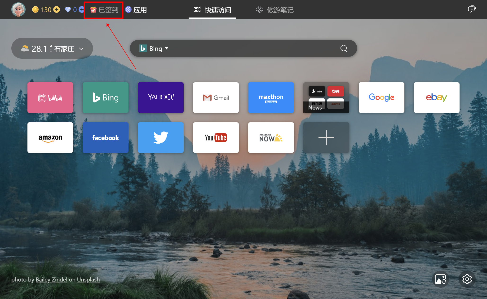
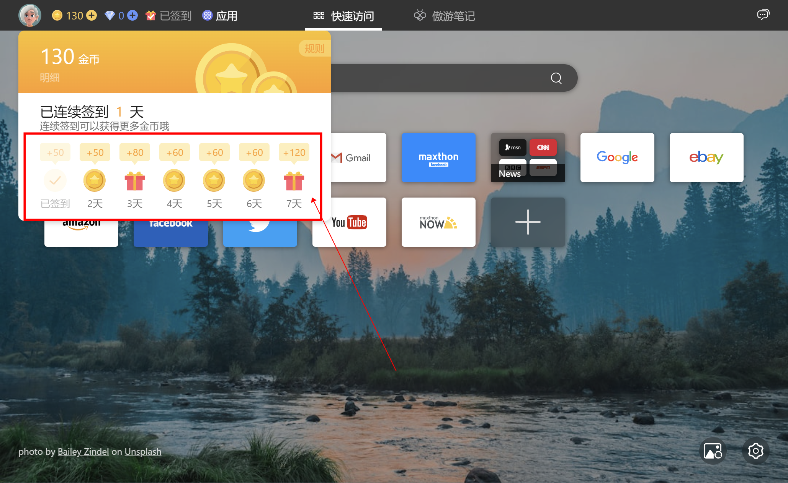
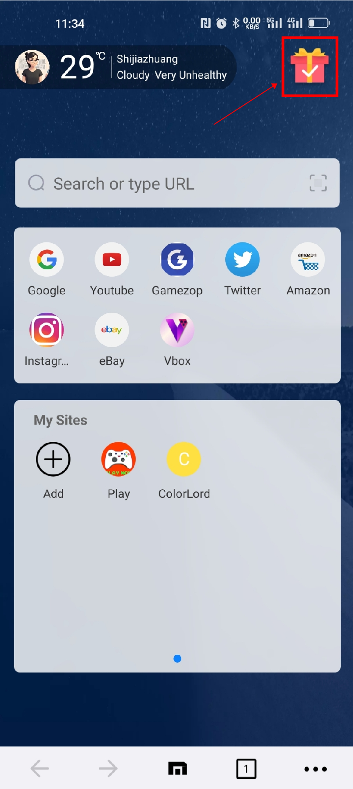
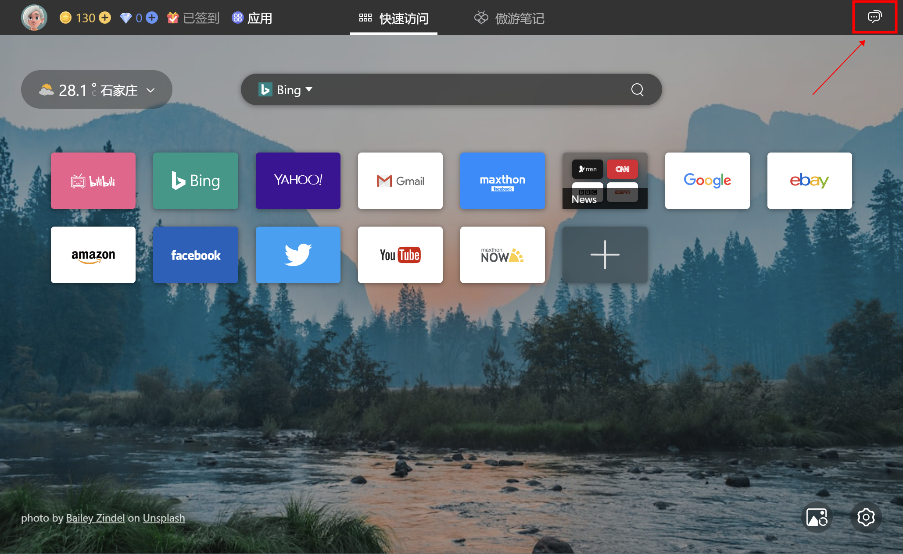
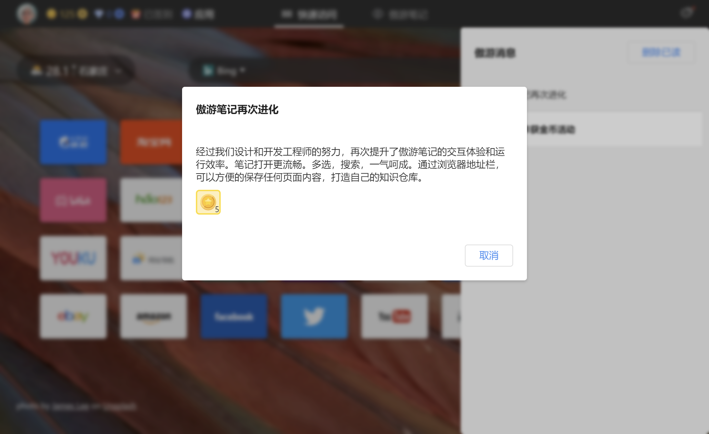

## 傲游浏览器金币活动指南

傲游浏览器一直以来都致力于为用户提供更好的上网体验。为了回馈广大用户的支持，傲游浏览器推出了金币活动，让用户在使用浏览器的同时还能获得金币奖励。本文将介绍金币获取的四种方式以及具体规则。

1. PC端签到：

   在PC端使用傲游浏览器连续签到7天，即可获得丰厚的金币奖励。新标签页的签到位置在左上角金币和钻石数字右侧。如果您使用了新标签页相关的拓展程序，可能会影响您正常使用签到功能。具体签到奖励如下：
   - 第1天：50金币
   - 第2天：50金币
   - 第3天：80金币
   - 第4天：60金币
   - 第5天：60金币
   - 第6天：60金币
   - 第7天：120金币

   值得注意的是，如果中间有一天未签到，则需要重新从第一天开始计算连续签到的天数。因此，建议用户每天都坚持签到，以获得更多的金币奖励。连续签到7天，总计可获得金币480个。

3. 移动端签到：

   在移动端使用傲游浏览器连续签到7天，同样可以获得丰厚的金币奖励。签到位置在移动端主页右上角。点击移动端下方控制条中间的傲游图标即可进入主页。具体签到奖励如下：
   - 第1天：20金币
   - 第2天：20金币
   - 第3天：40金币
   - 第4天：20金币
   - 第5天：20金币
   - 第6天：20金币
   - 第7天：80金币

   同样地，如果中间有一天未签到，则需要重新从第一天开始计算连续签到的天数。因此，建议用户每天都坚持在移动端签到，以获取更多金币。连续签到7天，总计可获得金币220个。
   移动端和PC端如果一直保持连续签到，7天可以获得金币700个，平均每天100个。

4. 新标签页消息通知：

   
   
   在傲游浏览器的PC端新标签页右上角会推荐傲游的新功能和消息。当用户阅读这些消息时，将获得额外的5金币奖励。用户只需点击消息，即可查看详细内容并获得金币。

5. 购买金币礼包：
   金币礼包使用美元结算，您可以直接购买并打开获得金币。每个礼包包含金币3000个。

通过以上四种方式，用户可以轻松获得金币奖励，进而提升会员等级。请注意，金币的使用和兑换规则可能会根据活动变化而调整，请用户随时关注官方公告以获取最新信息。
