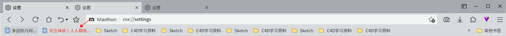
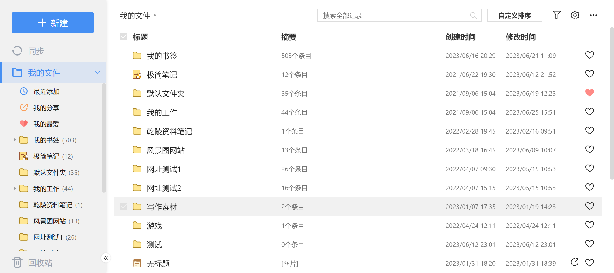
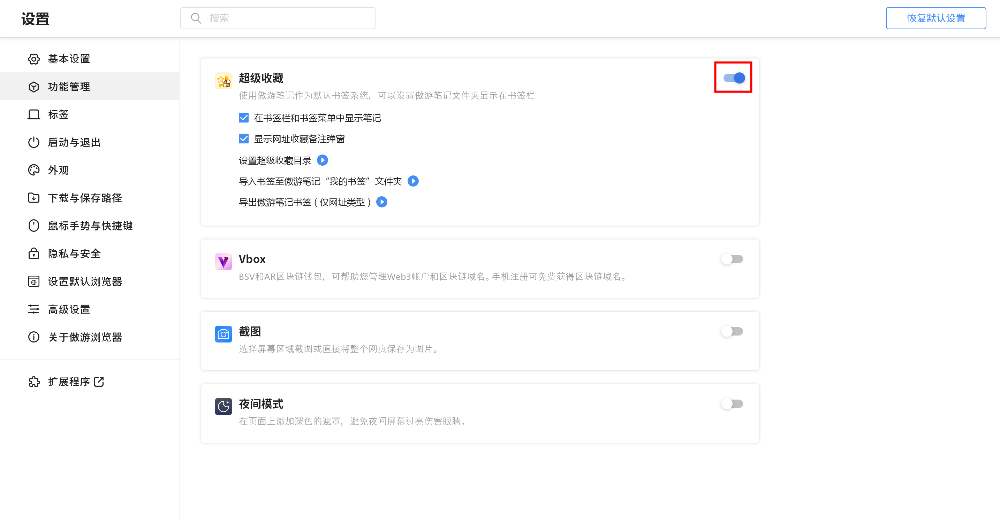
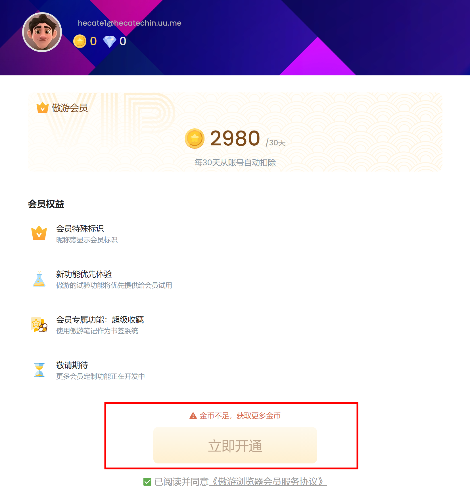

## 超级收藏用户指南

傲游浏览器推出了一项新的功能，名为“超级收藏”。这个功能允许用户将网址和笔记统一管理，建立个人知识库。下面是关于如何使用超级收藏功能的详细介绍。

1. 开通超级收藏：
   超级收藏是一个VIP功能，需要开通傲游浏览VIP订阅才能使用。进入设置>功能管理>超级收藏中开启此功能。

2. 设置超级收藏：
   - 显示在书签栏的傲游笔记文件夹：开启超级收藏后，可以将傲游账号中“傲游笔记”的任意一个文件夹显示在书签栏。书签栏显示的目录，在 设置>功能管理>超级收藏>超级收藏书签目录 下可以修改

  
   - 笔记类型记录显示设置：在功能管理中，还可以设置书签栏是否显示傲游笔记中的笔记类型记录。不勾选“在书签栏及书签菜单中显示笔记”时，书签栏和书签菜单中，将只会展示网址类型的傲游笔记

3. 导入书签至傲游笔记：
   首次开通超级收藏时，建议将浏览器书签导入到傲游笔记中。在功能管理>超级收藏中选择“导入书签至傲游笔记我的书签文件夹”即可。

4. 使用超级收藏：
   - 书签条目颜色标注：如果使用超级收藏，书签栏中的条目将用不同的文字颜色标注傲游笔记中，用户设置好的“我的最爱”条目。包含文件夹、笔记和网址

 
   - 管理傲游笔记：开通超级收藏后，傲游笔记的管理界面将会替代原书签管理器。在傲游笔记管理界面中，对网址和笔记的顺序进行调整，也可以在书签栏和书签菜单生效。

   - 网址备注：超级收藏中的网址相对于传统的书签，新增了备注字段，用户可以在这里填写关于这个站点的备注信息。在打开对应的网址时，备注将会显示在屏幕右下角。

5. 关闭超级收藏：
   如果不喜欢超级收藏，也可以在功能管理中关闭。关闭后书签栏将恢复原有的书签管理器数据

6. 导出傲游笔记书签：
   如果您已经在超级收藏中创建了不少网址，可以选择“导出傲游笔记书签(仅网址类型)”，将全部傲游笔记中的书签导出。再进入书签管理器，重新导入这些书签即可。

7. 升级为傲游会员：
   如果您还不是傲游VIP用户，可以在主菜单选择“升级成为傲游会员”，以每月2980金币的订阅价格，成为傲游会员。进入开通会员页面，输入傲游密码即可订阅傲游会员。

8. 购买金币：
   如果您当前的金币不足，可以在新标签页查看您的金币数量，点击金币旁边的加号，即可在金币活动页面购买金币。

结语：
以上就是傲游浏览器的超级收藏功能的全面介绍。希望本指南可以帮助你更好地利用这个强大的功能，提高你的网络浏览效率。如果有任何问题，欢迎随时向我们提问。