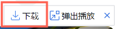
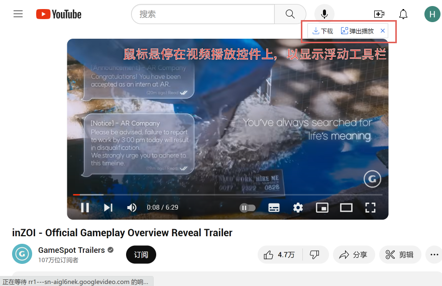
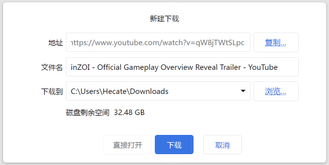
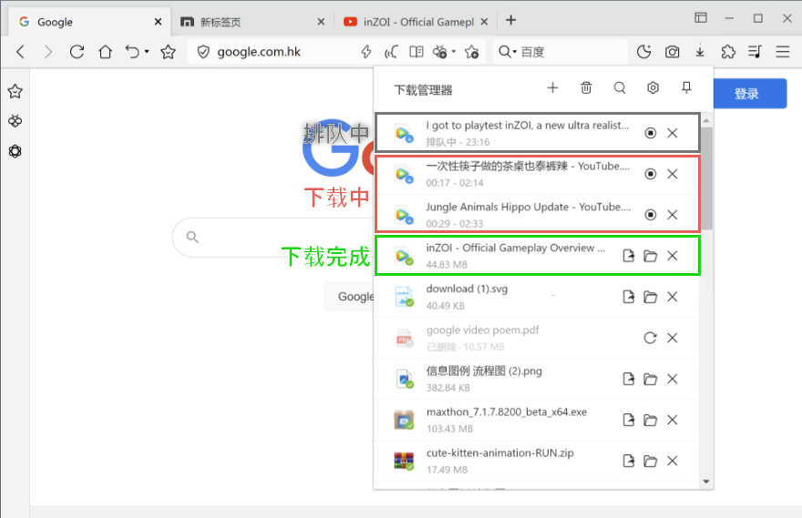
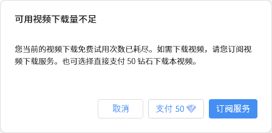

# 视频下载帮助

## 1. 介绍 🎉

欢迎使用Maxthon浏览器的视频下载功能！通过视频浮动工具栏，您可以轻松下载浏览器中播放的视频文件。无论您在浏览哪个网页播放视频，只需点击浮动工具栏上的下载按钮，即可将正在播放的视频保存到本地。这项功能对所有登录用户开放，均可免费试用并完成几次完整的视频下载。

## 2. 使用方法 📽️

### 2.1 视频下载按钮

在浮动工具栏上，找到下载按钮 。点击该按钮即可开始下载当前正在播放的视频。

请注意，只有在视频的完整播放界面，才能下载完整视频。在视频列表中，虽然也会显示浮动工具栏，但是视频并不能被正确的下载。

### 2.2 编辑下载信息

在弹出的下载窗口中，您可以编辑下载的视频名称和下载路径。确保设置适当的信息，然后点击下载。

## 3. 傲游会员优势 💎

傲游会员用户享有更多免费下载次数。当您是傲游会员时，您可以更频繁地使用视频下载功能。

## 4. 下载管理器 📁

使用傲游下载管理器进行视频下载。下载完成后，视频文件将带有特殊的角标，以便轻松区分。同时进行下载的视频数量有限，因此请注意排队状态。点击下载管理器上的停止下载按钮即可停止下载。视频停止下载后，可能造成不完全下载的情况。请谨慎处理。

## 5. 免费试用提示 ⚡

如果免费试用的下载次数用尽，系统将弹窗提示您。
您可以选择：

- 单独支付费用下载当前视频
- 直接订阅视频下载服务

## 6. 视频下载服务订阅 💳

视频下载服务提供以下订阅方式：

- 按月订阅：$4.98美元
- 按年订阅：$14.98美元

如果您选择按月或者按年订阅，您需要使用信用卡或支付宝支付，并且保证账户有足够的扣款额度。第三方支付平台会自动从您的账户中扣除款项。

当您订阅服务之后，之前的下载任务可能需要重新开始。重新找到之前的视频，点击浮动工具栏上的下载按钮即可。

除了订阅服务之外，您可以在不订阅服务的情况下，通过支付150钻石，单次下载一个视频。 **请注意，单次下载的情况下，请不要在下载过程中关闭浏览器，如果您出现网络问题导致的下载失败，在24小时内可以再次重新下载，超时重新下载需要再次付费。**

### 6.1 傲游钻石支付 💎

您还可以选择使用傲游钻石支付，29800钻石，价值与$29.8美元相当。

## 7. 订阅成功邮件 📧

订阅成功后，系统将发送一封邮件至您的邮箱，如果您没有邮箱，请尽快在傲游账号中绑定。邮件中包含视频下载服务的基本情况，并提供按月和按年订阅用户的退订地址。

## 8. 退订服务 🚫

在系统发送的订阅成功邮件中点击退订地址，按照引导操作即可完成视频下载服务的退订。请您妥善保管此邮件。如果未收到订阅成功邮件，您可以在"设置"->"下载和保存路径"->"完整视频下载浮动工具栏"中，按照指引进行退订。

## 9. 注意事项 🚨

- 在点击下载按钮之前，请确保已登录或订阅需要的网站账号。
- 下载的视频会录制网页正常播放时的全部内容，包括广告。
- 如果网页选择了倍速播放，在下载的视频中也会保留加速效果。

感谢您选择Maxthon浏览器视频下载功能，希望您享受愉快的下载体验！如果有任何问题，请随时联系我们的支持团队。

## 10. 常见问题与解答 🤔

### 免费试用次数问题 🆓
**问题**：我刚注册了Maxthon浏览器账号，如何获取并查看我的免费下载次数？

**回答**：首次登录后，您可以在视频下载功能页面或账户设置中查看剩余的免费下载次数。

### 订阅与付费 💳
**问题**：我该如何购买和激活视频下载服务的订阅？

**回答**：在免费试用次数耗尽后，系统会弹出提示窗口，您可以直接通过该窗口进行支付和订阅。您可以支付一定的费用，进行单次视频下载，也可以付费对此功能订阅，不限量下载。

### 下载限制 🚀
**问题**：同时下载视频的最大数量是多少？能否调整这个限制？

**回答**：当前设定的并发下载视频数量有限制，目前的限制为同时下载2个视频，未来可能在此基础上，允许用户自定义同时下载数量。

### 下载失败或中断 🚨
**问题**：如果视频下载过程中出现错误或中断怎么办？

**回答**：下载过程中，如果网络中断，可能造成视频只下载了前半部分，未能完整下载的情况。若视频下载失败，请检查网络连接是否稳定，并尝试重新下载。如问题依然存在，请查阅下载日志并在Maxthon浏览器的帮助中心寻求解决方案。

### 视频质量和格式 🎥
**问题**：下载的视频质量是否会与网页播放时一致？支持哪些格式下载？下载速度是否可以提升？

**回答**：下载的视频内容与网页播放时保持一致，包括清晰度和广告。但是，为了保证视频正常下载，目前仅支持1080P以及以下的清晰度。目前下载的视频格式为webm格式，可以使用所有主流浏览器播放，如果您需要转换成某种格式，可以在格式转换的软件或网站中转换。一般来说，基于目前所使用的技术方案，视频下载速度和视频时长直接相关，下载用时一般和视频时长一致。

### 退订操作 🚫
**问题**：我已订阅了月度服务，如何在下个月开始前取消自动续费？

**回答**：您可以通过邮件中的退订链接取消自动续费服务，或者登录您的Maxthon账户，在账户设置下的订阅管理界面手动取消订阅。取消方式仍然是通过邮件退订。请未绑定邮箱的傲游用户及时绑定邮箱。

### 网站兼容性 🌐
**问题**：所有在线视频网站都能使用此下载功能吗？

**回答**：Maxthon视频下载功能可支持大部分主流视频网站，但由于某些网站的技术保护措施，可能存在无法下载的情况。遇到此类问题，请联系客服确认。

 
